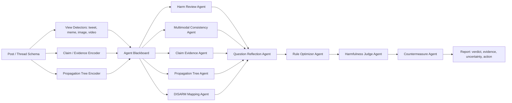

# KT3 Agentic MARO 参考文档：研究簇、Agent 分工与实现迁移

更新时间：2026-06-30

## 1. 文档定位

本文用于把 KT3 从“多模态 harmfulness 分类器集合”进一步收敛为“面向协同群体 characterization 的 Harmfulness Agentic Judge”。核心参考不是把 LLM Agent 当作每条帖子的在线主分类器，而是参考 MARO 一类工作，把 Agent 放在证据复核、问题反思、规则优化、解释生成和反制措施编排位置。

KT3 的目标闭环应为：

```text
统一 post / thread schema
-> 帖子级多模态 detector
-> claim / evidence / propagation-tree encoder
-> Agent blackboard
-> multi-agent review + question-reflection
-> validation-tuned decision rule optimization
-> harmfulness verdict + DISARM mapping + countermeasure
```

这一定义和当前仓库口径一致：Agent/RAG 是编排层、解释层和治理层，不替代底层可训练 detector；底层 detector 仍需在 FakeSV、HateXplain、MultiOFF、PHEME、mcfend 等本地数据上训练、校准和报告指标。

## 2. 方法论原则

1. Agent 先读结构化证据，再给复核结论。Agent 输入应来自 `post detector`、`claim evidence`、`propagation tree`、`user MIL`、`community graph`、`DISARM scorer` 的结构化输出，而不是直接读原始样本后零样本裁决。

2. Agent 的核心价值是发现“不确定性”。KT3 要显式输出低置信、跨模态冲突、证据不足、claim 未链接、传播树反常、反制风险，而不是只输出 `harmful / non_harmful`。

3. 规则不应长期手写固定。MARO 的关键启发是自动决策规则优化：在验证集上优化 Agent 权重、阈值、abstain 策略、冲突处理策略，而不是凭经验固定融合规则。

4. 反制措施必须证据约束。Countermeasure Agent 只能基于已检索证据、DISARM TTP、传播阶段和目标受众生成处置建议，不能编造事实或生成攻击性回应。

5. 传播树是 PHEME 类任务的主信息源。PHEME 不能只消费 source tweet 或文本字段，必须接入 `structure.json`、reactions、时间戳和 stance flow，才能支撑“帖子/传播树联合研判”。

## 3. 高水平研究簇与 KT3 迁移价值

| 研究方向 | 代表研究 | 核心机制 | 对 KT3 的迁移价值 | 当前落地状态 |
|---|---|---|---|---|
| 跨域多 Agent 与规则优化 | [MARO, EMNLP 2025](https://aclanthology.org/2025.emnlp-main.291/) | 多维专家 Agent、question-reflection、自动决策规则优化 | 作为 KT3 Agentic Judge 的主参考：底层 detector 产生证据，Agent 复核，规则优化器在验证集上学习最终裁决策略 | 当前 `kt3_multi_agent.py` 有本地多 Agent runtime，但仍是确定性规则，未实现验证集驱动的规则优化 |
| 多 Agent 辩论与事实解释 | [D2D, EMNLP 2025](https://aclanthology.org/2025.emnlp-main.764.pdf)、[ED2D, AAAI 2026](https://ojs.aaai.org/index.php/AAAI/article/view/41196) | 结构化多轮辩论、证据检索、检测和 debunking 联合输出 | 用于低置信和强冲突样本的复核：让支持方、质疑方、证据方分别陈述，再由 Judge Agent 归纳；ED2D 还提示误判解释可能强化误解，因此反制必须有安全闸 | 当前缺少 debate transcript、agent disagreement、debunking safety gate |
| 多模态 RAG 多 Agent fact-checking | [RAMA, 2025](https://arxiv.org/abs/2507.09174) | 多模态 claim 转查询、WebRetriever、跨源证据聚合、多 Agent ensemble | 用于 ClaimEvidenceAgent：把图文/视频 claim 变为检索查询，聚合外部证据，判断 evidence sufficiency | 当前 `kt3_rag.py` 是轻量本地 RAG，占位能力为主；未接入跨源检索与证据可信度评分 |
| 视觉误导与图文语境错配 | [MAD-Sherlock, 2024/2025](https://arxiv.org/abs/2410.20140) | 多模态 Agent debate、外部信息请求、out-of-context 判断 | 用于 MultimodalConsistencyAgent：判断图片真实但配文误导、图文组合才 harmful、旧图新用、语境错配 | 当前 MultiOFF / CLIP 分支能跑图文 baseline，但缺少 OOC 检索、视觉证据定位和 debate 解释 |
| 跨模态取证流水线 | [MACAW, 2024](https://openreview.net/pdf/4cf35992fa22738d28f8a67156a71de666b4eeae.pdf) | Retrieval Agent、Detective Agent、Analyst Agent 顺序工作 | 把 KT3 编排成“检索 -> 取证 -> 裁决”的流水线，适合 claim/evidence 与视觉一致性复核 | 当前没有明确拆出 retrieval / forensic / analyst 三阶段黑板 |
| FIMI / DISARM Agent 化 | [Agentic DISARM, 2026](https://arxiv.org/html/2601.15109v3)、[DISARM 框架说明](https://www.hybridcoe.fi/publications/hybrid-coe-research-report-7-foreign-information-manipulation-and-interference-defence-standards-test-for-rapid-adoption-of-the-common-language-and-framework-disarm/) | Agent 协同识别操纵行为并映射到 DISARM TTP | 用于 DISARMMappingAgent：把 harmfulness 证据进一步映射为操纵技术、攻击路径和反制方向 | 当前 `disarm_scorer.py` 有 DISARM 路径评分，但 KT3 Agent 输出尚未系统映射到 DISARM TTP |
| 传播树谣言检测 | [RumourEval 2019](https://aclanthology.org/S19-2147/)、[Tree-LSTM, ACL 2019](https://aclanthology.org/P19-1498/)、[RvNN, ACL 2018](https://aclanthology.org/P18-1184/) | 回复树、stance 演化、树结构递归/Tree-LSTM，多任务 stance + veracity | 用于 PropagationTreeAgent：PHEME 必须读取 tree structure、reaction stance、时间演化和关键分支，不应只做文本分类 | 当前 PHEME 分支主要是文本/claim baseline，尚未接入 `structure.json + reactions` 的树编码 |
| 短视频假新闻与多模态上下文 | [FakeSV, AAAI 2023](https://ojs.aaai.org/index.php/AAAI/article/view/26689)、[FakeSV repo](https://github.com/ictmcg/fakesv)、[FakingRecipe, ACM MM 2024](https://dl.acm.org/doi/10.1145/3664647.3680663) | 视频内容、标题/关键词、评论、发布者画像、创作过程、素材选择与编辑模式 | 用于 VideoEvidenceAgent 或 MultimodalConsistencyAgent：FakeSV 不能只靠 C3D，应逐步补 raw video、关键帧、ASR/OCR、评论和发布者上下文 | 当前本地 FakeSV 边界是 video_id、keywords、annotation、C3D 特征；缺 raw video、ASR、OCR、comments、profile |
| 反制叙事与事实驱动回应 | [CONAN, ACL 2019](https://aclanthology.org/P19-1271/)、[CONAN repo](https://github.com/marcoguerini/CONAN)、[MultiTarget-CONAN, ACL 2021](https://aclanthology.org/2021.acl-long.250/)、[RARG, NAACL 2024](https://aclanthology.org/2024.naacl-long.313/) | 专家反叙事、人机协同扩充、多目标 hate counter-narrative、检索增强回应生成 | 用于 CountermeasureAgent：输出事实纠错、降低扩散、非攻击性反叙事、人工审核建议，而不是只给风险等级 | 当前 `CounterNarrativeAgent` 有草案式输出，但缺少证据约束、目标受众控制和安全评估 |
| 多 Agent 生命周期治理 | [Multi-agent Systems for Misinformation Lifecycle, 2025](https://arxiv.org/html/2505.17511v1)、[AgentFact, 2025](https://arxiv.org/html/2512.22933v1) | 将检测、证据、解释、纠错拆成可单独评估的 Agent | 用于 KT3 工程分层：每个 Agent 要有独立输入输出、评价指标和失败回退策略 | 当前 Agent 顺序存在，但缺少 per-agent benchmark、failure policy 和 provenance log |

## 4. MARO-style Agent 编排总览

KT3 的 Agent 编排推荐采用 blackboard 架构。所有 detector 和 encoder 先把输出写入黑板，Agent 只读取黑板并追加自己的审计结果。这样可以保证每一步可复现、可审计、可替换。



## 5. Agent 分工定义

| Agent | 输入 | 主要职责 | 输出 | 不应承担的职责 | 当前代码映射 |
|---|---|---|---|---|---|
| `PostHarmAgent` | 帖子级 detector 输出、harm type、target、rationale、置信度 | 复核帖子是否 harmful、harm 类型是否一致、证据 span 是否足够 | `post_harm_review`、关键证据、低置信原因 | 不直接替代文本/图像/视频 detector | 当前对应 `HarmReviewAgent`，但仍是本地规则聚合 |
| `MultimodalConsistencyAgent` | text/OCR/ASR/caption/image/video 各视图输出和冲突标记 | 判断跨模态一致、互补、冲突、语境错配和隐式 harmfulness | `cross_modal_conflict`、`ooc_risk`、需要检索的视觉线索 | 不把缺失模态当作 non-harmful | 当前未独立实现；需要从 `post_semantics.py` 的 multimodal evidence 扩展 |
| `ClaimEvidenceAgent` | claim link、stance、RAG evidence、证据来源可信度 | 判断 claim 是否已链接、证据是否支持/反驳、是否需要外部检索 | `evidence_sufficiency`、`stance_review`、`retrieval_queries` | 不编造外部事实 | 当前对应 `StanceClaimAgent` 和 `EvidenceRetrievalAgent` 的一部分 |
| `PropagationTreeAgent` | PHEME `structure.json`、reactions、时间戳、stance flow、source tweet | 识别传播树中的关键分支、stance 演化、早期扩散风险、反常放大路径 | `tree_risk`、`key_branches`、`stance_flow`、`early_warning` | 不只看 source tweet 文本 | 当前未实现；PHEME 当前主要是文本/claim baseline |
| `UserMILAgent` | 用户 post bag、帖子级校准输出、账号上下文 | 判断账号是否持续传播 harmful 内容，输出代表性帖子和账户级置信 | `user_harm_score`、`attention_posts`、`persistence` | 不把发帖频率阈值当主判据 | 当前 `kt3_user_mil.py` 已有 deterministic Attention-MIL scaffold，未训练 |
| `CommunityJudgeAgent` | 社区图、用户级输出、KT1 协同结构、KT2 传播链 | 判断协同群体整体 harmfulness、角色分工和放大路径 | `community_harm_score`、`role_distribution`、`amplification_evidence` | 不简单平均成员分数 | 当前 `kt3_multi_agent.py` 有本地社区 judge，图模型未训练 |
| `DISARMMappingAgent` | harmfulness 证据、传播阶段、行为模式、DISARM scorer 输出 | 将 harmful 行为映射到 DISARM tactic / technique，并给出攻击路径解释 | `disarm_ttp`、`attack_path`、`countermeasure_hint` | 不在没有证据时强行贴 TTP | 当前 `disarm_scorer.py` 已有路径评分，Agent 层未系统化 |
| `QuestionReflectionAgent` | 所有 Agent 初步输出、冲突、缺失字段 | 生成结构化追问：缺什么证据、哪里冲突、是否需要人工审核或二次检索 | `questions`、`missing_evidence`、`review_required` | 不做最终裁决 | 当前未独立实现；MARO 的关键缺口 |
| `RuleOptimizerAgent` | 验证集预测、Agent 输出、人工审核标签、错误类型 | 优化 Agent 权重、阈值、abstain 策略、冲突处理规则 | `optimized_policy`、`view_weights`、`agent_weights`、`thresholds` | 不在线上单样本临时改规则 | 当前未实现；现有 gating fusion 仍偏模型/规则层 |
| `HarmfulnessJudgeAgent` | detector 输出、Agent 复核、优化策略、review questions | 输出最终 harmfulness verdict、置信度、解释和能力边界 | `final_harmfulness`、`final_score`、`rationale`、`capability_boundary` | 不隐藏不确定性 | 当前 `_final_decision` 是规则汇总，未接入优化策略 |
| `CountermeasureAgent` | final verdict、evidence、DISARM TTP、目标受众、传播阶段 | 生成反制措施：事实纠错、反叙事草案、降扩散建议、人工审核建议 | `countermeasure_plan`、`counter_narrative_draft`、`safety_notes` | 不生成攻击性、无证据或过度确定的回应 | 当前有 `CounterNarrativeAgent`，仍需证据约束和安全闸 |

## 6. 推荐黑板输入输出 schema

Agent 不应直接读取原始样本做主判别；它们应读取统一 blackboard。建议最小输入如下：

```json
{
  "case_id": "kt3-case-001",
  "post_schema_version": "kt3-post-case-v1",
  "post_views": {
    "tweet": {"label": "harmful", "score": 0.71, "confidence": 0.66, "evidence": ["text span"], "abstain": false},
    "meme": {"label": "uncertain", "score": 0.52, "confidence": 0.41, "evidence": [], "abstain": true},
    "image": {"label": "non_harmful", "score": 0.22, "confidence": 0.63, "evidence": ["image embedding match"], "abstain": false},
    "video": {"label": "missing", "score": null, "confidence": 0.0, "evidence": [], "abstain": true}
  },
  "claim_evidence": {
    "claim_id": "claim-x",
    "stance": "support",
    "retrieved_evidence": [],
    "evidence_sufficiency": "insufficient"
  },
  "propagation_tree": {
    "available": true,
    "source_id": "source-tweet",
    "structure_path": "structure.json",
    "reaction_count": 42,
    "stance_flow": {"support": 12, "deny": 3, "query": 8, "comment": 19}
  },
  "context": {
    "event_id": "event-x",
    "language": "zh/en",
    "dataset": "PHEME/FakeSV/MultiOFF/HateXplain/mcfend"
  }
}
```

每个 Agent 的输出应统一为：

```json
{
  "agent": "PropagationTreeAgent",
  "decision": "needs_tree_review",
  "score": 0.73,
  "confidence": 0.68,
  "evidence": ["branch-a shows fast supportive amplification"],
  "uncertainty": ["stance labels are weak or missing"],
  "questions": ["Does the largest branch deny or amplify the source claim?"],
  "recommended_action": "retrieve_external_evidence"
}
```

最终 Judge 输出应统一为：

```json
{
  "final_harmfulness": "harmful",
  "final_score": 0.78,
  "confidence": 0.70,
  "harm_types": ["misinformation", "manipulative_amplification"],
  "selected_views": ["tweet", "claim_evidence", "propagation_tree"],
  "agent_weights": {"PostHarmAgent": 0.25, "ClaimEvidenceAgent": 0.25, "PropagationTreeAgent": 0.30, "DISARMMappingAgent": 0.20},
  "conflict_reason": "text supports claim while image evidence is unavailable",
  "review_required": true,
  "review_reason": "external evidence insufficient and propagation tree shows rapid amplification",
  "countermeasure_plan": ["fact-check response", "reduce amplification", "human analyst escalation"]
}
```

## 7. 代码迁移建议

### 7.1 短期：在现有本地 Agent 上补齐分工

1. 在 `system/backend/app/core/risk/kt3_multi_agent.py` 中扩展 `agent_order`：加入 `MultimodalConsistencyAgent`、`PropagationTreeAgent`、`DISARMMappingAgent`、`QuestionReflectionAgent`、`RuleOptimizerAgent`、`HarmfulnessJudgeAgent`。

2. 新增 `kt3_agent_blackboard.py`：统一把 `post_semantics.py`、`kt3_user_mil.py`、`kt3_community_gate.py`、`kt3_rag.py`、`disarm_scorer.py` 输出整理成 blackboard。

3. 新增 `kt3_propagation_tree.py`：读取 PHEME `structure.json + reactions/*.json`，输出 tree depth、branch size、stance flow、early burst、key branches。注意这些是结构编码输入，不应退化为手工阈值结论。

4. 新增 `kt3_agent_policy.py`：先实现可复现的 validation-tuned policy optimizer，优化 per-agent 权重、abstain 阈值、review trigger。形式可从 logistic/coordinate search 起步，但文档表述必须强调其作用是“决策规则优化 baseline”，后续可替换为 MARO-style 自动规则搜索。

5. `CounterNarrativeAgent` 加安全闸：没有可引用证据时只输出“需要补充证据/人工审核”，不能生成事实性纠错话术。

### 7.2 中期：从确定性 Agent 走向可训练/可优化 Agentic Judge

1. 帖子级 detector 继续训练：XLM-R/RoBERTa 文本分支、CLIP/BLIP 图文分支、C3D/temporal/video 分支、claim cross-encoder 分支。

2. 传播树分支接入 PHEME：使用 Tree-LSTM/RvNN/Tree Transformer 思路，把 source tweet 与 reactions 的树结构、stance flow、时间演化编码为 thread representation。

3. Agent 只处理选择性样本：low confidence、cross-view conflict、claim unlinked、tree-risk high、DISARM high-impact 等样本进入 Agent 复核，避免全量高成本在线裁决。

4. 在验证集上优化策略：以 macro-F1、ECE、abstain coverage-risk、review precision、countermeasure safety 为目标，学习 agent weights 和 review policy。

5. 输出审计日志：每个 Agent 的输入、证据、问题、置信度、失败原因都要进入报告，保证答辩时能解释“为什么判为 harmful”和“为什么需要人工审核/反制”。

## 8. 当前能力边界

当前仓库已经具备一个可运行的 KT3 scaffolding：

| 能力 | 当前状态 |
|---|---|
| 帖子级多视图检测 | 已有 text/image/video/claim baseline 和 trainable post 脚本，但性能仍是 baseline-to-v1 |
| 多 Agent runtime | `kt3_multi_agent.py` 已实现本地确定性多 Agent 顺序执行 |
| 用户级 MIL | `kt3_user_mil.py` 已有 Attention-MIL 风格聚合，但不是训练好的神经 MIL |
| RAG | `kt3_rag.py` 是轻量本地 RAG，占位和接口价值大于真实性能 |
| DISARM | `disarm_scorer.py` 已有路径评分，Agent 映射尚未闭环 |
| PHEME propagation tree | 尚未接入 `structure.json + reactions` 的真实树编码 |
| FakeSV raw video | 当前边界仍是 C3D 预提取特征和文本/关键词，不含 raw video、ASR、OCR、comments、profile |
| 自动规则优化 | 尚未实现 MARO-style validation-driven rule optimization |
| 反制措施 | 已有草案式 Agent，但缺证据约束、安全闸和用户研究/人工审核闭环 |

因此，当前可以诚实表述为：

```text
KT3 已有多模态帖子级 baseline、用户级 MIL scaffold、本地多 Agent runtime 和报告接口；
但 MARO-style Agentic Judge 仍需补齐传播树编码、证据检索、question-reflection、
验证集驱动规则优化和安全约束反制生成，才能支撑“帖子/传播树 harmfulness 判定 + 反制措施”的完整闭环。
```

## 9. 答辩口径建议

1. 主创新不要说“用了多智能体”。更稳的说法是：KT3 将协同群体 characterization 中最难的 harmfulness 维度拆成帖子、用户、社区和传播树证据，并用 MARO-style Agentic Judge 做证据复核、冲突解释、规则优化和反制编排。

2. 当前工程不要声称已经达到 MARO。当前是本地 deterministic Agent runtime；下一步明确是把 MARO 的 question-reflection 和 automated decision rule optimization 工程化。

3. PHEME 的改进点要具体：从文本/claim baseline 升级到 propagation tree encoder，读取 `structure.json + reactions`，输出 stance flow 和 key branches。

4. FakeSV 的改进点要具体：从 C3D 特征 baseline 升级到 raw-video preprocessing，逐步加入 keyframes、OCR、ASR、comments、publisher profile；若本地没有 raw video，就必须标为能力边界。

5. Countermeasure Agent 的答辩重点不是“生成一句话”，而是基于证据的处置计划：事实纠错、降低扩散、反叙事、人审升级和 DISARM 对策映射。

## 10. 2026-06-30 决策更新：人工选择性调用的自然语言 Agent 报告

本轮实现将 KT3 Agent 层从“自动执行的本地多 Agent 汇总”调整为“人工选择性调用的 LLM 专家研判层”。该决策对应正式 ADR：[../../doc/adr/0001-kt3-manual-maro-agent-review.md](../../doc/adr/0001-kt3-manual-maro-agent-review.md)。

关键边界如下：

- `/risk/assess` 默认不调用 LLM Agent，只生成 `review_queue`、`agent_review_suggestions` 和基础 detector/融合/传播/图谱输出。
- Agent 调用必须由分析师在报告详情中人工触发，输入包括被选帖子、传播树 ID、结构化 detector 输出、脱敏文本、OCR/ASR/caption、图片/关键帧引用。
- Agent 主体输出是 MARO-style 自然语言 analysis report，不是字段化分类器输出，也不用于拟合 PHEME/FakeSV/MultiOFF 等数据集标签。
- 系统只保留最小审计元数据：`run_id`、`agent_name`、`model`、`input_refs`、`input_hash`、`status`、`created_at`、`human_triggered_by`。
- LLM 调用失败时只记录失败原因，不使用本地规则伪造自然语言报告。

第一版在线 Agent 集合固定为 7 个：

| Agent | 自然语言报告职责 |
|---|---|
| `PostHarmAgent` | 帖子内容概览、detector 结论回顾、harm 类型与目标对象、证据充分性、人工确认问题 |
| `MultimodalConsistencyAgent` | 媒体预处理输入、跨模态一致性、图文/音视冲突、语境错配、组合语义 harmfulness、需补充证据 |
| `ClaimEvidenceAgent` | claim 摘要、帖子立场、已有证据、证据缺口、是否足以支撑 harmfulness 研判、建议检索方向 |
| `PropagationTreeAgent` | 传播树结构概览、关键分支、stance 演化、异常放大迹象、与 harmfulness 的关系、需人工核验节点 |
| `QuestionReflectionAgent` | 已发现冲突、缺失证据、必须回答的问题、建议补充调用/检索、若不补证据的风险 |
| `HarmfulnessJudgeAgent` | 专家报告综述、证据强弱、建议性 harmfulness 判断、能力边界、人工确认项、是否建议进入反制 |
| `CountermeasureAgent` | 可用证据、事实纠错方向、降扩散/人审建议、反叙事草案、不能说什么/安全注意 |

因此，KT3 Agent 层的评估标准也随之改变：重点不是 macro-F1，而是报告可审计性、证据引用完整性、冲突识别质量、人工触发日志完整性和反制安全边界。
