# LOBO - Evaluation of Generalization Deficiencies in Twitter Bot Classifiers：深度解读

> **作者**：Juan Echeverria、Emiliano De Cristofaro、Nicolas Kourtellis、Ilias Leontiadis、Gianluca Stringhini、Shi Zhou  
> **会议/期刊与年份**：ACSAC 2018；所读文件为 arXiv:1809.09684v1（2018-09-25），首页注明已发表于 ACSAC 2018  
> **论文链接**：https://arxiv.org/abs/1809.09684  
> **实际使用来源**：用户指定的本地 PDF；未混用其他版本、代码或二手解读  
> **页码约定**：全文 `PDF p.N` 均指文件的 1-based PDF 页码；该文件页码与论文印刷页码一致  
> **论文类型**：主类型为方法/评价协议；次类型为实证评估  
> **学科 Lens**：计算机科学与人工智能（主）；社会与行为测量（次，仅用于构念与外推审查）  
> **读者画像**：research-generalist；具备科研与机器学习基础，不预设熟悉社交机器人检测  
> **解读目标**：reproduce + transfer（复现并迁移到 CogGuard）  
> **视觉能力模式**：visual；全部 5 幅图和 7 张表均直接核验  
> **解读置信度**：中；PDF 可完整读取，但代码、数据快照、依赖版本和超参数缺失，且表 5、类标识及特征数存在源内冲突

## 1. 核心思想一句话总结（Elevator Pitch）

> **LOBO按家族留出，证明高常规准确率仍会漏检未知机器人家族。**

## 2. 论文背景与动机（Background & Motivation）

### 2.1 具体问题

论文研究二分类任务：给定一个 Twitter 账户的资料与历史推文特征，输出该账户是 bot 还是 user。常规随机划分会让同一机器人家族同时进入训练集和测试集，模型因而可能只学到该家族的发送时刻、模板、账户年龄等特征，却被总体准确率掩盖。作者提出 Leave-One-Botnet-Out（LOBO）：训练时完全排除一个目标机器人类，测试时只用该类，借此估计对未见机器人类型的迁移能力。[论文 §1、§4，PDF pp.1,4-5]

这里的“类”并不总是严格意义上的单一 botnet：表 1 混合了单一活动、检测器输出、按粉丝数分组的人工标签、蜜罐样本和媒体人遭攻击名单。故本文统一称“机器人家族/数据类”，并把“留类”解释为数据来源与行为族的联合域偏移。[论文 §3.1、表 1，PDF pp.3-4]

### 2.2 为什么重要

- **现实价值**：攻击者会改变行为；对已见家族的 97% 准确率不能说明系统能发现下一批攻击账户。
- **学术价值**：论文把评价单位从“随机账户”提升为“行为家族”，提前触及后来常称为 group/domain generalization 的问题。
- **典型场景**：模型在 Star Wars bots 上训练、测试都近乎完美，却可能把此前未见的 Social spambots #2 几乎全部判为真人。

### 2.3 论文之前的研究版图

| 路线 | 代表信号 | 有效之处 | 关键局限 | 本文如何回应 |
|---|---|---|---|---|
| 账户资料 | 粉丝、好友、账户年龄 | 单账户、低调用成本 | 易学到特定家族表面特征 | 在家族级留出下检验 |
| 社交图 | 连接结构、Sybil 社区 | 能利用群体结构 | API 限流、采集昂贵、可被时序策略规避 | 明确不使用图特征 |
| 操作相似性 | 同步发帖、共同 IP/点击 | 直接面向协调行为 | 依赖特定可见信号 | 作为相关路线，不纳入本文分类器 |
| 内容与链接 | 模板、URL、传播异常 | 可定位垃圾与恶意内容 | 内容随活动变化 | 用跨家族评价暴露过拟合 |

上述定位来自论文 Related Work；论文没有在相同数据上重跑这些系统，因此不能把 LOBO 的分类器与所有旧路线作公平性能排序。[论文 §2，PDF p.2]

### 2.4 从痛点到研究问题

> **随机账户划分默认训练/测试同分布 → 同家族特征泄漏使常规指标虚高 → 不同机器人数据类可作为未见行为的代理 → 逐类完全留出并测试 → 比较已见与未见家族性能 → 结论只覆盖这些 Twitter 数据类。**

- **作者主张**：LOBO 是现实中未知机器人泛化能力的代理，并应成为通用机器人检测器的最低评价标准。[论文 §1、§4、§9，PDF pp.2,4-5,10]
- **论文直接展示的事实**：LightGBM 在 C30K 常规划分上为 97.84%，在平衡 C500 上为 93.93%；C500 的逐家族 LOBO 均值为 57.51%，家族范围为 0.71%-98.14%。[表 3、表 6，PDF pp.6,8]
- **本文推断**：LOBO 有效诊断“家族身份是否跨折共享”，但还不是未见平台、未来时间、未知活动或社区真实性的充分检验。

## 3. 核心方法/理论/研究设计详解（Core Method, Theory, or Study Design）

### 3.1 总体框架

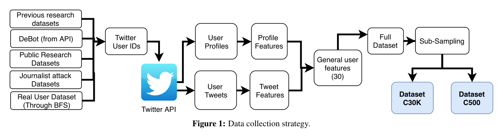

*图 1（Data collection strategy，PDF p.3）。来源数据经 Twitter API 获取资料与推文，抽取账户级特征，再构造 C30K 与 C500。*

**图 1 详细解读**

1. **输入**：既有研究数据、DeBot API、公开数据、媒体人遭攻击名单，以及通过 BFS 获取的真人账户。
2. **采集**：账户 ID 经 Twitter API 取 user profile 与最多 3,200 条可获取推文。
3. **表示**：资料特征与推文特征合并为论文声称的“30 维”账户向量。
4. **输出**：完整数据再经两种子采样形成不平衡 C30K 与平衡 C500。
5. **核验结果**：图中箭头、两条特征支路、Full Dataset、Sub-Sampling 和两个终端数据集均完整可见；它解释数据流，不证明泛化结论。[图 1、§3、§6.1，PDF pp.3,6]

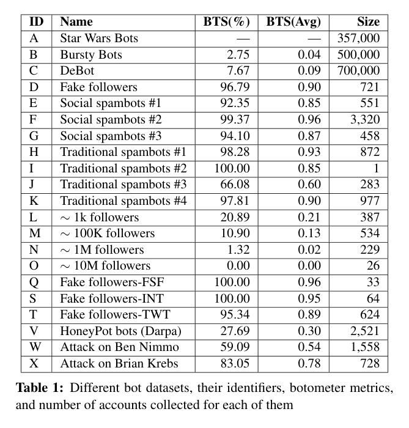

*表 1（Different bot datasets...，PDF p.4）。BTS(%) 为 Botometer 分数高于 0.5 的比例，BTS(Avg) 为平均分，每类最多随机查询 1,000 个账户。*

**机器人家族数据重构**

- 三个超大类为 A Star Wars（357,000）、B Bursty（500,000）和 C DeBot（700,000）；它们主导未平衡数据量，但 Botometer 的 BTS 分别为缺失、2.75% 和 7.67%。
- D-K 覆盖 fake followers、social spambots 与 traditional spambots；规模从 I 的 1 个账户到 F 的 3,320 个账户。
- L-O 是按粉丝量级划分的人工标注 bots；Q/S/T 是不同购买服务的 fake followers；V 是 DARPA honeypot bots；W/X 是对 Ben Nimmo/Brian Krebs 的攻击名单。
- 数据语义并不齐一：C 是检测器输出，V 依赖蜜罐假设，W/X 未被论文视为既有研究 ground truth。该异质性增加覆盖面，也把“家族差异”与“来源/标注机制差异”纠缠在一起。[§3.1、表 1，PDF pp.3-4]

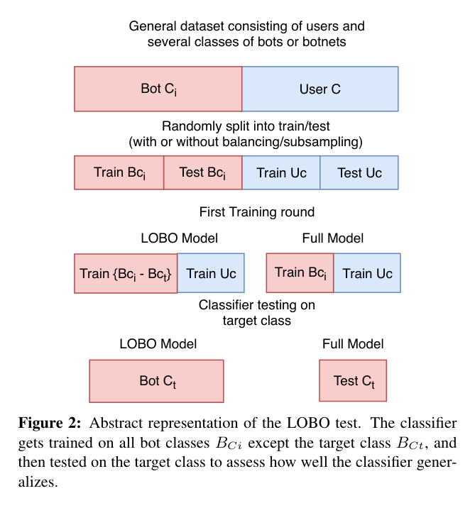

*图 2（Abstract representation of the LOBO test，PDF p.4）。蓝色为 users，红色为 bot classes；LOBO 模型从训练数据中删除目标类。*

**图 2 详细解读**

1. 一般数据包含用户类 $U$ 与多个机器人类 $B_i$。
2. 每类独立随机作 70/30 train/test 划分；是否平衡取决于 C30K 或 C500。
3. Full model 使用所有机器人的训练部分与用户训练部分；其目标类测试集是未见账户，但家族已见。
4. LOBO model 删除目标家族 $B_t$ 的全部训练账户，再在完整 $B_t$ 上测试；此时账户和家族均未见。
5. 图 2 是协议定义，不是性能证据；最重要的防泄漏边界是“目标家族的任何账户均不能进入训练”。[§4、图 2，PDF pp.4-5]

### 3.2 数据集构造与划分

#### C30K：保留规模现实但限制三个巨型类

- A、B、C 各随机取 30,000；D-X 使用可获得的全部账户，合计约 105,000 bots。
- 真人数据随机取 105,000，最终约 210,000 个账户。
- 类别总量平衡，但机器人内部的家族极不平衡，从 26 到 30,000 不等。
- 论文称测试集约为 C30K 的 30%，即约 63,000 个账户。[§6.1-6.2，PDF p.6]

#### C500：平衡机器人家族

- 从账户数大于 500 的每个机器人类随机抽 500；论文正文称有 14 类，形成 7,000 bots，再配 7,000 users。
- 每次需要时动态重采样，并对每类作 70/30 划分。
- LOBO Test II 对每个目标类重复 100 次，以降低随机抽样和划分波动。[§6.1、§6.4，PDF pp.6-7]
- **源内冲突**：表 6 只有 13 个目标行，并出现表 1 未定义的 `U`，同时缺少符合 `>500` 条件的 `X`。无法仅凭 PDF 确认 `U` 是否为 `X` 的排版错误。

#### 真人对照

作者从一个真人种子沿 outgoing friends 做最多 4 跳 BFS，人工核验第一层，得到超过 100 万英语账户，并假设真人不太会关注 bots。作者明确承认该方法不能保证无 bot 混入。[§3.3，PDF p.4]

该对照不是 Twitter 人群的概率样本：单种子 BFS、英语筛选、同质连接与人工仅核验第一层都可能造成选择偏差。对泛化实验而言，它还会让“bot 数据来源”与“user BFS 来源”成为容易学习的标签代理。

### 3.3 特征与模型流水线

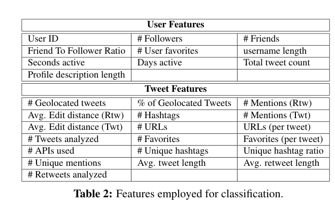

*表 2（Features employed for classification，PDF p.6）。核验裁图保留了全部行列和标题。*

**特征重构**

- **资料特征**：User ID、followers、friends、friend/follower ratio、user favorites、username length、seconds active、days active、total tweet count、profile-description length。
- **推文特征**：地理标记数/比例、推文与转推中的 mentions、两类平均 edit distance、hashtags、URLs 及每推 URL、分析的 tweets/retweets 数、favorites 及每推 favorites、API/source 数、unique hashtags 及比例、unique mentions、平均 tweet/retweet 长度。
- 编辑距离只在最近 200 条 tweets 与最近 200 条 retweets 内两两计算后取均值；每账户最多获取 3,200 条推文。`total tweet count` 来自 profile，包含已删除推文且不受 3,200 上限约束。[§5.1-5.2，PDF p.5]
- 不使用社交图，理由是 Twitter API 图查询限流，部署时难以快速获取。[§5，PDF p.5]

**源内计数问题**：图 1 和 §6.2 称向量为 30 维，但表 2 可枚举出 10 个 user 项和 19 个 tweet 项，共 29 项；其中 `User ID` 又通常应是标识符而不是可泛化特征。代码缺失使实际列集合不可确认。

**模型**：比较 LightGBM、XGBoost、Random Forest、Decision Tree 与 AdaBoost，均称使用“most standard and naive python implementation”。论文未报告库版本、默认参数、随机种子、缺失值处理、类别权重、阈值或特征预处理。[§6.2，PDF p.6]

论文在常规结果后称“our LGBM classifier”，但 LOBO 小节随后只写“the classifier”，未给出明确模型绑定。表 6 的 full-model 均值与表 3 的 LGBM C500 结果接近但不相同，不能据此把所有 LOBO 结果无条件归为某个确切实现。这是精确复现的阻断项。

### 3.4 LOBO 的形式化重构

论文没有编号公式；下式是对图 2 与 §4 的忠实形式化，不是作者给出的新公式。

设机器人家族集合为 $\mathcal{B}=\{B_1,\ldots,B_m\}$，真人类为 $U$，目标家族为 $B_t$。每个类先独立划分训练/测试部分。

$$
\mathcal{D}_{\text{full}}^{\text{train}}
=U^{\text{train}}\cup\bigcup_{i=1}^{m}B_i^{\text{train}},
\qquad
\mathcal{D}_{\text{LOBO},t}^{\text{train}}
=U^{\text{train}}\cup\bigcup_{i\ne t}B_i^{\text{train}}.
$$

$$
A_{\text{full},t}=\operatorname{Acc}(f_{\text{full}},B_t^{\text{test}}),
\qquad
A_{\text{LOBO},t}=\operatorname{Acc}(f_{-t},B_t),
\qquad
G_t=A_{\text{full},t}-A_{\text{LOBO},t}.
$$

**符号与判定**

- $f_{\text{full}}$：看过目标家族训练账户的二分类器。
- $f_{-t}$：从未看过目标家族的二分类器。
- $A_{\text{LOBO},t}$：只在 bot 目标类上计算；因为没有负例，论文脚注指出此处 accuracy 数值等于 recall，但不能估计 false-positive rate 或 precision。[§6.3 脚注 2，PDF p.7]
- $G_t$：看到该家族带来的绝对准确率百分点收益，不是相对百分比。

**最小例子**：在 C500 的 F 类，full model 为 94.02%，LOBO 为 0.71%，故 $G_F=93.31$ 个百分点；随机账户测试看起来可靠，但家族留出后几乎全漏检。[表 6，PDF p.8]

**Before / After / Diff / Trade-off**

- **Before**：账户级随机划分；测试账户未见，但测试家族已见。
- **After**：家族级留出；测试账户和测试家族均未见。
- **Diff**：改变的是 split unit，不是模型架构。
- **Trade-off**：更接近域外评价，但每次需重训，结果也混合家族行为、采集源和标注机制差异。

### 3.5 Few-shot 学习率与 t-SNE

学习率实验固定一个 C500 数据集。对目标类初始保留全部 500 个账户作测试，再将 $X\in\{0,2,4,8,16,32,64,128,256\}$ 个随机目标账户移入训练；其他家族各使用完整 500 个账户。每个 $X$ 重复 50 次并取目标类平均准确率。[§7.2，PDF pp.8-9]

这不是独立测试集大小固定的标准学习曲线：随着 $X$ 增加，目标测试集从 500 缩小到约 244。它能描述少量目标样本适配速度，但训练增长与测试集变化同时发生。

t-SNE 使用 C30K 的账户特征投影到二维，目的是解释不同家族与真人特征重叠程度。论文未报告 perplexity、学习率、迭代数、初始化或随机种子，故只能方向性复现。[§7.3、图 5，PDF p.9]

### 3.6 核心创新

1. **评价单位创新**：不再只问“未见账户能否分类”，而问“未见行为家族能否分类”；最小新颖单元是 split protocol。
2. **多家族证据资源**：把 20 个已收集数据类放入统一账户特征流水线；代价是标签与来源异质。
3. **适配速度分析**：从纯 LOBO 延伸到逐步加入目标家族样本，显示新家族并非同样易学。

它主要属于 **全新评价问题定义 + 对既有交叉验证的组级改造**，而不是全新分类器架构。

## 4. 证据与结果分析（Evidence & Results）

### 4.1 研究设计与证据协议

- **RQ1**：常规随机划分的高准确率是否代表跨家族泛化？
- **RQ2**：家族不平衡是否足以解释 LOBO 下降？
- **RQ3**：看到多少目标家族样本后可恢复性能？
- **材料**：表 1 的 bot 数据类、BFS user 数据，以及其资料与历史推文。
- **主要指标**：常规 accuracy/AUC；LOBO target-class accuracy（数值等于 recall）；accuracy gain。
- **重复**：C500 LOBO 每目标类 100 次；few-shot 每步 50 次。C30K LOBO 未按 100 次重复，作者承认更受随机性影响。[§6.3-7.2，PDF pp.7-8]
- **不确定性**：论文只给部分标准差描述和图中 95% 区间；没有原始重复结果、区间计算方法或显著性检验。

### 4.2 全量图表覆盖清单

| 编号 | PDF页 | 作用 | 关键？ | 报告位置 | 视觉核验 |
|---|---:|---|:---:|---|---|
| 图 1 | 3 | 数据、API、特征与子采样流水线 | 是 | §3.1 | 已核查并嵌入 |
| 表 1 | 4 | 20 个数据类、Botometer 指标与规模 | 是 | §3.1 | 已核查并嵌入 |
| 图 2 | 4 | Full/LOBO split 定义 | 是 | §3.1 | 已核查并嵌入 |
| 表 2 | 6 | 账户与推文特征 | 是 | §3.3 | 已重裁、核查并嵌入 |
| 表 3 | 6 | C30K/C500 常规性能 | 是 | §4.3 | 已重裁、核查并嵌入 |
| 表 4 | 6 | C30K 混淆矩阵 | 是 | §4.3 | 已重裁、核查并嵌入 |
| 表 5 | 7 | C30K LOBO；表头/数值冲突 | 是 | §4.4 | 已核查并嵌入 |
| 表 6 | 8 | C500 单类、full、LOBO 与 gain | 是 | §4.4 | 已核查并嵌入 |
| 图 3 | 8 | few-shot 跨类均值与 95% 区间 | 是 | §4.5 | 轴、图例、区间已核查 |
| 图 4 | 8 | A/C/F/H/V 家族学习曲线 | 是 | §4.5 | 轴、颜色、图例已核查 |
| 图 5 | 9 | 两组 t-SNE 对照 | 是 | §4.6 | 两面板与图例已核查 |
| 表 7 | 9 | 13 类在九个样本量下的准确率 | 是 | §4.5 | 已核查并嵌入 |

### 4.3 常规随机划分：高分但只证明家族内插值

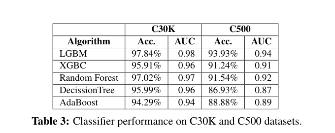

*表 3（Classifier performance on C30K and C500 datasets，PDF p.6）。*

| 算法 | C30K Acc. | C30K AUC | C500 Acc. | C500 AUC |
|---|---:|---:|---:|---:|
| LGBM | 97.84% | 0.98 | 93.93% | 0.94 |
| XGBC | 95.91% | 0.96 | 91.24% | 0.91 |
| Random Forest | 97.02% | 0.97 | 91.54% | 0.92 |
| DecisionTree | 95.99% | 0.96 | 86.93% | 0.87 |
| AdaBoost | 94.29% | 0.94 | 88.88% | 0.89 |

平衡家族后所有模型下降，LGBM 下降 3.91 个百分点，DecisionTree 下降 9.06 个百分点。这说明 C30K 的大类占比确实抬高总体结果，但 C500 的 93.93% 仍然很高，尚不足以暴露未知家族风险。[表 3、§6.2，PDF p.6]

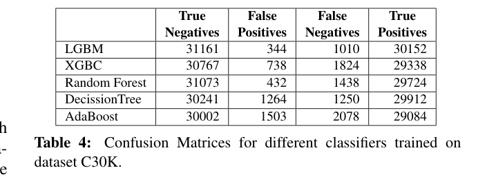

*表 4（Confusion Matrices...，PDF p.6）。列顺序为 TN、FP、FN、TP。*

LGBM 的 TN/FP/FN/TP 为 31,161/344/1,010/30,152；这支持常规测试上的高区分度。五种算法都在相同约 63k 测试规模上展示大量 TN/TP，但论文没有给跨重复方差。该表只验证随机账户划分，不验证未知家族。[表 4、§6.2，PDF p.6]

### 4.4 LOBO：C30K 的源内冲突与 C500 的主结果

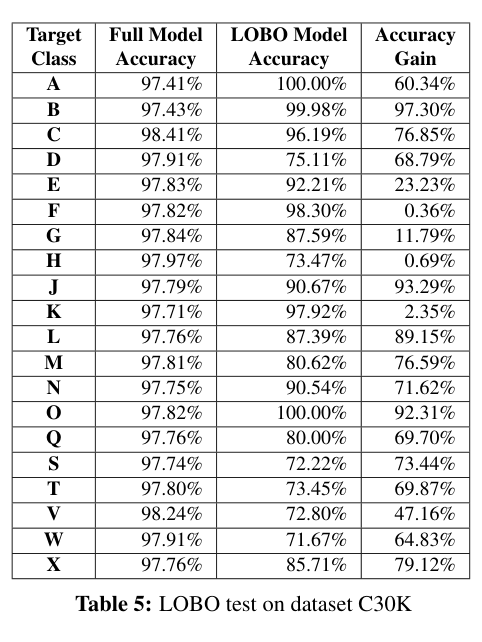

*表 5（LOBO test on dataset C30K，PDF p.7）。原图如实保留；表头与正文定义不一致。*

**表 5 不能按印刷表头直接读取。** 正文定义需要至少“full model 在目标类上的准确率”“LOBO 在完整目标类上的准确率”和二者差值；但印刷表仅有三列数值，且例如 F 行为 97.82%、98.30%、0.36%。正文同时称未见 F 类表现很差，因此 0.36% 显然更像 LOBO accuracy，而不是印刷表头所称 Accuracy Gain。类似地，E 行的 92.21% 与 23.23% 符合 full-target 与 LOBO 的关系。[表 5、§6.3，PDF p.7]

此外，正文报告 C30K 未见类平均准确率 54.88%，但对表 5 最后一列 20 个显示值作未加权均值为 58.44%。没有代码或原始结果时，无法恢复缺失/错位列及平均口径。故表 5 只作定性旁证，不用于精确复现基准。

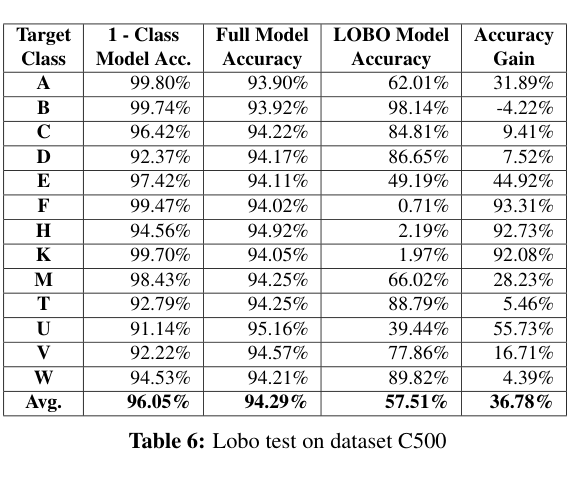

*表 6（Lobo test on dataset C500，PDF p.8）。这是结论最清楚、最关键的结果表。*

| 目标类 | 单类模型 | Full model | LOBO model | Gain（百分点） |
|---|---:|---:|---:|---:|
| A | 99.80% | 93.90% | 62.01% | 31.89 |
| B | 99.74% | 93.92% | 98.14% | -4.22 |
| C | 96.42% | 94.22% | 84.81% | 9.41 |
| D | 92.37% | 94.17% | 86.65% | 7.52 |
| E | 97.42% | 94.11% | 49.19% | 44.92 |
| F | 99.47% | 94.02% | 0.71% | 93.31 |
| H | 94.56% | 94.92% | 2.19% | 92.73 |
| K | 99.70% | 94.05% | 1.97% | 92.08 |
| M | 98.43% | 94.25% | 66.02% | 28.23 |
| T | 92.79% | 94.25% | 88.79% | 5.46 |
| U | 91.14% | 95.16% | 39.44% | 55.73 |
| V | 92.22% | 94.57% | 77.86% | 16.71 |
| W | 94.53% | 94.21% | 89.82% | 4.39 |
| **均值** | **96.05%** | **94.29%** | **57.51%** | **36.78** |

**如何读**：单类模型和 full model 都看过目标家族；LOBO 从未见过它。Full model 的家族均值 94.29%，LOBO 降到 57.51%，平均损失 36.78 个百分点。F/H/K 的 LOBO 分别只有 0.71%/2.19%/1.97%，而 B 为 98.14%，证明“未知家族”不是统一难度。[表 6，PDF p.8]

**支持强度：强支持（样本内）**。平衡家族并重复 100 次后仍有巨大差距，足以推翻“高随机划分准确率必然意味着跨家族泛化”。但它不证明任意未来 botnet 都会有相同均值，也不测 LOBO 部署时的误报。

**标识冲突**：表 1 没有 U；按 `>500` 规则应包含 X。表 6/7 的 U 是否就是 X 无法核验，报告不擅自改名。

### 4.5 Few-shot 适配：平均改善掩盖家族差异

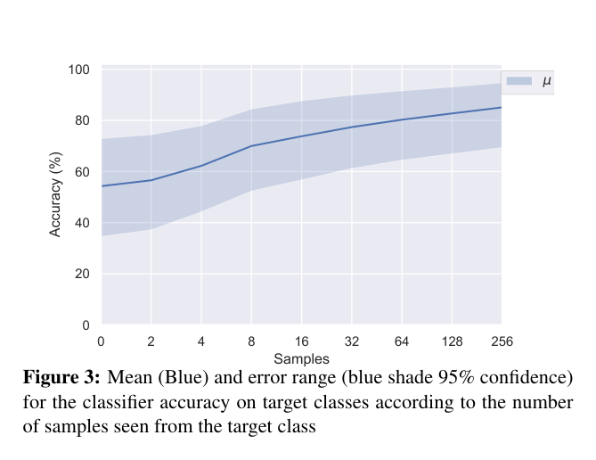

*图 3（Mean and 95% confidence range...，PDF p.8）。横轴为移入训练的目标类样本数，纵轴为目标类 accuracy；蓝线为均值，阴影为论文标注的 95% 区间。*

平均曲线随样本从 0 增至 256 而上升，但阴影很宽，说明跨家族均值不能代表单一家族。论文未说明区间是跨家族还是跨 50 次重采样计算、也未给公式，不能把阴影当作严格可复现的置信区间。

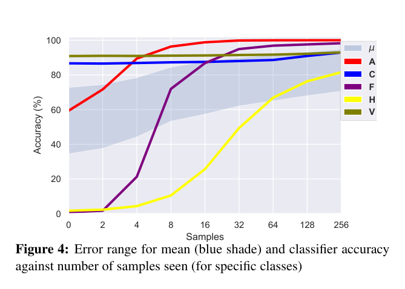

*图 4（specific classes，PDF p.8）。红 A、蓝 C、紫 F、黄 H、橄榄 V；浅蓝阴影复用图 3 的均值区间。*

- A 从 59.4% 快速升至 16 样本时 98.8%；F 从 0.8% 升至 32 样本时 94.9%。
- H 最慢，从 1.7% 到 256 样本时仍只有 81.6%。
- C、V 基线较高但改善小；V 从 80.0% 到 84.3%。
- 图 4 直接反驳“一个统一 few-shot 样本预算足够所有新家族”。[图 4、表 7，PDF pp.8-9]

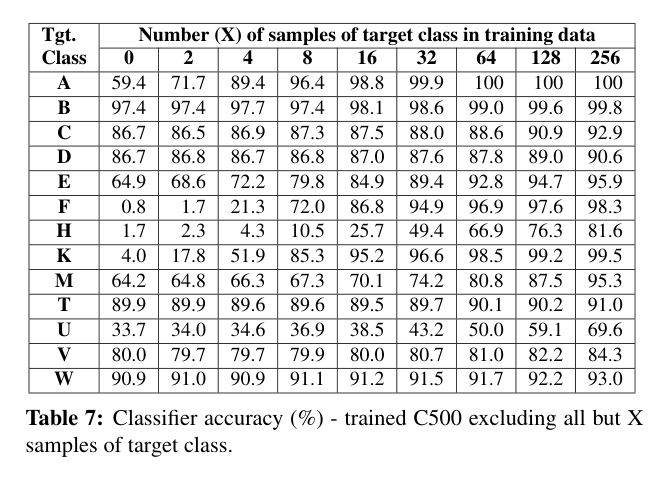

*表 7（Classifier accuracy (%)...，PDF p.9）。九列样本数为 0、2、4、8、16、32、64、128、256。*

表 7 是图 3/4 的数值底稿，含 13 个目标类。关键反例包括：T 在 0-256 样本间仅 89.9%-91.0%，W 为 90.9%-93.0%，D 为 86.7%-90.6%；“加入样本必有明显提升”并不成立。另一方面，K 从 4.0% 经 8 个样本升至 85.3%，A/F 也有跃迁，说明适配速度取决于家族内部一致性及其与既有类的特征距离。[表 7、§7.2，PDF p.9]

**证据边界**：每增加训练样本就从测试集合移走样本，且只固定一个 C500 抽样后重复目标选择；曲线同时受到训练信息增加、测试集缩小和抽样难度变化影响。

### 4.6 t-SNE：解释性旁证，不是泛化证明

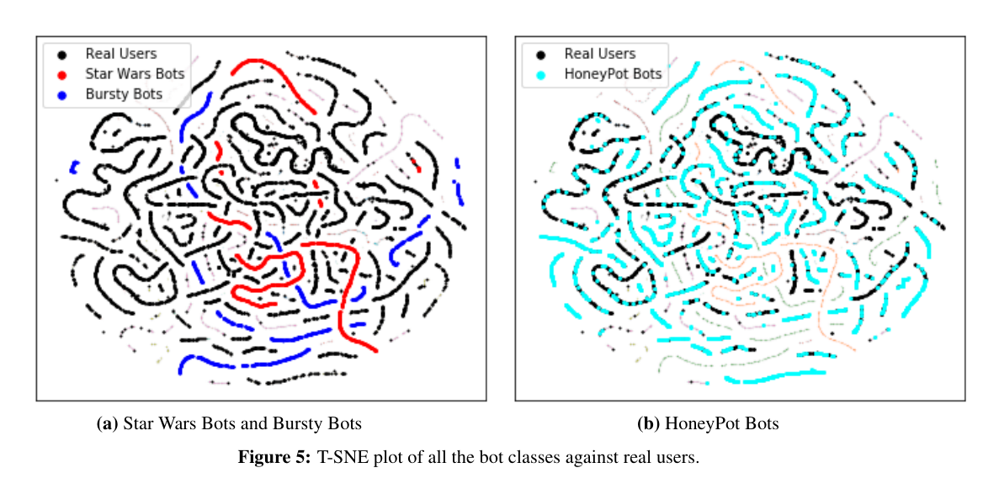

*图 5（T-SNE plot...，PDF p.9）。(a) 黑色真人与红色 Star Wars、蓝色 Bursty；(b) 黑色真人与青色 Honeypot。*

面板 (a) 中 Star Wars 与 Bursty 形成较清晰、较少与黑色真人混合的条带；面板 (b) 中 Honeypot 青色点大量沿真人条带重叠。视觉上它与“有些家族容易、另一些像真人”的解释一致。[图 5、§7.3，PDF p.9]

支持强度仅为**部分支持**：t-SNE 会扭曲全局距离，参数和随机种子未报告，图中还淡绘了其他类却未逐一标注；它不能证明可分性机制，也不能替代原空间分类评估。

### 4.7 稳定性、泄漏与替代解释

- **重采样稳定性**：作者称 C500 目标类中几乎全部 LOBO 标准差低于 4%，例外是 A 的 24% 和 E（Social spambots #1）的 13%。没有逐类原始分布，故为部分支持。[§7.1，PDF p.8]
- **同家族泄漏**：常规 70/30 划分让相同活动模板、创建批次和采集源跨折出现；这是 LOBO 正在诊断的主要问题。
- **跨数据类重复**：论文未说明账户 ID 去重，也未检查同一账户是否出现在多个历史数据集或 BFS user 集；若有重叠，LOBO 仍会泄漏。
- **时间泄漏**：特征使用采集时所有可获取历史；没有按预测时点截断。账户生命周期、删除后 profile count 和收集日期可能携带未来或批次信息。
- **来源混杂**：bot 与 user 的获取管道不同，bot 家族之间的 ground truth 机制也不同。模型可能识别“数据集来源”，不只是机器人行为。
- **标签噪声/幸存偏差**：仅可收集未被暂停且非私密账户；作者承认部分 bot 集有 false positives，user 集也可能有 bots。
- **指标失真**：LOBO 目标集只有正类，accuracy 等于 recall；没有同时测试匹配 users，不能估计 precision、specificity、校准或现实低基率下的告警质量。
- **伪重复**：同一 botnet 内账户高度相关，以账户为独立样本会让区间过窄；更合理的推断单位应是家族/活动。

### 4.8 主张-证据审计

| 核心主张 | 最强证据 | 支持等级 | 最大替代解释 | 最快补强方案 |
|---|---|---|---|---|
| C1 高常规准确率不保证跨家族泛化 | 表 3 vs 表 6 | 强 | 数据来源域偏移而非纯行为族差异 | 去重并按统一采集协议重建多家族数据 |
| C2 LOBO 能稳定刻画未知家族难度 | C500 100 次重复、§7.1 | 部分 | 缺原始方差与分层区间；A/E 波动大 | 发布每次 split 与逐家族 bootstrap CI |
| C3 少量目标样本可快速恢复多数家族 | 图 3/4、表 7 | 部分 | 测试集同步缩小，H/V/T/W 改善有限 | 固定独立 test，逐家族多种子学习曲线 |
| C4 特征空间距离解释家族难度 | 图 5 | 弱 | t-SNE 参数/随机性与视觉选择 | 原空间距离、监督可分性和稳定嵌入检验 |
| C5 LOBO 代理现实未知 bots | 图 2、表 6 | 部分 | 未覆盖平台迁移、时间漂移与未标注未知类 | 加入 leave-platform 和 forward-time 外部测试 |

### 4.9 复现可行性

| 层级 | 可行性 | 可做什么 | 阻断项 |
|---|---|---|---|
| 协议复现 | 高 | 重建 group-held-out split、full/LOBO/gain、few-shot 曲线 | 需自行定义无冲突类 ID |
| 方向性结果复现 | 中 | 用现有多活动数据验证常规分数与组外分数落差 | 原 Twitter 数据老化、暂停/私密、API 政策变化 |
| 数值精确复现 | 低 | 无法保证表 3-7 数值一致 | 无数据快照/代码/依赖/超参数/seed；表内冲突 |

最小复现包应固定：账户去重后的 class manifest、采集时间与标签来源、决策时点截断特征、29/30 维列定义、库版本和参数、随机种子、每次 C500 抽样/划分索引、逐重复预测、区间计算脚本。存储压力主要来自全量 tweets，原实现称达数 TB；profile-only 或按时点聚合特征可先做协议复现。[§8.3，PDF p.10]

## 5. 论文的贡献与影响（Contribution & Impact）

### 5.1 主要贡献

1. **问题层**：把 bot detection 的泛化问题从随机账户测试明确化为未见机器人家族测试。
2. **方法层**：给出可套在任意二分类器上的 LOBO split，不依赖特定模型架构。
3. **证据层**：用 C30K/C500 说明不平衡不是全部原因，并展示显著家族异质性与适配速度差异。

### 5.2 精确迁移到 CogGuard

#### 先纠正构念：账户 bot 分类不等于社区真实性

本论文的观测单位、标签和输出都是**单账户 bot/user**。它没有测量账户之间是否共同控制、是否同步协调、内容是否同源、身份/来源是否虚假、活动是否具有欺骗意图，也没有定义“社区”。因此：

- 多个高 bot-score 账户可能只是公开、良性的自动化服务；
- 多个真人账户也可能实施协调式不真实行为；
- 对社区内账户 bot 概率求均值，会把个体属性错误外推为群体构念，属于生态谬误；
- LOBO 可迁移的是**组级留出评价原则**，不是“bot = 不真实社区”的标签语义。

CogGuard 应把输出定义为社区/活动级的、带证据的真实性或协调表征，例如共同控制迹象、时间同步、内容复用、跨平台迁移和来源一致性；bot score 最多是一项账户层辅助证据。

#### 三条留出轴

| 迁移轴 | 分组单位 | 训练集 | 测试集 | 防泄漏边界 | 主要回答 |
|---|---|---|---|---|---|
| Leave-campaign-out | 独立活动/行动主体 | 其他活动 + 匹配真实社区 | 完整目标活动 + 同期匹配对照 | 账户、内容模板、URL、媒体哈希、转发链均不得跨折 | 未见活动能否发现 |
| Leave-platform-out | 平台 | 其他平台的活动与真实社区 | 完整目标平台 | 只用可跨平台定义的特征；平台 ID/接口字段不得作捷径 | 表征能否跨平台 |
| Forward-time | 时间窗/活动起始时间 | 截止时点前数据 | 未来窗口与新活动 | 所有特征按决策时点截断，禁用未来互动与后验封禁标签 | 能否抵抗概念漂移 |

**精确实验矩阵**

1. **同平台 leave-campaign-out**：固定平台与时间窗，仅留出活动，隔离活动泛化。
2. **leave-platform-out**：在相近时期训练其他平台，目标平台完全不可见，测试跨平台测量等价性。
3. **forward-time known-campaign**：允许旧活动身份但只给过去记录，测行为漂移。
4. **campaign + platform + time 三重留出**：目标活动、目标平台、未来窗口同时未见，作为最强外部有效性测试。

每格同时放入目标社区和匹配真实社区，报告 campaign-macro recall/precision、PR-AUC、FPR、校准、worst-campaign、worst-platform 与时间衰减；置信区间按活动而非账户聚类 bootstrap。常规随机 node/account split 只保留为“内插上限”，不得作为主结论。

#### CogGuard 的最小可行迁移实验

- 选择至少 6 个相互独立活动、2 个平台、2 个时间段；每个活动明确标签来源和共同控制证据。
- 建立实体/内容/URL/媒体哈希跨折去重，所有特征按告警时点截断。
- 使用同一基础模型比较 random-account、leave-campaign、leave-platform、forward-time 四种 split；机制不变，只改变评价域。
- 加入三类关键对照：良性自动化社区、真人但协调不真实活动、非协调低真实性账户集合。
- 若 random-account 很高而 leave-campaign 明显下降，即复现 LOBO 的核心现象；若 bot-score 能区分账户却不能区分上述三类对照，即证明其不具社区真实性构念效度。

### 5.3 不宜直接迁移的内容

- Twitter 专属 profile/API 字段不能无验证地跨平台复用。
- 2018 年 API 可取最多 3,200 tweets 的采集条件不应视为当前可用协议。
- 单一 BFS user 类不适合作为跨平台真实社区基线。
- target-only accuracy 不能作为 CogGuard 告警指标；必须包含真实/困难负例。
- t-SNE 图不能作为真实性或共同控制证据。

### 5.4 下一步研究

1. **论文原生补强**：当前假设是数据类代表未知 bot 行为；破裂点是来源与家族混杂；最小验证是统一采集、统一标签、跨数据集去重后的 LOBO。
2. **跨领域迁移**：当前假设是组留出足以代理现实；破裂点是平台与时间；最小验证是三轴交叉矩阵。
3. **更强证据**：当前区间以账户/重复为主；破裂点是家族内相关；最小验证是 campaign-level bootstrap 与外部活动复现。
4. **实践应用**：当前模型离线使用全历史；破裂点是在线未来泄漏；最小验证是严格 decision-time 特征回放。

## 6. 结论（Conclusion）

LOBO 最重要的贡献不是一个新分类器，而是把“训练和测试是否共享行为家族”变成显式评价变量。C500 中 full model 94.29% 与 LOBO 57.51% 的落差强力证明常规随机划分会高估未知家族能力，但表 5 错位、类 ID 冲突、特征数冲突和实现细节缺失阻碍数值精确复现。对 CogGuard，应该迁移 group-held-out 思想并扩展为 leave-campaign、leave-platform 与 forward-time，而不能把账户 bot 判定当作社区真实性。最值得投入的是协议复现与多轴外部验证，不是追逐论文表中的精确小数。

> **最终判断**：核心评价思想值得复现；原始数值仅宜谨慎引用。  
> **读完应记住的一句话**：随机留账户测内插，整族留出才开始测未知活动。
