# Coordinated Behavior on Social Media in 2019 UK General Election：深度解读

> **作者**：Leonardo Nizzoli, Serena Tardelli, Marco Avvenuti, Stefano Cresci, Maurizio Tesconi  
> **会议/期刊与年份**：ICWSM 2021 论文版本；本地 PDF 首页标识为 arXiv:2008.08370v2，2021-04-01  
> **论文链接**：未在本任务中外部检索；实际使用本地 PDF `nizzoli-et-al-2021-coordinated-behavior.pdf`  
> **实际使用来源**：本地 PDF、12 页文字层、12 页页面图、13 个编号视觉对象裁图  
> **页码约定**：全文均使用 1-based `PDF p.N`  
> **论文类型**：实证/观察/发现论文，兼具网络方法框架论文  
> **学科 Lens**：社会与行为科学为主；计算机科学网络分析为次  
> **读者画像**：research-generalist，目标是判断它对 CogGuard 在 Coordination Discovery 之后的社区级 Authenticity 表征有什么支持  
> **解读目标**：deep understanding + transfer to CogGuard  
> **视觉能力模式**：visual，已直接检查所有编号图表、算法和关键裁图  
> **解读置信度**：中高；论文主文完整、图表已核查，但没有补充材料、官方实现、参数完整性或独立复现实验

## 1. 核心思想一句话总结（Elevator Pitch）

> 用连续协同图谱刻画社群，证据来自 UK GE 转推网络。

## 2. 论文背景与动机（Background & Motivation）

### 2.1 具体问题

论文要解决的问题不是“识别 bot”或“判定社区是否不真实”，而是在社交媒体信息操纵研究中，把协调行为从二元标签扩展成可连续分析的社区级现象。作者指出，information/influence operations 常伴随协调传播，但 coordination 与 inauthenticity 是不同概念：草根行动可以协调但真实，单个假账号可以不真实但不协调；截至作者写作时，尚无成功自动区分真实协调与不真实协调的报告 [Introduction, PDF pp.1-2]。

对 CogGuard 的问题翻译是：Coordination Discovery 发现一组账号或社群后，系统需要生成社区级证据档案，描述它“如何协同、围绕什么议题、结构上像什么、是否伴随自动化线索”，但不能直接把协同强度当作 Authenticity 准确率。

### 2.2 为什么重要

- **现实价值**：二元阈值会把“明显协同”和“弱协同”粗暴切开，容易漏掉小型活动社群或把阈值选择当作实证结论 [Contributions, PDF p.2]。
- **学术价值**：论文把 coordination 操作化为用户行为相似网络中的连续强度，并展示不同社区在协同强度、网络结构、叙事和自动化指标上的差异 [Figure 6-9, PDF pp.8-10]。
- **典型场景**：CogGuard 在跨平台事件中发现一个转发相似度社群后，可以沿本文思路输出“阈值曲线、社区谱系、主题词、自动化指标、暂停账号比例”等描述性字段；Authenticity 仍需额外身份、组织、人工审查或平台处置证据。

### 2.3 论文之前的研究版图

| 路线 | 代表方法 | 有效之处 | 关键局限 | 本文如何回应 |
|---|---|---|---|---|
| 人工 CIB 调查 | 平台或研究者手工审查 | 语境强，能判断身份和意图 | 成本高，难规模化 | 只自动刻画 coordination，不声称自动判断 inauthenticity [PDF pp.1-2] |
| 固定阈值网络法 | Pacheco 等 co-retweet 投影后切边 | 直观，能得到 coordinated/uncoordinated 二元结果 | 阈值任意，丢失连续差异 | 用 multiscale backbone 和移动阈值分析完整协同谱 [Related Work, PDF p.2; Figure 10, PDF p.11] |
| 近同时/重复分享 | Giglietto 等 link-sharing 参数阈值 | 适合特定同步行为 | 仍依赖固定参数 | 把相似度、过滤和社区分析拆成可替换步骤 [Method overview, PDF pp.3-4] |
| bot/自动化检测 | Botometer、账号行为模型 | 可辅助识别自动化线索 | automation 不等于 coordination 或 authenticity | 把 Botometer 和暂停比例作为后验表征而非目标标签 [Figure 9, PDF p.10] |

### 2.4 从痛点到研究问题

> **旧方法依赖固定相似度阈值 → 在多社区、多强度协调中会不均匀丢失信息 → 作者发现用户相似网络的边权分布仍可保留多尺度结构 → 因而提出多尺度过滤加移动阈值社区检测，用连续 coordination extent 描述社群。**

- **作者主张**：本文框架能比二元方法更细粒度地揭示 coordinated communities，并能估计不同社区的特征协同程度 [Contributions, PDF p.2; Conclusions, PDF p.11]。
- **论文直接展示的事实**：在 2019 UK GE Twitter 数据中，作者构建 10,782 个 superspreaders 的 co-retweet 相似网络，过滤后保留 276,775 条边，并展示 7 个可解释社区及其协同曲线 [PDF pp.5-8; Figure 4-7]。
- **本文推断**：该工作可作为 CogGuard 的“协同发现后社区表征”证据模板，但不能作为社区 Authenticity 分类器，因为它没有真实/不真实标签、训练测试协议或社区真实性评估 [Introduction, PDF pp.1-2; Conclusions, PDF p.11]。

## 3. 核心方法/理论/研究设计详解（Core Method, Theory, or Study Design）

### 3.1 总体框架

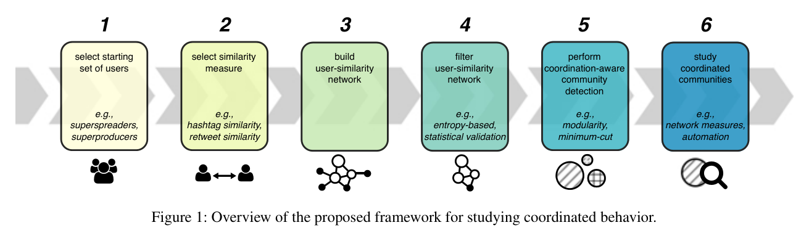

*图1（Overview of the proposed framework for studying coordinated behavior，PDF p.4）。它把研究流程拆成六步：选用户、选相似度、建用户相似网络、过滤网络、执行 coordination-aware community detection、研究协调社区。*

图1最重要的不是图标，而是接口分层：前 3 步生成行为相似网络，步骤 4 决定哪些边有统计意义，步骤 5 把社区检测放到不断提高的相似度阈值上运行，步骤 6 再对社区做网络、文本和自动化表征 [Figure 1, PDF p.4]。这对 CogGuard 的启发是，社区级 Authenticity 不应在发现阶段被提前写死；系统应先保留“这个社区为什么被发现”的证据链，再接入真实性、身份欺骗、危害性和归因证据。

### 3.2 核心流程或论证链

以两个用户 A、B 为例：如果他们都转发了很多普通热门内容，相似性不一定可疑；如果他们共同转发了少数不那么流行的 tweet，TF-IDF 会提高这些共同行为的权重，cosine similarity 会使 A、B 在用户相似网络中形成较强边 [User similarity network, PDF p.5]。论文流程如下：

1. **起点**：2019-11-12 至 2019-12-12 的 UK General Election Twitter 数据，包含 hashtag 采集、官方账号及互动、quoted retweets，总计 11,264,820 tweets 和 1,179,659 distinct users [Dataset, PDF p.3]。
2. **选择研究对象**：作者只分析 retweets 数最高的 top 1% superspreaders，共 10,782 users；这些用户发布 39% tweets 和 44.2% retweets [PDF p.5]。
3. **构建表示**：每个 superspreader 用其 retweeted tweet IDs 的 TF-IDF 向量表示；TF-IDF 的目的在于降低高流行 tweet 权重，提高罕见共转发的解释价值 [PDF p.5]。
4. **建图与过滤**：用 cosine similarity 生成加权无向用户相似网络 `G(E,V,W)`，再用 Serrano 等 multiscale backbone 方法保留统计相关边，得到 276,775 edges [PDF p.5; Figure 2-3]。
5. **移动阈值社区检测**：先在过滤网络上运行 Louvain，再随阈值 `t_i` 增加移除较弱边和孤立点，以上一轮社区初始化下一轮社区检测，从而追踪社区结构随 coordination extent 的变化 [Algorithm 1, PDF p.5]。
6. **社区表征**：对不同 coordination levels 下的社区计算规模、density、clustering coefficient、assortativity、word shift、Botometer 均值和 suspended accounts 比例 [Figure 6-9, PDF pp.8-10]。

### 3.3 关键步骤、组件或概念

#### 3.3.1 Superspreader 抽样

- **解决的问题**：全量 1.18M 用户太大，且作者更关心信息传播中影响更大的账号。
- **输入/前提与产出**：按 retweets 数选择 top 1%，得到 10,782 users；这些用户覆盖 39% tweets 和 44.2% retweets [PDF p.5]。
- **关键假设**：高 retweet 传播者更可能体现选举讨论中的协调传播结构。
- **风险**：该样本不是普通用户或选民总体；社区结构可能是高活跃传播者的结构，而非全平台结构。
- **对 CogGuard 的接口**：必须记录采样规则。若 CogGuard 改用高发帖者、跨平台账号或全量用户，不能直接复用本文数值阈值。

#### 3.3.2 Co-retweet TF-IDF 相似度

- **解决的问题**：直接统计共同转发会被热门 tweet 主导。
- **内部机制**：用户向量的维度是 retweeted tweet IDs；TF-IDF 降低流行内容权重，提高共同转发冷门内容的信号 [PDF p.5]。
- **产出**：weighted undirected user similarity network `G(E,V,W)`，边权 `w(e)` 表示行为相似度。
- **风险**：它只捕捉 co-retweet coordination，不覆盖同步发帖、共同 hashtag、跨平台扩散、身份伪装或内容原创策略。

#### 3.3.3 多尺度骨干过滤

- **Before**：固定 edge-weight threshold，例如 0.9，直接把低于阈值的边删掉 [Related Work, PDF p.2; Figure 10, PDF p.11]。
- **After**：使用 multiscale filtering 保留不同尺度上 statistically meaningful 的网络结构 [Method overview, PDF p.4; Figure 3, PDF p.6]。
- **Diff**：从“阈值越高越 coordinated”改为“先保留多尺度有意义结构，再在社区检测中分析协同强度”。
- **Trade-off**：减少阈值任意性，但论文没有报告 backbone 显著性参数、软件版本和完整复现设置，方法复现需要补充实现决策。

#### 3.3.4 Coordination-aware community detection

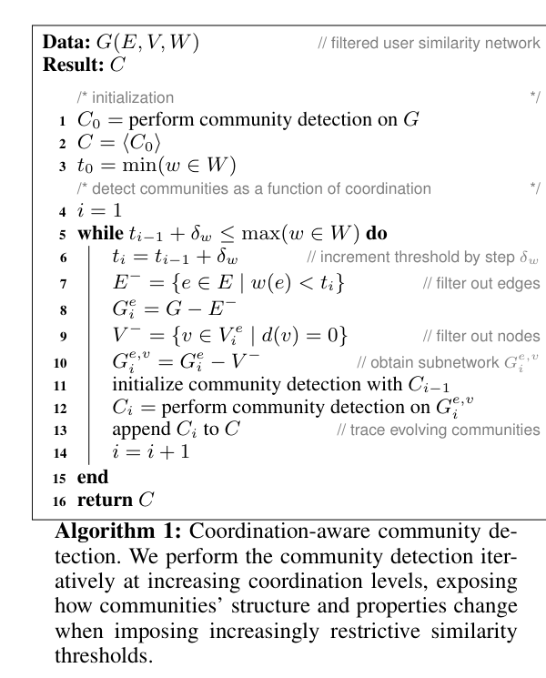

*算法1（Coordination-aware community detection，PDF p.5）。该算法从过滤网络开始，随 edge-weight threshold 增加反复移除弱边和孤立点，并用上一轮社区初始化下一轮 Louvain。*

算法1的核心是把社区检测从一次性操作变成一条阈值轨迹。`C0` 是初始过滤网络上的社区，`t0 = min(w in W)`，每次用步长 `delta_w` 提高阈值，删去 `w(e) < t_i` 的边和度为 0 的节点，再用 `C_{i-1}` 初始化社区检测 [Algorithm 1, PDF p.5]。论文没有给出 `delta_w` 的数值，也没有说明社区拆分、合并和谱系命名如何完全自动处理，因此 CogGuard 若复现，需把阈值步长、随机种子、Louvain resolution 和社区 lineage 规则显式固化。

#### 3.3.5 社区表征而非真实性判定

步骤 6 只研究 coordinated communities：规模曲线、网络指标、词汇叙事和自动化线索 [Figure 6-9, PDF pp.8-10]。这些是“社区画像字段”，不是 Authenticity 标签。尤其 Figure 9 只把 Botometer 和 Twitter suspension 当成 possible automation or inauthenticity indicators，不能推出社区就是不真实、恶意或归属于某组织。

### 3.4 关键形式化内容

#### 操作性定义 1：用户相似网络

**来源**：Method overview Step 3 与 UK GE implementation，PDF pp.4-5。

论文把用户相似网络写作 `G(E,V,W)`，其中 `V` 是被分析用户，`E` 是用户之间的相似边，`W` 是边权集合。对于本案例，用户向量是 TF-IDF weighted retweeted tweet IDs，用户相似度用 cosine similarity 计算 [PDF p.5]。可写成下列等价重构：

$$
w(u,v)=\frac{x_u \cdot x_v}{\|x_u\|\,\|x_v\|}
$$

- `x_u`：用户 `u` 的 retweeted tweet ID TF-IDF 向量。
- `w(u,v)`：两个用户在共同转发内容上的行为相似度。
- **最小例子**：若 A、B 共同转发一个冷门 tweet，而 C 只共同转发热门 tweet，TF-IDF 会让 A-B 的边更可能被认为有信息量。
- **边界**：这是对论文文字的数学化重构，论文没有给出编号公式；它不能捕捉非转发行文、时间同步、跨平台身份或真实/不真实意图。

#### 操作性定义 2：coordination extent

**来源**：Analysis of coordinated behaviors，PDF p.8。

作者把某次迭代子网络的 coordination extent 定义为该次 moving threshold 在过滤网络边权分布中的 percentile rank。论文给出例子：degree of coordination = 0.9 意味着子网络只包含整体过滤网络中 top-10% strongest edges [PDF p.8]。

这个定义的直觉是“越往右，保留的边越强，社区成员之间行为相似越高”。但它是相对于本图边权分布的秩，不是跨数据集可比的概率，也不是 Authenticity 或 harmfulness 分数。

#### 操作性定义 3：网络指标

**来源**：Network measures，PDF pp.8-9。

论文用三类标准网络指标表征每个协调社区随 coordination extent 的变化：density 衡量实际连接占所有可能连接的比例；clustering coefficient 反映局部三角闭合；assortativity 衡量高度节点是否连接其他高度节点 [Figure 7, PDF p.9]。这些指标支持的是结构模式解释，例如“hub-and-spoke”或“peer clique”，不是身份真实性结论。

### 3.5 核心创新

1. **连续 coordination 而非二元标签**：把阈值从最终分类边界转成分析轨迹，因此可以看到社区在不同协同强度下的规模和结构变化 [Contributions, PDF p.2; Figure 6-7]。
2. **多尺度过滤加移动阈值**：先用 backbone 避免固定阈值剪掉几乎全部网络，再用算法1跟踪社区 [Figure 3, PDF p.6; Algorithm 1, PDF p.5]。
3. **社区级多维画像**：将网络结构、hashtag clouds、word shift、Botometer 和 suspension 放在同一 coordination axis 下分析 [Figure 5-9, PDF pp.7-10]。
4. **明确边界**：论文承认仍不能区分 authentic coordinated behaviors 与 inauthentic coordinated behaviors [Conclusions, PDF p.11]。

## 4. 证据与结果分析（Evidence & Results）

### 4.1 研究设计与证据协议

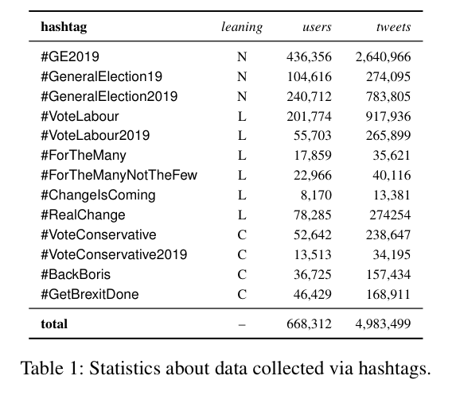

*表1（Statistics about data collected via hashtags，PDF p.3）。它列出 13 个采集 hashtag、政治倾向、users 和 tweets；总计 668,312 users 与 4,983,499 tweets。*

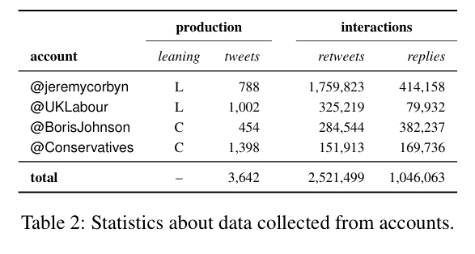

*表2（Statistics about data collected from accounts，PDF p.3）。它列出 @jeremycorbyn、@UKLabour、@BorisJohnson、@Conservatives 的 tweets、retweets 和 replies；合计 3,642 tweets、2,521,499 retweets、1,046,063 replies。*

- **研究对象与材料**：2019 UK GE 期间 Twitter 流数据，采集窗口为 2019-11-12 至 2019-12-12；最终数据含 11,264,820 tweets 和 1,179,659 distinct users [Dataset, PDF p.3]。
- **选择规则**：分析对象不是全体用户，而是 retweets 数 top 1% superspreaders，共 10,782 users [PDF p.5]。
- **测量与评价**：coordination 用 co-retweet TF-IDF cosine similarity 与 percentile-rank moving threshold 操作化；政治倾向从 seeded hashtag label propagation 得到；自动化用 Botometer scores 和 suspended accounts 作为辅助指标 [PDF pp.5,8,10]。
- **对照与比较**：主要比较对象是固定 edge-weight thresholds 0.5、0.7、0.9 的二元切边方法 [Figure 10, PDF p.11]。
- **不确定性协议**：论文没有报告置信区间、重复运行方差、Louvain 随机性、backbone 参数敏感性、Botometer 缺失分析或人工标注一致性。这是结果可复核性的主要弱点。

### 4.2 全量图表覆盖清单

| 编号 | 页码 | 作用 | 关键？ | 报告位置 | 处理说明 |
|---|---:|---|:---:|---|---|
| 表1 | PDF p.3 | hashtag 数据来源与规模 | 是 | §4.1 | 已检查列名、13 行 hashtag、total 和 caption |
| 表2 | PDF p.3 | 官方账号及互动数据规模 | 是 | §4.1 | 已检查 production/interactions 分组列、4 个账号和 total |
| 图1 | PDF p.4 | 六步总体框架 | 是 | §3.1 | 已检查六个阶段、箭头、示例和 caption |
| 算法1 | PDF p.5 | 移动阈值社区检测 | 是 | §3.3.4 | 使用 reviewed crop，已检查 Data/Result、1-16 行和 caption |
| 图2 | PDF p.5 | 过滤后的用户相似网络与政治倾向 | 是 | §4.3 | 已检查网络、Labour-Conservative 色标和 caption |
| 图3 | PDF p.6 | 过滤前后边权 CCDF 与固定阈值对比 | 是 | §4.3 | 已检查坐标轴、log inset、filtered/unfiltered 图例和 0.9 阈值线 |
| 图4 | PDF p.7 | 七个协调社区和强度色阶 | 是 | §4.3 | 使用 reviewed crop，已检查七类标签、强弱色阶和 caption |
| 图5 | PDF p.7 | 各社区 TF-IDF hashtag clouds | 是 | §4.3 | 已检查 (a)-(g)、社区标签和 polarity 色点 |
| 图6 | PDF p.8 | 社区规模随 coordination 变化 | 是 | §4.3 | 已检查 size 与 size(%) 两面板、图例和轴 |
| 图7 | PDF p.9 | density、clustering、assortativity 曲线 | 是 | §4.3 | 已检查三面板、零线、图例和坐标轴 |
| 图8 | PDF p.9 | B60/LCH word shift 叙事差异 | 是 | §4.3 | 使用 reviewed crop，已检查两面板、rank、shift(%), text-size keys 和词项 |
| 图9 | PDF p.10 | coordination 与 automation/suspension | 是 | §4.3 | 已检查 Botometer 与 suspended 两面板、图例和轴 |
| 图10 | PDF p.11 | 固定阈值 0.5/0.7/0.9 对比 | 是 | §4.4 | 已检查三面板、社区颜色图例和 caption |

### 4.3 核心证据与主结果

#### 图2和图3：网络构建与过滤是否保留了多尺度结构

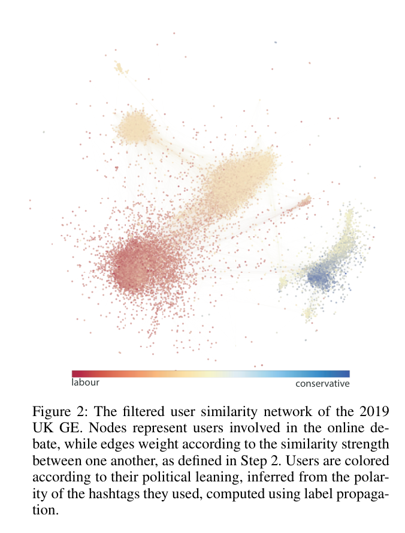

*图2（The filtered user similarity network of the 2019 UK GE，PDF p.5）。节点是用户，边权是步骤2定义的相似度，颜色表示由 hashtag polarity 推断的政治倾向。*

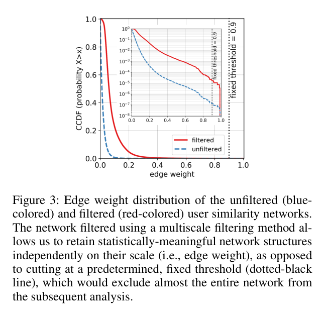

*图3（Edge weight distribution of the unfiltered and filtered user similarity networks，PDF p.6）。红线为 filtered network，蓝虚线为 unfiltered network，黑色虚线标出 fixed threshold = 0.9。*

图2显示过滤后网络仍有多个大社区和小社区，Labour 端红色、Conservative 端蓝色、Neutral 黄色在空间上分离，论文把这种分离解释为网络结构与政治倾向的 sanity check [Network interpretation, PDF p.6]。图3更关键：固定 0.9 阈值会切掉几乎全部网络，而 multiscale filtering 后的红线在较宽 edge weight 范围内保留尾部结构 [Figure 3, PDF p.6]。

**支持强度**：对“固定阈值会损失大量信息”是强支持；对“政治解释准确”是部分支持，因为政治倾向由 seeded hashtag propagation 得到，没有独立人工验证。

#### 图4和图5：七个社区可解释，但解释是后验表征

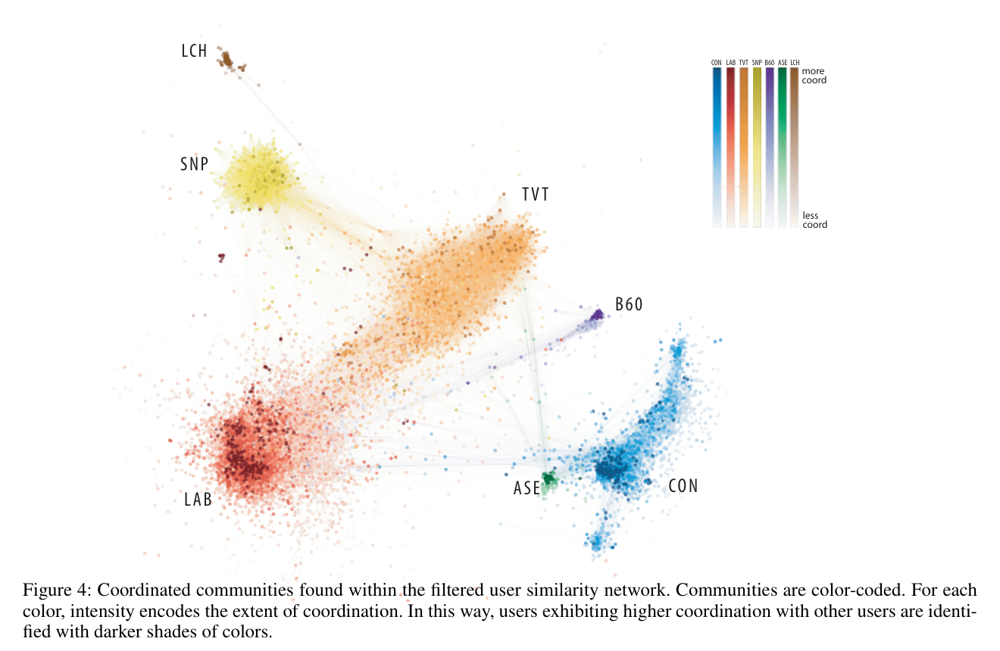

*图4（Coordinated communities found within the filtered user similarity network，PDF p.7）。颜色区分 CON、LAB、TVT、SNP、B60、ASE、LCH，深色表示更高 coordination。*

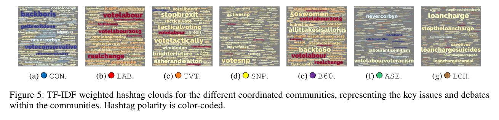

*图5（TF-IDF weighted hashtag clouds for the different coordinated communities，PDF p.7）。七个面板展示各社区主要 hashtag，hashtag polarity 以颜色编码。*

作者在正文中将七个社区解释为：CON、LAB、TVT、SNP、B60、ASE、LCH [PDF pp.6-7]。图5视觉上支持这些解释：CON 面板突出 backboris、getbrexitdone、voteconservative；LAB 面板突出 votelabour、realchange、forthemany；TVT 面板突出 tacticalvoting、stopbrexit；SNP 面板突出 votesnp、indyref2020；B60 突出 50swomen、backto60；ASE 突出 nevercorbyn、labourantisemitism；LCH 突出 loancharge、stoptheloancharge、loanchargesuicides [Figure 5, PDF p.7]。

**支持强度**：对“社区具有政治或议题可解释性”是部分支持。图4/5提供网络与文本一致的描述性证据，但社区命名是作者后验解释，没有独立标注者、真实性标签或组织归属验证。

#### 图6和图7：不同社区的协调强度曲线不同

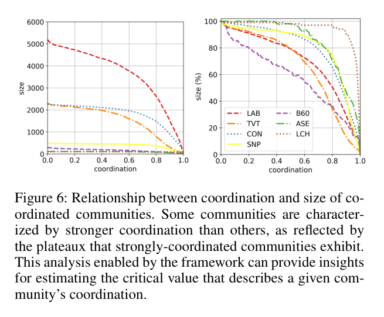

*图6（Relationship between coordination and size of coordinated communities，PDF p.8）。左面板显示绝对 size，右面板显示社区内保留比例。*

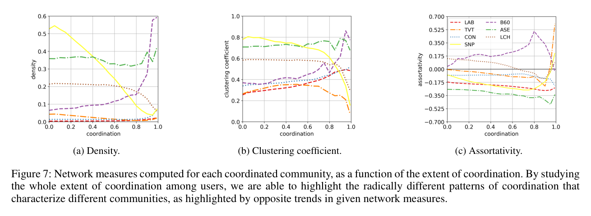

*图7（Network measures computed for each coordinated community，PDF p.9）。三面板分别为 density、clustering coefficient、assortativity。*

图6是论文最能支持“非二元 coordination”的证据。作者报告 LCH 在较高 coordination 值前有长平台，因此可用约 0.9 描述；ASE 可用约 0.55 描述；LAB、TVT、B60 等在谱上下降方式不同 [PDF p.8]。图7进一步显示 B60 在 coordination 接近 0.8 处 density、clustering 和 assortativity 明显升高；作者据此说 B60 更像互相连接的 coordinated peers，而 ASE/LAB 的 disassortative 结构更像少数 hub 支持许多低度节点 [PDF p.9]。

**支持强度**：对“不同社区不能用一个统一固定阈值描述”是强支持。对“某社区组织性更强”的机制解释是部分支持，因为这些曲线是描述性、嵌套子网派生结果，没有置信区间或反事实验证。

#### 图8：强协同用户的叙事更具体

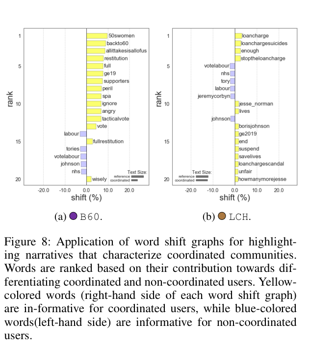

*图8（Application of word shift graphs for highlighting narratives that characterize coordinated communities，PDF p.9）。黄色右侧词项更能区分 strongly coordinated users，蓝色左侧词项更能区分 non-coordinated users。*

图8只展示 B60 和 LCH 两个社区。B60 的强协同侧出现 50swomen、backto60、alltakesisallofus、restitution 等词；LCH 的强协同侧出现 loancharge、loanchargesuicides、stoptheloancharge、savlives 等词。作者解释为：强协调用户比同社区其他用户使用更具体的 campaign narratives，而非仅泛泛讨论 Labour 话题 [Themes and narratives, PDF pp.9-10]。

**支持强度**：部分支持。图8提供具体文本差异，但只展示两个社区，阈值来自前述探索性分析，没有报告重采样稳定性、文本预处理细节或人工主题验证。

#### 图9：coordination 与 automation 不应混同

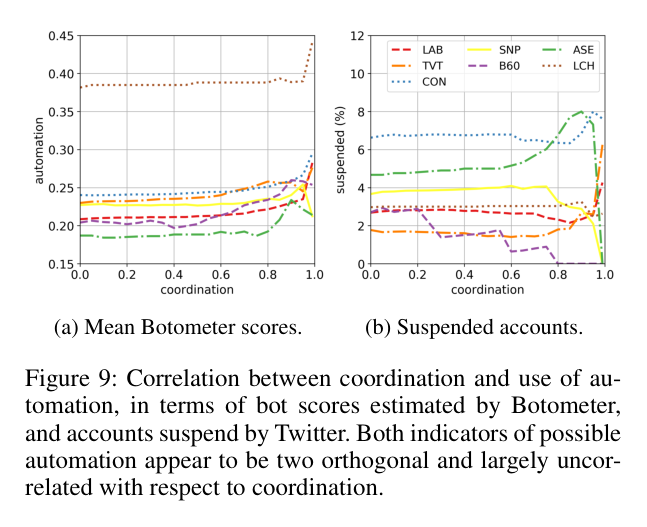

*图9（Correlation between coordination and use of automation，PDF p.10）。左面板为 mean Botometer scores，右面板为 suspended accounts (%)。*

作者使用 Botometer English/universal scores 的最大值作为 automation score，并把 Twitter suspensions 作为 possible automation or inauthenticity indicator [Use of automation, PDF p.10]。图9中，多数社区的 Botometer 均值随 coordination 没有一致单调变化；LCH 整体 automation score 更高，CON/ASE 的 suspended accounts 较高，B60 suspended accounts 随 coordination 下降。作者据此说 coordination 与 automation 基本正交 [Figure 9, PDF p.10]。

**支持强度**：部分支持。图9足以说明“在这个案例中不能用 bot 指标替代 coordination”，但论文没有给出相关系数、显著性、置信区间、Botometer 缺失率或 suspend 原因，因此不能推出普遍正交，更不能推出 authenticity。

### 4.4 对照、消融、稳健性或反例

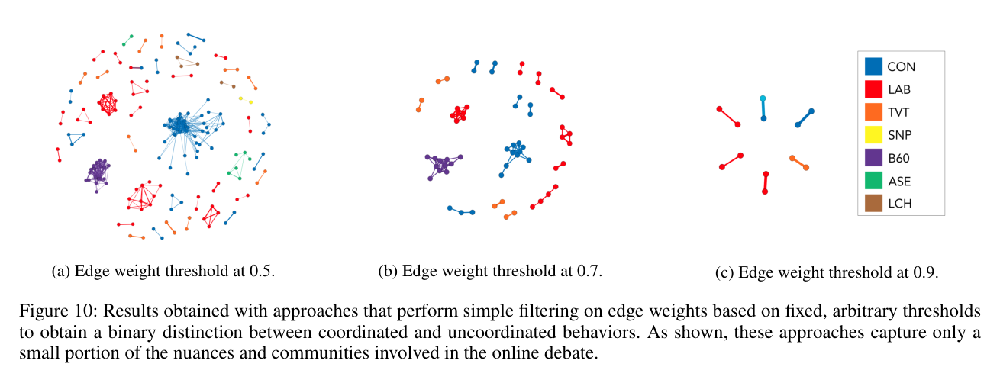

*图10（Results obtained with fixed edge-weight thresholds，PDF p.11）。三个面板分别展示 edge weight threshold 0.5、0.7、0.9 的二元切边结果。*

图10是论文对固定阈值方法的直接反例。作者按 Pacheco 等相似 co-retweet 分析中的 0.9 阈值执行严格切边，结果只有 6 条边满足条件 [Comparative evaluation, PDF p.10]。图10视觉上也显示：阈值从 0.5 到 0.9 提高时，保留网络急剧收缩，并且各社区收缩不均匀；CON 在低阈值下扩张明显，而 B60 或 LAB 的变化方式不同 [Figure 10, PDF p.11]。

**真正证明了什么**：固定阈值会在该 co-retweet 相似网络上产生高度敏感且社区不均匀的结果。  
**仍有替代解释**：这不证明 multiscale backbone 是唯一合理方法，也不证明作者的阈值步长、Louvain 设置和社区谱系就是最优。  
**最小补强**：对 backbone 参数、Louvain resolution、随机种子、similarity measure、用户抽样规则做敏感性分析，并报告社区曲线稳定性。

### 4.5 定性证据、失败案例与边界

论文的定性证据主要来自图5 hashtag clouds、图8 word shift graphs 和正文社区解释 [PDF pp.6-10]。这些证据能帮助读者理解社区围绕哪些话题协同，但存在三类边界：

- **选择性展示**：图8只展示 B60 与 LCH，未展示所有社区的 word shift，也没有失败案例。
- **解释性后验**：CON、LAB、TVT、SNP、B60、ASE、LCH 的命名与政治含义来自作者解释和可见 hashtag，不是独立标注或因果识别。
- **概念边界**：coordination、automation/bot evidence、authenticity/identity deception、harmfulness、attribution 是不同层。本文对 coordination 有较强操作化，对 automation 只做辅助比较，对 authenticity 明确没有完成自动区分，对 harmfulness 和 attribution 基本不作实证判定。

### 4.6 主张-证据审计

| 核心主张 | 最强证据 | 支持等级 | 最大替代解释 | 最快证伪/补强方案 |
|---|---|---|---|---|
| C1: coordination 应按连续强度分析，而非只做二元标签 | 图6、图10、算法1 | 强支持 | 连续曲线可能依赖特定相似度和过滤参数 | 在多事件、多 similarity measures 下复现曲线稳定性 |
| C2: 2019 UK GE case study 的高传播者样本覆盖大量转推活动 | 表1、表2、PDF p.5 的 10,782/39%/44.2% | 强支持 | 高传播者不代表普通用户 | 报告全体用户与 superspreader 子样本的结构差异 |
| C3: TF-IDF co-retweet + multiscale backbone + Louvain 形成可复用 handoff | 图1、算法1、图2-3 | 部分支持 | 关键参数未报告完整，复现可能不稳定 | 固化参数、代码、随机种子和社区谱系规则 |
| C4: 七个社区具有政治和议题可解释性 | 图4、图5、正文社区解释 | 部分支持 | hashtag polarity 与作者解释可能有偏 | 独立标注社区议题和政治倾向，报告一致性 |
| C5: 不同社区有不同特征协同强度 | 图6、图7、图10 | 强支持 | elbow 判断探索性强 | 用预注册阈值选择、bootstrap 和新事件重复验证 |
| C6: density、clustering 和 assortativity 揭示社区随协同强度变化的不同结构模式 | 图7 | 部分支持 | 描述性曲线没有不确定性或跨事件复现 | 对窗口、阈值、Louvain seed 和新事件做 bootstrap/敏感性分析 |
| C7: 强协调用户叙事更具体 | 图8 | 部分支持 | 只展示两个社区，文本预处理不透明 | 对所有社区做同一 word shift/主题模型稳定性检查 |
| C8: coordination 与 automation largely orthogonal | 图9 | 部分支持 | 没有相关系数和不确定性，Botometer/suspension 有测量误差 | 报告相关、置信区间、缺失率和人工账号类型核验 |
| C9: 论文声明数据以 DOI 10.5281/zenodo.4647893 公开 | Data Availability、表1-2 | 部分支持 | 本精读未独立核验当前载荷和许可状态 | 单独访问 DOI、核对文件清单、校验和与许可 |
| C10: 本文不是 supervised community-authenticity detection | Introduction、Figure 9、Conclusions | 强支持 | 无 authenticity 标签、训练/测试协议或准确率 | 增加独立真实性 Gold 与 held-domain 评估 |
| C11: 对 CogGuard 可迁移的是 provenance-rich community dossier | 图1、算法1、图6-9 | 部分支持（本文推断） | dossier 到四状态判决尚无训练或验证证据 | 在冻结 Discovery 输出上比较透明聚合、MIL 和 selective abstention |

### 4.7 可靠性、复现性与争议点

- **最可信的结论**：固定阈值会遮蔽多社区、多强度 coordination；本文框架能输出更丰富的社区表征 [Figure 6-10, PDF pp.8-11]。
- **最弱或最可能被高估的结论**：coordination 与 automation “orthogonal” 的普遍性。本文只给可视曲线，没有统计检验或跨数据集验证 [Figure 9, PDF p.10]。
- **协议公平性**：固定阈值对比是有力直观反例，但不是完整方法学基准；0.9 来自相近工作，0.5/0.7 是示例阈值 [Comparative evaluation, PDF pp.10-11]。
- **复现缺口**：缺少 backbone 显著性参数、`delta_w`、Louvain 随机种子、软件版本、Botometer 调用时间和缺失处理。
- **伦理与治理**：论文使用公开 Twitter 数据并发布研究数据 DOI，但主文没有详细讨论隐私、hydration 后可得性、删除用户保护或双重用途风险 [Dataset, PDF p.3]。
- **总体可信度**：中高，适合借鉴为发现后表征框架；不适合作为真实性、危害性或归因的直接判断依据。

## 5. 论文的贡献与影响（Contribution & Impact）

### 5.1 主要贡献

1. **问题层贡献**：将 coordination 从二元检测问题改写为连续谱分析问题，明确与 inauthenticity 分离 [Introduction and Contributions, PDF pp.1-2]。
2. **方法层贡献**：提出六步网络框架和 coordination-aware community detection，使社区结构可随阈值轨迹观察 [Figure 1, Algorithm 1, PDF pp.4-5]。
3. **证据层贡献**：在 2019 UK GE 数据上展示七个社区、社区强度曲线、结构指标、叙事差异和自动化指标对照 [Figure 4-9, PDF pp.7-10]。

### 5.2 对 CogGuard 的影响

对 CogGuard 最有价值的迁移单元不是“检测不真实社区”，而是一个 provenance-rich community characterization dossier：

- **Coordination evidence**：用户集合、相似度定义、边权分布、过滤规则、社区谱系和 coordination extent 曲线。
- **Content evidence**：社区 hashtag cloud、word shift、叙事主题和是否只出现在强协同子群。
- **Automation evidence**：Botometer 类指标、平台 suspension 类指标，但只作为辅助线索。
- **Authenticity boundary**：默认不设置真实性结论，除非有独立 identity deception、组织控制、平台处置或人工审查证据。
- **Harmfulness and attribution boundary**：议题攻击性、政治倾向或组织性不等于危害性；社区话题也不等于幕后归因。

### 5.3 值得探索的未来方向

1. **未来方向：社区真实性标签**
   - 当前假设：coordination 只提供候选和表征。
   - 破裂点：下游用户可能误把强协同当作不真实。
   - 新问题：怎样用独立证据标注 community-level Authenticity。
   - 最小验证：对若干已知平台处置或人工审查案例，比较 coordination 特征是否提升真实性分类。

2. **未来方向：跨平台与多行为相似度**
   - 当前假设：co-retweet similarity 足以刻画该 Twitter 事件。
   - 破裂点：CogGuard 需要处理微博、新闻、转发、评论、时间同步和内容复写。
   - 新问题：不同 similarity measures 的社区谱系是否一致。
   - 最小验证：在同一事件上并行运行 co-retweet、co-hashtag、time-window、semantic similarity，并报告谱系稳定性。

3. **未来方向：参数敏感性与可复现包**
   - 当前假设：multiscale backbone 与 Louvain 轨迹给出稳定结果。
   - 破裂点：未报告参数或随机性可能改变社区。
   - 新问题：哪些参数真正影响社区级结论。
   - 最小验证：公开代码、随机种子、阈值步长，做 backbone、resolution、sampling 和 edge definition 消融。

4. **未来方向：叙事、危害性和归因分层**
   - 当前假设：hashtag/word shift 可描述内容。
   - 破裂点：内容主题可能被误读为危害性或幕后主体。
   - 新问题：如何把 narrative specificity、harmfulness、attribution 分成可审计的不同证据栏。
   - 最小验证：为每个社区分别输出协调证据、内容证据、危害证据和归因证据，并要求每栏有独立来源。

## 6. 结论（Conclusion）

这篇论文最可靠的价值是把 coordinated behavior 从二元阈值检测改造成社区级连续谱分析，并在 2019 UK GE co-retweet 网络上展示了为什么统一固定阈值会丢失社区差异。它对 CogGuard 的直接贡献是提供 Coordination Discovery 之后的社区表征模板：记录相似度来源、网络过滤、阈值轨迹、结构指标、叙事和自动化线索。它不能支持“协同社区就是不真实社区”，也不能支持社区 Authenticity 分类准确率，因为论文没有真实性标签、因果识别、危害判定或归因验证。

> **最终判断**：有条件借鉴，适合作为 CogGuard 社区级协同表征与证据交接框架，不适合作为 Authenticity 判定器。
>
> **读完应记住的一句话**：本文把“谁一起动”讲清楚，但没有证明“谁是假装的”。
