# The False positive problem of automatic bot detection in social science research：深度解读

> **作者**：Adrian Rauchfleisch；Jonas Kaiser  
> **期刊与年份**：PLOS ONE 15(10): e0241045，2020，Version of Record  
> **论文链接**：https://doi.org/10.1371/journal.pone.0241045  
> **实际使用来源**：[本地 PDF](../../sources/rauchfleisch-kaiser-2020-false-positive.pdf)；PLOS 官方 S1-S5 DOCX；Harvard Dataverse v3.1 的 README 与 R scripts（https://doi.org/10.7910/DVN/XVCKRS）  
> **页码约定**：`PDF p.N` 为本地 PDF 从 1 开始的文件页码；补充图 S1-S5 为独立官方 DOCX，其标题亦列于 PDF p.17  
> **论文类型**：实证/观察型测量审计  
> **学科 Lens**：社会与行为科学（主）；计算机科学与 AI 测量（次）  
> **读者画像**：research-generalist  
> **解读目标**：复现，并迁移到 CogGuard 的 community-level authenticity characterization  
> **视觉能力模式**：visual；已逐一核查 8 幅正文图、5 张正文表和 5 幅补充图  
> **解读置信度**：高（论文、补充图、代码和数据记录均可核查）；未实际重跑 R 数值分析

## 1. 核心思想一句话总结（Elevator Pitch）

> **论文用跨语言三月重复测量证明 Botometer 阈值会产生大量误判。**

## 2. 论文背景与动机（Background & Motivation）

### 2.1 具体问题

论文审计的是一个测量链条：研究者把 Twitter 账户提交给 Botometer，得到 `0-1` 的 score 或 complete automation probability（CAP），再选一个阈值把连续分数二值化为 bot/human，最后据此估计某个讨论中的 bot 数量。问题不只是 classifier 能否排序 bot 与 human，而是这个排序在新总体、不同语言和不同日期上能否支持阈值后的实质结论。[论文 Introduction，PDF pp.1-3]

作者提出四个 research questions：五组账户上的总体 diagnostic ability（RQ1）、按 Twitter 假设总体比例计算的 precision/recall（RQ2）、语言差异（RQ3）、三个月内分类稳定性（RQ4）。[论文 Research questions，PDF pp.3-4]

这里必须先区分三个构念：

- **automation**：账户行为是否由软件自动执行，是本文标签的目标。
- **account authenticity**：账户是否如实代表其身份、控制者和行为来源；自动但公开声明的 bot 可以是“真实披露的自动账户”。
- **community authenticity**：一组账户是否存在隐藏协同、身份欺骗、操纵性组织或虚假草根动员；它需要关系和群体层证据，不能由单账户 automation score 定义。

因此，本文直接审计的是第一层测量，讨论触及第二、三层风险，但没有构建 community-level Gold。

### 2.2 为什么重要

- **现实价值**：在低 prevalence 总体中，少量 false-positive rate 会转化为大量被错误指控的真人；错误标签还会污染 bot prevalence、传播影响和 disinformation attribution。
- **学术价值**：论文把“测试集 AUC 高”与“特定总体中阈值可用”分开，展示 measurement transport、base-rate dependence 和 temporal reliability 是三个独立问题。
- **对 CogGuard 的典型场景**：一个社区中 85% 是真人、15% 是 bot。即使账户级模型能较好排序，若其 false-positive rate 对新语言、时间或账户类型漂移，社区级聚合会把系统误差放大为“该社区不真实”的错误结论。

### 2.3 论文之前的研究版图

| 路线 | 代表方法 | 有效之处 | 关键局限 | 本文如何回应 |
|---|---|---|---|---|
| 单账户 supervised classifier | Botometer/BotOrNot | API 易用，给出连续 score，可大规模执行 | 训练覆盖、语言、概念漂移和阈值依赖 | 在五组已标注账户上跨三个月反复测量 |
| 固定阈值 prevalence study | 既有研究使用 `0.43`、`0.76` 或 CAP `0.25` | 能输出明确 bot 数量 | 忽略总体 prevalence 与 false-positive cost | 用 15%/85% 重采样重建 PR 曲线与阈值结果 |
| 群体/行为模式方法 | unsupervised group behavior、network analytics | 更接近 coordinated activity | 同样可能依赖任意阈值和情境假设 | 作为未来方向，而非本文直接比较基线 |
| 人工 forensic validation | 手工检查或 classifier + coding | 能检查身份、语境和行为机制 | 难以规模化、编码也可能不一致 | 建议抽样/分层人工验证并报告 reliability |

以上是作者在 Introduction 与 Discussion 中的研究定位，不是本文对 53 种 detection methods 的完整 benchmark。[论文 Introduction，PDF pp.2-3；Discussion，PDF pp.15-17]

### 2.4 从痛点到研究问题

> **旧研究把原测试集 AUC 和单次 score 当作可迁移测量 → 新语言、低 prevalence 与时间变化破坏阈值分类 → 作者用已标注账户、每日重复调用和 prevalence-aware PR 分析 → 证明误判与不可复现风险。**

- **作者主张**：Botometer v3 在其数据上会产生实质 false positives/negatives，且 score 随时间变化。[论文 Abstract；Discussion，PDF pp.1, 14-16]
- **论文直接展示的事实**：五组账户的 ROC/PR 指标、阈值处 precision/recall、逐账户 SD 和跨阈值比例。[表 1-5；图 2-8，PDF pp.4, 8-15]
- **本文推断**：这些结果足以否定“Botometer score 可直接充当 CogGuard community authenticity Gold”，但不能证明任何特定 community 不真实。

## 3. 核心方法/理论/研究设计详解（Core Method, Theory, or Study Design）

### 3.1 总体框架

```text
五组账户与 bot/human 标签
  → 2019-03-03 至 2019-06-02 每日 00:00 UTC 调用 Twitter 与 Botometer v3
  → 每账户聚合三个月平均 universal/English score 与 CAP
  → ROC-AUC 检查排序区分能力
  → 按 15% bots / 85% humans 有放回重采样 100,000 个账户
  → PR-AUC 与文献阈值处 precision/recall
  → 比较 English 与 universal outputs、执行 DeLong tests
  → 用逐账户 SD 与 threshold crossing 检查时间稳定性
```

这是一项观察型 measurement audit，不是训练新 classifier，也没有因果干预。它能描述 Botometer v3 在所选账户、语言和时间上的行为，不能识别 score 变化究竟来自账户行为、Twitter 返回特征、Botometer 服务端模型还是 API 状态变化。[论文 Data and methods，PDF pp.4-7]

### 3.2 标签与数据集

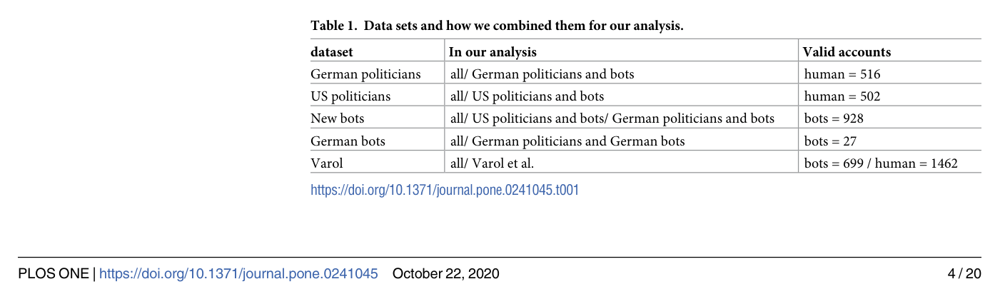

*表 1（Data sets and how we combined them for our analysis，PDF p.4）。有效账户合计 4,134。*

| 原始集合 | 初始标签依据 | 有效账户 | 在分析中的角色 | 主要标签风险 |
|---|---|---:|---|---|
| German politicians | 人工确认的官方议员账户 | 516 humans | all；German comparisons | “官方真人”不等于完全无自动化 |
| US politicians | 115th Congress 官方账户表 | 502 humans | all；US comparison | 机构运营、排程或团队代发可能存在 |
| New bots | Botwiki 与作者另行识别的明显 bots | 928 bots | all；US/German new-bot comparisons | 多为公开、创意、清晰 bot，不代表隐蔽恶意 bot |
| German bots | 德语 bot 列表 | 27 bots | all；German-language comparison | 样本极小，估计不稳定 |
| Varol et al. | Botometer 作者团队的人工标签 | 699 bots / 1,462 humans | all；Varol comparison | 一部分用于 Botometer 训练，评估不独立 |

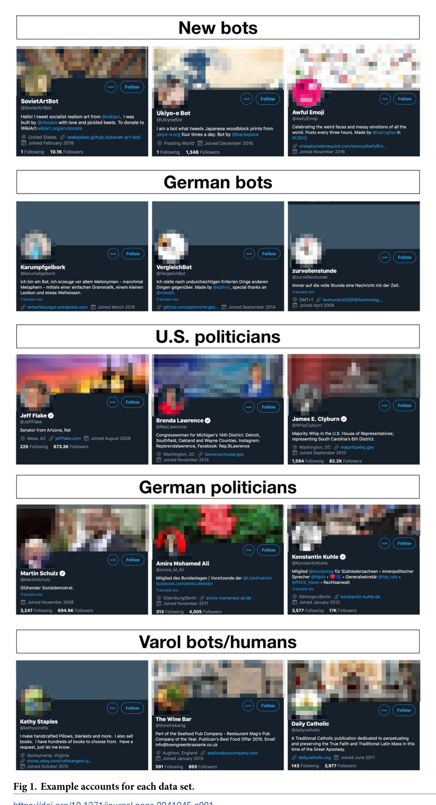

*图 1（Example accounts for each data set，PDF p.5）。每组展示三个账户；bot 示例多在 bio 中声明 bot，政治人物示例有身份与官网线索，Varol 示例则更模糊。*

**标签的精确定性**：这不是统一双人编码、盲审和 adjudication 产生的 Gold。四组被作者视为“human coders would have no difficulty”区分的 clear-cut cases；Varol 标签被继承而非逐账户重新核查。[论文 Data and methods，PDF pp.4-6] 这使测试对 Botometer 相对友好，因而“连清晰案例都不稳”是有力反例；同时它也降低了向隐蔽 campaign bot 和 community authenticity 外推的代表性。

### 3.3 重复测量与缺失处理

- **时间**：2019-03-03 至 2019-06-02，每日 00:00 UTC，连续三个月，无采集停机。
- **初始账户**：4,583；理论调用数为 421,636（4,583 × 92 天）。
- **有效 score**：374,724；空 timeline 排除 2,021 次、missing account 11,197 次、private account 33,608 次、API technical errors 86 次。
- **纳入账户**：至少成功访问一次且 timeline 至少有一条 tweet 的 4,134 个账户。[论文 Data and methods，PDF p.6]
- **聚合**：公开 `code.R` 对每账户现有观测取三个月均值；时间审计则保留逐日 score，计算逐账户 SD 和阈值两侧是否都出现过。[公开 code.R，lines 38-46；时间分析代码]

**风险**：账户只需成功一次即可纳入，账户间实际观测次数可能不同。论文列出调用级缺失原因，却没有把 missingness 与账户类型、日期、score 或 temporal volatility 联合建模；private/deleted 账户尤其集中于 Varol 集合。复现时应输出每账户有效天数分布，并以 `min_days` 做敏感性分析。

### 3.4 决策规则与关键形式化内容

论文没有编号公式。以下是对论文与公开代码的忠实形式化，便于复现，不应误读为作者给出的新理论。

#### 3.4.1 阈值分类

对账户 $i$ 的三个月平均 score $\bar{s}_i$ 和阈值 $\tau$：

$$
\hat y_i(\tau)=\mathbf{1}[\bar{s}_i>\tau].
$$

- $\hat y_i=1$：研究者把账户判为 bot。
- `universal score` 的重点阈值是 `0.76`；`universal CAP` 的重点阈值是 `0.25`，均来自既有应用。[论文 Introduction，PDF p.2；Results，PDF pp.9-10]
- ROC 扫描全部阈值；PR 曲线把 bot 作为 positive class。

论文 p.7 对 ROC 端点的文字说明把阈值方向写反了：若规则是 `score > threshold`，`threshold=0` 应接近把所有账户判为 bot，即 `(FPR,TPR)=(1,1)`；`threshold=1` 应接近 `(0,0)`。公开代码与曲线本身按 score 排序运行，此处应视为叙述错误，而不是改变结果的分析步骤。[论文 Results，PDF p.7；公开 code.R]

#### 3.4.2 prevalence 如何改变 precision

设 bot prevalence 为 $\pi$，某阈值的 true-positive rate 为 $TPR_\tau$、false-positive rate 为 $FPR_\tau$，则：

$$
Precision_\tau=\frac{\pi TPR_\tau}{\pi TPR_\tau+(1-\pi)FPR_\tau}.
$$

论文通过按 `0.15/0.85` 权重有放回重采样实现同一逻辑。[论文 Methods，PDF p.7；公开 code.R `weighted_resample`]

**最小例子**：1,000 个账户中 150 个是真 bot。若 `TPR=0.50`、`FPR=0.10`，会得到 75 个 true positives 和 85 个 false positives，precision 只有 `75/(75+85)=46.9%`。AUC 可以不错，但被标为 bot 的账户仍以真人为多数。

**校准边界**：这条公式分析 threshold utility，不检验概率 calibration。论文没有 reliability diagram、Brier score、expected calibration error、calibration slope/intercept，也没有证明 `CAP=0.25` 表示本总体中 25% 的真实概率。CAP 的名称不能替代校准证据。

#### 3.4.3 时间跨阈值指标

对账户 $i$ 的逐日 score $s_{it}$：

$$
I_i(\tau)=\mathbf{1}\left[\min_t s_{it}\le \tau < \max_t s_{it}\right].
$$

公开代码对每个 $\tau\in\{0,0.05,\ldots,1\}$ 计算 `s_it > tau`，若同一账户三个月内同时出现 `TRUE` 和 `FALSE`，便计为跨阈值。图 7 的纵轴是各数据集 $I_i(\tau)=1$ 的比例。[图 7，PDF p.13；公开 code.R]

这个指标回答“单日二值标签会不会翻转”，不回答 score 变化是否合理。若账户真实行为发生变化，翻转可能是 sensitivity；若账户未变，则可能是 measurement instability。论文没有独立 ground truth 时间序列来区分两者。

### 3.5 Before / After / Diff / Trade-off

- **Before**：报告原测试集 ROC-AUC，选一个文献阈值，对某日 score 二值化。
- **After**：在目标账户集合上本地验证；按部署 prevalence 检查 PR；每日重复三个月；比较语言；检查阈值翻转。
- **Diff**：从单次、全局 discrimination 指标转向 deployment-conditional measurement audit。
- **Trade-off**：获得更真实的误判与稳定性信息，但需要本地标签、重复 API 调用和人工审计；结论仍依赖样本构成与 prevalence 假设。

### 3.6 可执行复现协议

1. 从 Harvard Dataverse v3.1 下载 `data_botometer.RData` 与 `data_botometer_add.rds`，把本目录 `assets/reproduction/code.R`、`code_additional.R` 和数据置于同一工作目录。
2. 使用 R `>=3.6`，先执行 `set.seed(124)`。主脚本依赖 `PRROC`、`dplyr`、`plyr`、`sjstats`、`data.table`、`ggplot2`、`ggridges`；补充脚本还用 `pROC` 等包。[Dataverse README；公开 R scripts]
3. 按 `user.id_str` 聚合三个月 mean universal score/CAP；分别构造 All、German/German bots、German/new bots、US/new bots、Varol 五种比较。
4. 用正负类各自有放回 bootstrap 10,000 次得到 ROC-AUC/PR-AUC 区间。
5. 用 `weighted_resample(..., weight_bot=.15, weight_human=.85, n=100000)` 生成部署比例 thought experiment；重算 ROC/PR 与阈值点。
6. 在逐日数据上计算账户 SD，并扫描 `0-1`、步长 `0.05` 的 threshold crossing。
7. 对 German 与 US ROC 做 DeLong 比较，重画图 2-8；用 additional data/script 重画补充图 S1-S5。

**精确复现障碍**：README 未锁定 package versions，也没有 `renv.lock` 或 `sessionInfo()`；当前 Botometer/Twitter API 无法重放 2019 服务状态；论文的 raw score 是历史服务输出，数据复现可行，重新采集复现不可行。本文未下载两份大数据文件，也未实际运行 R，因此只验证了协议、代码与已发布结果的一致性。

## 4. 证据与结果分析（Evidence & Results）

### 4.1 研究设计与证据协议

- **研究对象**：4,134 个至少成功访问一次的 Twitter 账户，标签为 bot/human。
- **测量对象**：Botometer v3 的 universal score、English score、universal CAP、English CAP。
- **主要单位**：账户；重复测量为账户-日，但主要 AUC 分析先取账户均值。
- **比较**：五种账户组合；15%/85% synthetic prevalence；universal vs English；不同阈值；不同日期。
- **不确定性**：表 2-5 报告 10,000 次 stratified bootstrap 的 95% intervals；German bots 只有 27 个，原始区间明显更宽。
- **伦理与治理**：论文公开 user IDs 符合当时 Twitter developer terms，但账户级 bot 指控有误伤风险；作者建议人工验证并共享可复核 IDs。[论文 Discussion，PDF p.16]

### 4.2 全量图表覆盖清单

| 编号 | 位置 | 作用 | 关键？ | 处理与证据等级 |
|---|---:|---|:---:|---|
| 表 1 | PDF p.4 | 数据集、组合和有效账户数 | 是 | 已视觉核查并嵌入；标签与样本账本 |
| 图 1 | PDF p.5 | clear-cut bot/human 示例 | 是 | 已视觉核查并嵌入；定性标签依据，存在挑样边界 |
| 图 2 | PDF p.8 | universal score ROC curves | 是 | 已视觉核查并嵌入；与表 2 联读 |
| 表 2 | PDF p.8 | universal score ROC/PR 数值与区间 | 是 | 已视觉核查并嵌入；主 discrimination/base-rate 证据 |
| 图 3 | PDF p.9 | universal CAP ROC curves | 是 | 已视觉核查并嵌入；与表 3 联读 |
| 表 3 | PDF p.9 | universal CAP ROC/PR 数值与区间 | 是 | 已视觉核查并嵌入；CAP 与 score 结果近似 |
| 图 4 | PDF p.10 | universal score PR curves，阈值 0.76 | 是 | 已视觉核查并嵌入；false-positive/negative 核心证据 |
| 图 5 | PDF p.11 | universal CAP PR curves，阈值 0.25 | 是 | 已视觉核查并嵌入；false-positive/negative 核心证据 |
| 表 4 | PDF p.11 | English score ROC/PR | 是 | 已视觉核查并嵌入；语言/score variant 比较 |
| 表 5 | PDF p.12 | English CAP ROC/PR | 是 | 已重裁并视觉核查；语言/CAP variant 比较 |
| 图 6 | PDF p.13 | universal score/CAP 的逐账户 SD | 是 | 已视觉核查并嵌入；重复测量波动 |
| 图 7 | PDF p.13 | universal score/CAP 的 threshold crossing | 是 | 已重裁并视觉核查；分类翻转核心证据 |
| 图 8 | PDF p.15 | 相同 mixture 与 human-only score densities | 是 | 已视觉核查并嵌入；反对用分布估 prevalence |
| 补充图 S1 | 官方 DOCX | English score/CAP ROC | 是 | 已提取原始 JPEG 并视觉核查；正文语言结果补强 |
| 补充图 S2 | 官方 DOCX | English score/CAP 的逐账户 SD | 是 | 已提取原始 JPEG 并视觉核查；时间结果补强 |
| 补充图 S3 | 官方 DOCX | English score/CAP threshold crossing | 是 | 已提取原始 JPEG 并视觉核查；时间结果补强 |
| 补充图 S4 | 官方 DOCX | English score/CAP PR 与阈值点 | 是 | 已提取原始 JPEG 并视觉核查；语言阈值结果补强 |
| 补充图 S5 | 官方 DOCX | English score density | 是 | 已提取原始 JPEG 并视觉核查；分布不可比性补强 |

### 4.3 区分能力：ROC 看起来尚可，但跨数据集差异大

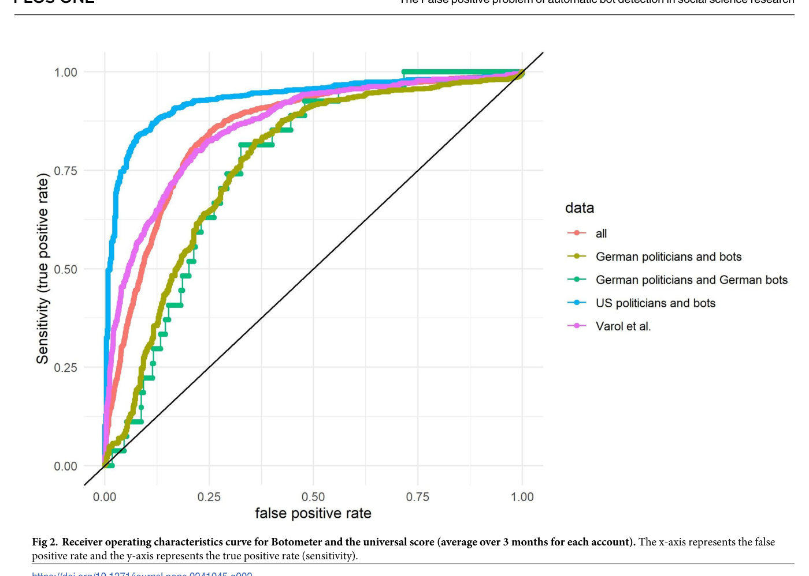

*图 2（PDF p.8）。横轴 FPR、纵轴 TPR；黑色对角线是随机排序。US politicians/new bots 曲线最靠左上，两个 German comparisons 最弱。*

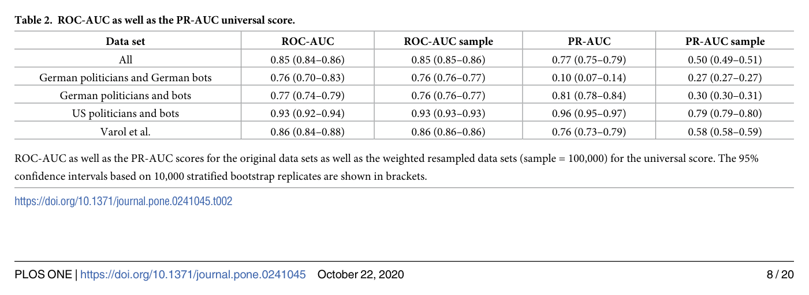

*表 2（PDF p.8）。括号为 10,000 次 stratified bootstrap 95% intervals。*

关键数值：All ROC-AUC `0.85 (0.84-0.86)`；German politicians/German bots `0.76 (0.70-0.83)`；German politicians/new bots `0.77 (0.74-0.79)`；US politicians/new bots `0.93 (0.92-0.94)`；Varol `0.86 (0.84-0.88)`。按 15/85 重采样后 ROC-AUC 基本不变，但 sample PR-AUC 分别变为 `0.50`、`0.27`、`0.30`、`0.79`、`0.58`。[表 2，PDF p.8]

**支持 C1/C2：部分支持。** 数据直接证明本研究样本中的 dataset shift 和 base-rate effect；不能证明其他时期、平台或 classifier 的具体表现。

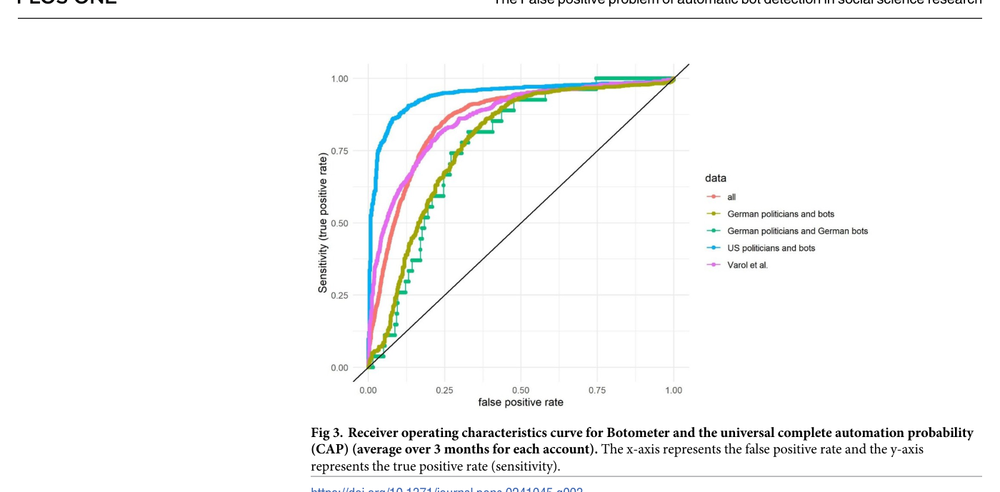

*图 3（PDF p.9）。CAP 的曲线排序与 universal score 基本相同。*

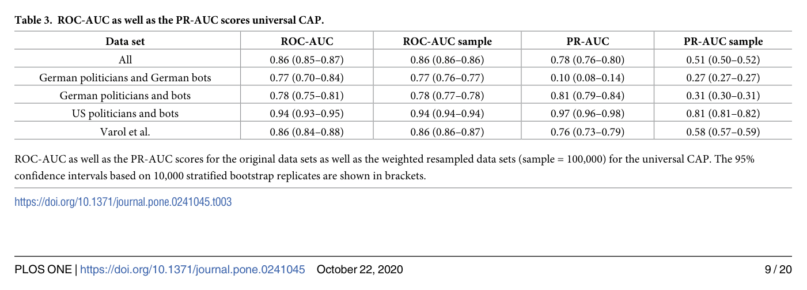

*表 3（PDF p.9）。All sample PR-AUC 为 0.51；German/German、German/new、US/new、Varol 分别为 0.27、0.31、0.81、0.58。*

CAP 没有消除 dataset dependence。其数值略有变化，但没有把低 prevalence 下的 precision 问题变成已校准概率问题。[表 3，PDF p.9]

### 4.4 阈值后的 false-positive 与 false-negative

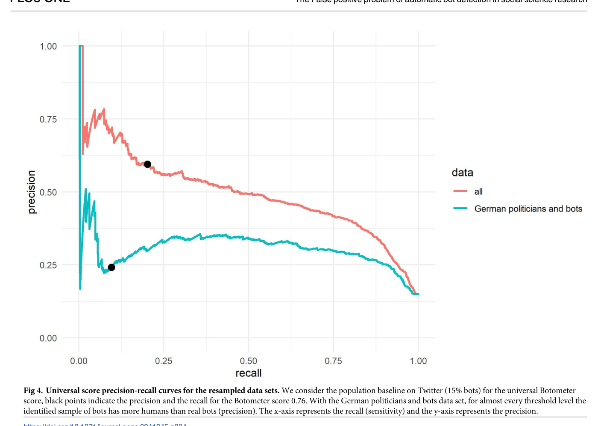

*图 4（PDF p.10）。只画 All 与 German politicians/new bots；黑点为 threshold 0.76。*

- **All**：precision `0.59`，所以被判为 bot 的账户中 `41%` 是 humans；recall `0.20`，所以 `80%` 真 bots 漏检。
- **German politicians/new bots**：precision `0.24`，即 `76%` flagged accounts 是 humans；recall `0.10`，即 `90%` 真 bots 漏检。[论文 Results，PDF p.9]

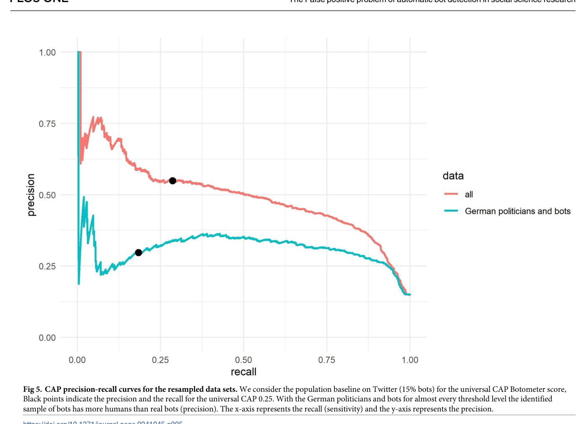

*图 5（PDF p.11）。黑点为 CAP threshold 0.25。*

- **All**：precision `0.55`，false-positive humans 占 flagged sample 的 `45%`；recall `0.29`，漏检 `71%` 真 bots。
- **German politicians/new bots**：precision `0.30`，false-positive humans 占 `70%`；recall `0.18`，漏检 `82%` 真 bots。[论文 Results，PDF p.10]

**支持 C2：部分支持但决策含义强。** 点估计清楚说明文献阈值在 15% prevalence thought experiment 中不可接受；外推必须对目标社区 prevalence 做 sensitivity sweep，而不能把 15% 当常数。

### 4.5 语言与总体迁移

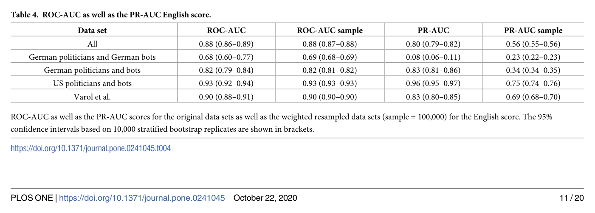

*表 4（PDF p.11）。English score 在 Varol 上 sample PR-AUC 从 universal 的 0.58 提高到 0.69，但 German politicians/German bots 从 0.27 降到 0.23。*

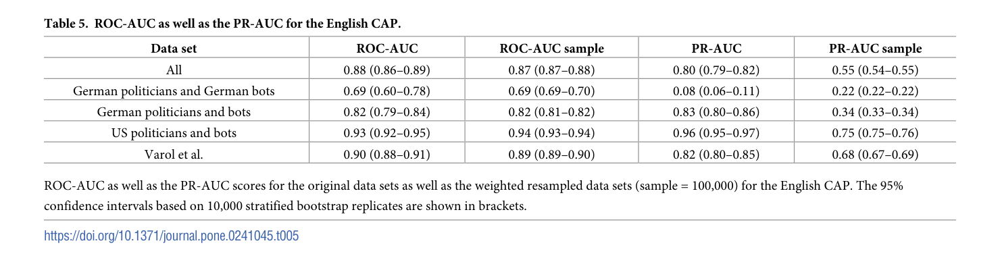

*表 5（PDF p.12）。English CAP 的 sample PR-AUC：All 0.55、German/German 0.22、German/new 0.34、US/new 0.75、Varol 0.68。*

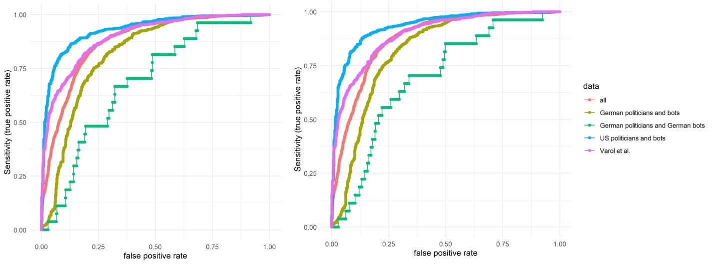

*补充图 S1（官方 s001.docx；标题亦见 PDF p.17）。左为 English score，右为 English CAP；German politicians/German bots 曲线在两面板均最弱。*

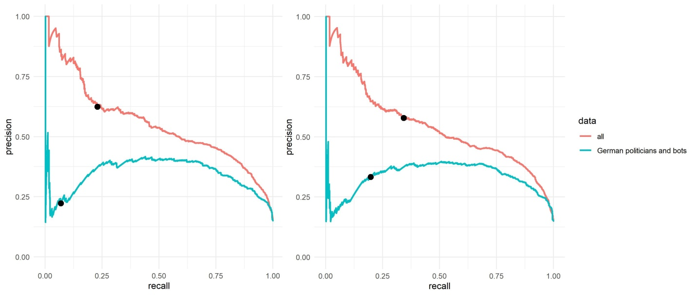

*补充图 S4（官方 s004.docx；标题亦见 PDF p.17）。左黑点为 English score 0.76，右黑点为 English CAP 0.25；German comparison 的 precision 仍低于 All。*

作者报告 German sets 与 US politicians/new bots 的 ROC-AUC 差异在 universal score/CAP 上均 `p<0.001`，Bonferroni `alpha=0.005`。[论文 Results，PDF pp.11-12]

**支持 C3：部分支持。** 同一 German account set 上 English variant 比 universal variant 更差，支持语言适配风险；但“German vs US”还混合了国家、politician cohort、bot source、训练覆盖和样本量。German bots 只有 27 个，不能把结果解释为稳定的语言效应量。另一个统计风险是 German politicians/new bots 与 US politicians/new bots 共用同一批 positive new bots，公开代码却用 `roc.test(..., paired=FALSE)`；这会忽略两条 ROC 的相关性，显著性区间应重算。

### 4.6 重复测量与分类翻转

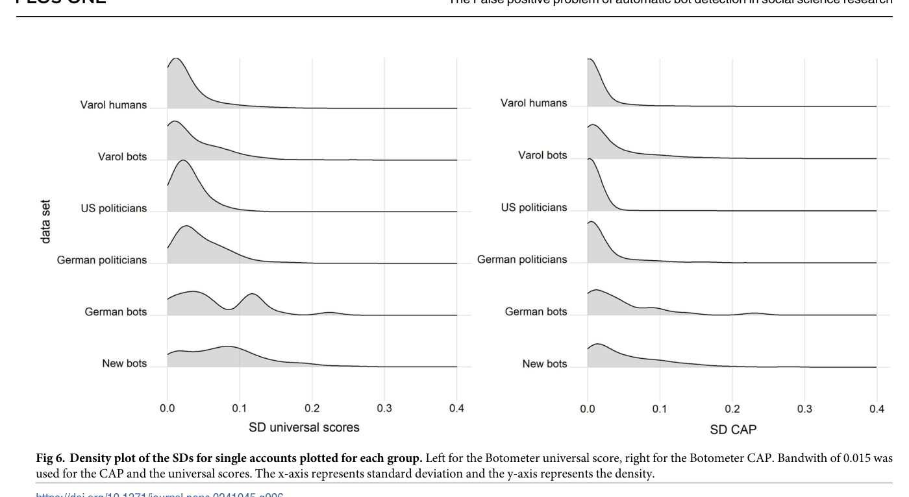

*图 6（PDF p.13）。左为 universal score SD，右为 CAP SD；bot groups 的右尾通常更长，German bots 呈多峰/长尾，CAP 整体略低波动。带宽 0.015。*

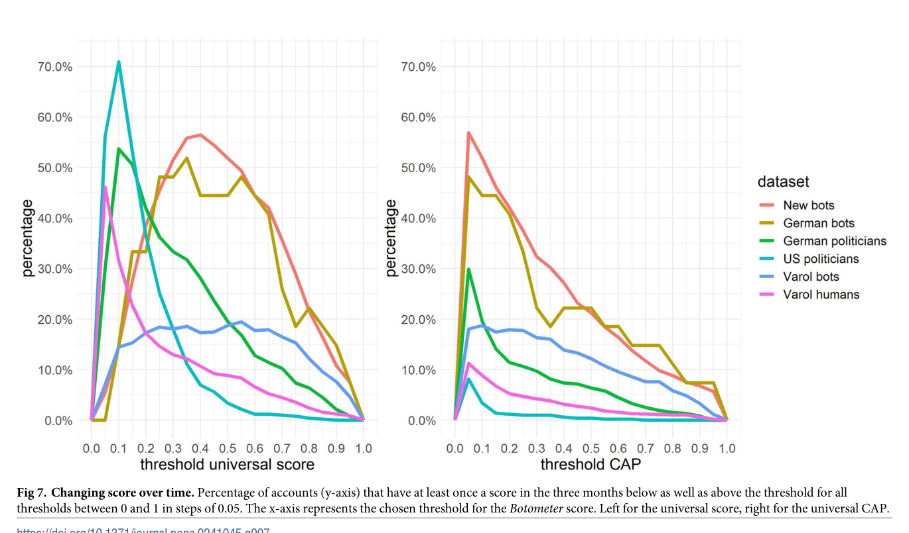

*图 7（PDF p.13）。纵轴是三个月内至少一次位于阈值两侧的账户比例；左为 universal score，右为 CAP；阈值按 0.05 扫描。*

在文献阈值处，论文报告：[论文 Results，PDF p.12]

| 输出/阈值 | New bots | German bots | Varol bots | German politicians | US politicians | Varol humans |
|---|---:|---:|---:|---:|---:|---:|
| universal score / 0.76 | 27.2% | 22.2% | 13.9% | 7.4% | 0.6% | 3.1% |
| universal CAP / 0.25 | 37.5% | 33.3% | 17.7% | 10.7% | 1.0% | 4.7% |

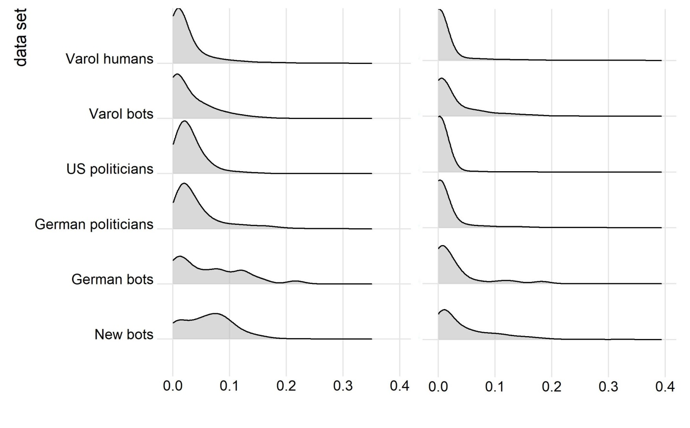

*补充图 S2（官方 s002.docx；标题亦见 PDF p.17）。左为 English score、右为 English CAP；bot groups 仍有更宽尾部。*

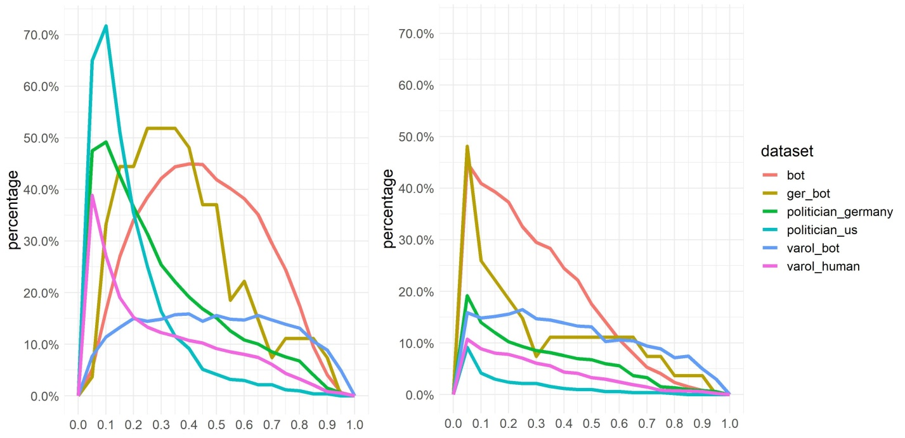

*补充图 S3（官方 s003.docx；标题亦见 PDF p.17）。English variants 也出现阈值依赖的标签翻转，尤其在低阈值和 bot groups。*

**支持 C4：强支持，但只限 observed service behavior。** 多次测量直接观察到翻转；作者没有版本化每日 Botometer backend，也没有固定账户输入快照，因此不能把全部变化归因于 classifier noise。

### 4.7 为什么不能用 score distribution 估 prevalence

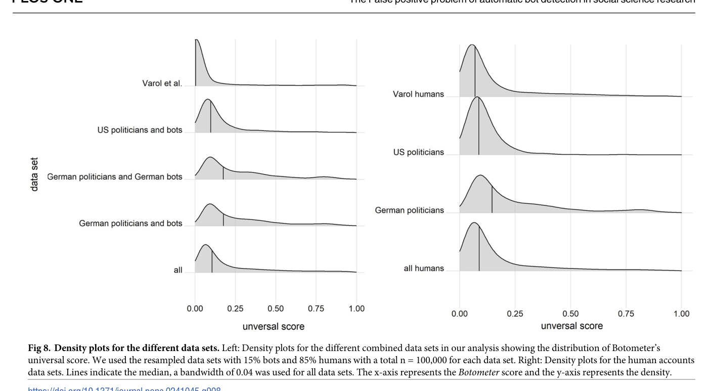

*图 8（PDF p.15）。左侧五组 mixture 都被重采样为同一 15% bots/85% humans，却呈不同 density；右侧仅 humans 的三个来源也不相同。竖线为 median，带宽 0.04。*

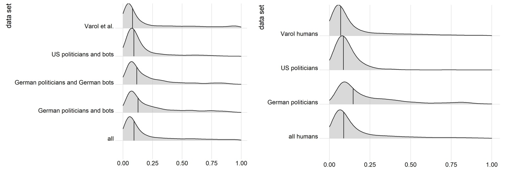

*补充图 S5（官方 s005.docx；标题亦见 PDF p.17）。English score 复现同一反例：相同比例并不产生可比较的 score density。*

**支持 C5：部分支持。** 图 8/S5 有效否定“看到 density 向高分移动就可直接读出 bottiness/prevalence”；但它没有比较经过标签迁移、mixture modeling 或 local calibration 的正式 prevalence estimators。

### 4.8 主张—证据审计

| 核心主张 | 最强证据 | 支持等级 | 最大替代解释 | 最快证伪/补强方案 |
|---|---|---|---|---|
| C1：Botometer v3 跨集合区分能力不稳定 | 图 2-3、表 2-3 | 部分支持 | clear-cut 样本与训练集重叠，不代表真实部署 | 在独立、预注册、多语言账户集上重复 |
| C2：固定阈值在低 prevalence 下误判严重 | 图 4-5、表 2-3 | 部分支持 | prevalence 固定为 15%，synthetic n=100,000 | 对 prevalence `1%-30%` 做 PPV/NPV sensitivity，并从原账户层 bootstrap |
| C3：语言/总体迁移损害表现 | 表 4-5、补充图 S1/S4 | 部分支持 | 语言与 cohort/bot type 混杂 | 同类账户、同一 bot family 的平衡多语言设计 |
| C4：单日标签会翻转 | 图 6-7、补充图 S2/S3 | 强支持 | 账户真实变化与服务端变化未分离 | 固定输入 snapshot、记录 API/model revision、每日技术重复 |
| C5：raw score density 不能直接给 prevalence | 图 8、补充图 S5 | 部分支持 | 未比较正式校准/mixture estimators | 在独立 local labels 上比较 calibrated prevalence estimators |
| C6：本文不是概率 calibration 研究 | Methods/Results 指标全集 | 强支持 | 无 | 增加 reliability diagram、Brier/ECE、slope/intercept |
| C7：不能提供 community authenticity Gold | 表 1、Data and methods、Discussion | 强支持 | 无 community labels、boundaries 或 coordination evidence | 建立双人裁决的 community Gold，并把 bot score 仅作辅助特征 |

### 4.9 可靠性、复现性与争议点

1. **最可信结论**：在 Botometer v3 的 2019 服务状态下，同一账户 score 会跨日变化，文献阈值在作者的 15% prevalence thought experiment 中产生大量 FP/FN。这两点有重复测量、阈值点和多种 score variants 互相支持。
2. **标签构念不完整**：明显自报 bots 与官方 politicians 适合测试 automation 的最低能力，却不覆盖隐蔽 bot、cyborg、团队运营、sockpuppet 或 human-coordinated astroturfing。Varol labels 又与训练数据重叠。
3. **prevalence 不确定性未传播**：15% 是固定假设。表 2-5 的 sample intervals 极窄，例如 `0.27-0.27`，因为代码先生成 100,000 个有放回伪样本，再在伪样本上 bootstrap；这反映 synthetic sample 的 Monte Carlo precision，而不是原账户分布和真实 prevalence 的完整不确定性。应从原账户层重采样，并在每次 replicate 中重估或扫描 prevalence。
4. **重复测量未做层级模型**：主 AUC 用账户均值，时间分析用 SD/跨阈值比例；没有 random-effects、within/between variance decomposition，也没有对有效天数差异建模。
5. **语言因果主张偏强**：score variant 与 cohort 结果支持 transport risk，但没有正交操纵 language。更准确的表述是“language/account-population shift”，不是纯语言因果效应。
6. **DeLong 相关性处理**：公开代码对共享 positive cases 的 ROC 比较仍设 `paired=FALSE`，p-values 需要重算；point AUC 与 PR 结果不因此消失。
7. **ROC 端点叙述错误**：PDF p.7 把 threshold 0/1 对应的 ROC 端点方向反写。图表、代码和主要数值仍可读，但复现者不能照抄该段解释。
8. **校准缺失**：没有 probability calibration 评估。对 CogGuard，AUC、PR 与 calibration 三者必须分别报告。
9. **版本与时间边界**：目标是 Botometer v3、Twitter 2019。作者在 p.16 提到 v4 整体更好，但本文没有测试 v4；更不能外推到 2026 平台、API、语言和行为生态。
10. **代码开放但环境未锁定**：Dataverse v3.1 提供主/补充 R scripts 和数据，seed=124、R>=3.6；没有 package lock，重新采集历史 API 输出不可行。

### 4.10 为什么这篇论文不能供应 community authenticity Gold

**结论是明确的：不能。** 原因不是论文质量低，而是研究对象与 CogGuard 标签目标不一致。

- **单位错位**：本文 Gold-like unit 是单账户 `bot/human`；CogGuard 需要 community 与成员关系、时间窗口和协调事件。
- **构念错位**：automation 不等于 inauthenticity。公开声明的 utility bot 可以自动且真实；真人 sockpuppets 可手工操作却不真实。
- **标签来源不足**：clear-cut examples、official politicians 和 inherited Varol labels 不是针对 community authenticity 的预注册编码本体，也没有 inter-coder reliability。
- **没有 coordination truth**：论文未标注共同控制、同步行为、内容复用、网络结构、资金/组织来源或 campaign intent。
- **测量不稳定**：语言、账户总体和日期都会改变 score/阈值标签；把这些标签聚合到 community 会把偏差放大。
- **没有校准**：CAP/score 不能直接解释为目标总体中的真实性概率。

因此，论文能给 CogGuard 的是 **measurement governance evidence**：任何 automation feature 都必须本地验证、重复测量、报告 prevalence-sensitive precision/recall，并与人工 forensic evidence 结合。它不能进入 `Gold label source` 列，只能进入 `risk/control rationale` 与 `auxiliary feature evidence`。

## 5. 论文的贡献与影响（Contribution & Impact）

### 5.1 主要贡献

1. **问题层贡献**：把“classifier 在原测试集区分得好”与“社会科学部署结论可靠”分离，直接审计 false positives、false negatives 和 reproducibility。
2. **方法层贡献**：把每日重复测量、prevalence-aware PR、阈值点与语言/总体比较组合为一套轻量 measurement audit。
3. **证据层贡献**：公开 374,724 个历史 valid scores、主/补充数据和 R scripts，使已发布数值可重算。
4. **边界贡献**：用图 8/S5 给出反例，说明 raw score distribution 不能直接当作“bottiness”或 prevalence。

### 5.2 迁移到 CogGuard 的设计要求

#### 5.2.1 标签层级

| 层级 | CogGuard 可接受定义 | Botometer 类 score 的角色 |
|---|---|---|
| Community Gold | 明确 community 边界/时间窗；至少双人独立编码；证据含协调、身份/来源披露、行为语境；冲突 adjudication | 不得单独决定标签，只能作为待核线索 |
| Community Silver | 高置信平台处置、官方归因或多源 forensic case，来源与日期可追溯 | 可作一致性检查，不覆盖来源证据 |
| Weak/Proxy | thresholded automation、同步度、重复内容、网络异常等启发式 | 明确标为 proxy，并保留阈值、版本、语言、日期 |
| Feature | 连续 account/community statistics | 不转换为 truth；输入模型或 analyst view |

#### 5.2.2 把“一个 authenticity 分数”拆成证据向量

CogGuard 至少应分别记录：

- `automation_evidence`：自动发布、客户端、节律、Botometer-like score；
- `coordination_evidence`：同步、共同 URL/文本、时序相关、dense subgraph；
- `identity_deception_evidence`：冒充、披露不一致、控制者/来源异常；
- `campaign_context`：事件、语言、地域、平台与时间窗；
- `adjudication`：coder、证据包、decision rule、置信度和 dissent；
- `measurement_provenance`：tool/model version、调用时间、阈值、feature availability。

社区级 authenticity 应是证据整合结果，不应是成员 bot flags 的平均值或比例。

#### 5.2.3 重复测量与 threshold governance

1. 对连续特征保存原值，不只保存二值标签。
2. 对关键窗口至少做多次 snapshot，输出 within-community/within-account variance。
3. 对所有阈值报告 sensitivity surface，而不是单点 performance。
4. 按目标语言、平台、community size 和事件类型分层验证。
5. precision/recall 必须用目标 prevalence 或 prevalence range 计算；同时报告 calibration curve 与 Brier/ECE。
6. 对 community aggregation 做 error propagation：成员误判相关时，不能按独立 Bernoulli 误差处理。

### 5.3 最小可行迁移实验

**当前假设**：账户级 automation score 与 community inauthenticity 有辅助关联。  
**破裂点**：benign bots、human sockpuppets、语言迁移、时间漂移和相关误差。  
**最小验证**：

1. 从 CogGuard case pool 分层抽取至少四类 community：benign automation、organic human、human-coordinated inauthentic、bot-assisted inauthentic。
2. 固定 community boundary 与 observation window，建立双人独立编码和 adjudication Gold。
3. 在至少三个时间点采集 account-level automation outputs，固定 tool/model revision。
4. 构造三组模型：仅 automation、仅 coordination、二者加 identity/context；按 language/event 留一外部验证。
5. 报告 community-level PR-AUC、calibration、decision curves、threshold stability 和 subgroup worst-case；禁止只报 ROC-AUC。
6. 做 prevalence `1%-30%`、成员 missingness、community size 与相关误判 sensitivity。

若“仅 automation”无法区分 benign bots 与 inauthentic communities，而 coordination/identity evidence 能区分，就验证了本文对 CogGuard 的核心迁移判断。

### 5.4 值得探索的未来方向

1. **论文原生下一步：固定输入的 service drift audit**  
   当前假设：跨日 score 变化反映总体不稳定；破裂点：账户输入也在变；新问题：模型服务与行为变化各占多少；最小验证：每天提交同一冻结 timeline snapshot，并记录 API/model hash。
2. **更强证据：hierarchical prevalence-aware uncertainty**  
   当前假设：100,000 resample 足以表征部署；破裂点：伪样本区间忽略原样本与 prevalence；新问题：真实 PPV/NPV 区间多宽；最小验证：原账户层 hierarchical bootstrap 加 prevalence prior/sweep。
3. **跨领域迁移：community authenticity measurement model**  
   当前假设：单账户 automation 可汇总；破裂点：authenticity 是群体、关系和语境构念；新问题：多证据如何形成可审计 community judgment；最小验证：Gold cases 上比较 feature-only、evidence-fusion 与 human-adjudicated systems。
4. **实践应用：language/time monitoring gate**  
   当前假设：上线前一次验证足够；破裂点：语言与时间漂移；新问题：何时触发降级或重标；最小验证：设 subgroup calibration/stability control limits，越界时停止输出二值 authenticity。

## 6. 结论（Conclusion）

这篇论文最有价值的不是证明 Botometer “无用”，而是证明一个高 AUC 的单账户 classifier 在低 prevalence、新语言和新时间上仍可能产生不可接受的决策误差。三个月每日重复测量、15/85 PR thought experiment 和跨数据集结果共同支撑这一警告；开放数据与代码使历史数值具有较好可复核性。其主要边界是标签构念狭窄、German bot 样本小、prevalence 不确定性未传播、language 与 cohort 混杂，以及 Botometer v3/2019 的版本限制。对 CogGuard，它应被引用为“为什么必须做本地校准、重复测量和人工证据裁决”的依据，而绝不能被当作 community authenticity Gold 来源。

> **最终判断**：核心测量治理参考；值得复现数值协议并迁移验证框架，不可迁移其标签为 community Gold。  
> **读完应记住的一句话**：AUC 衡量排序，Gold 要求构念、总体、时间与裁决都对齐。
