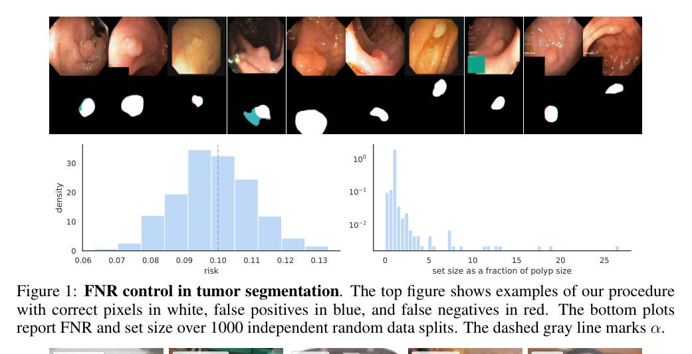
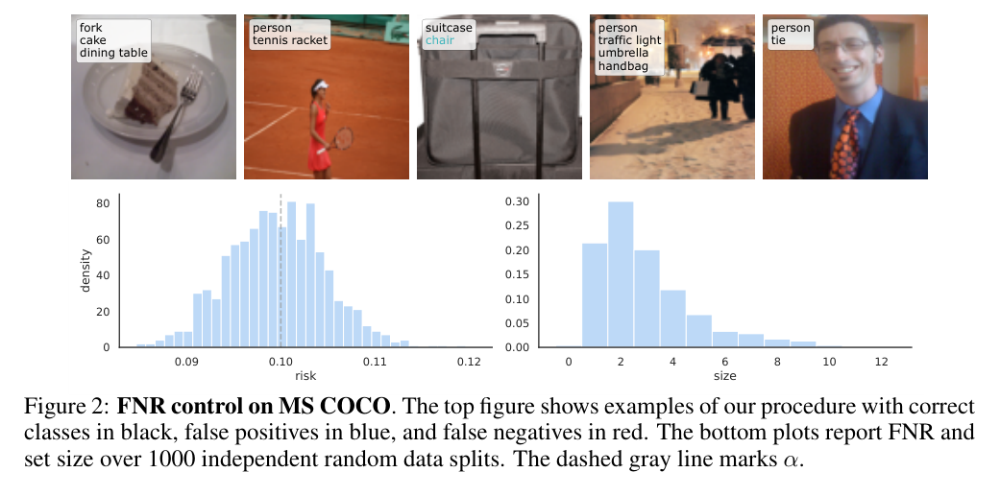
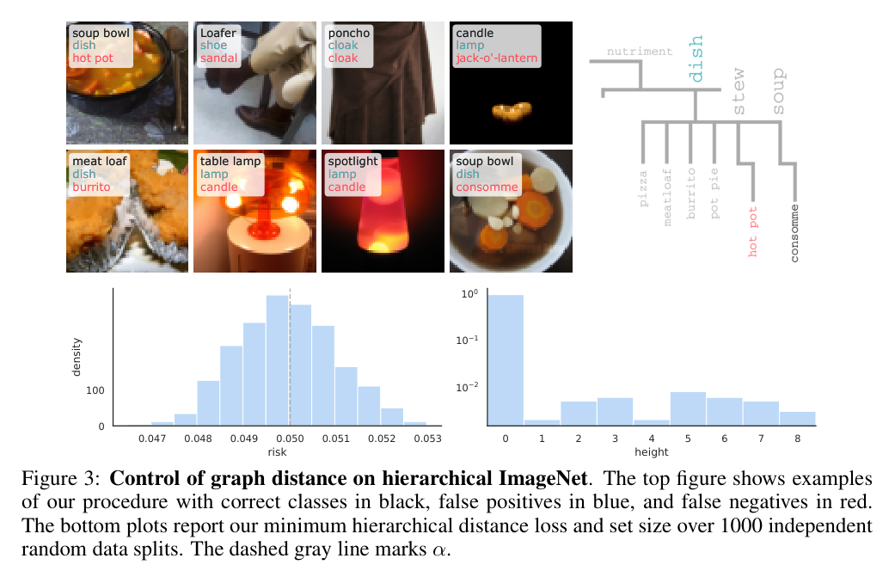
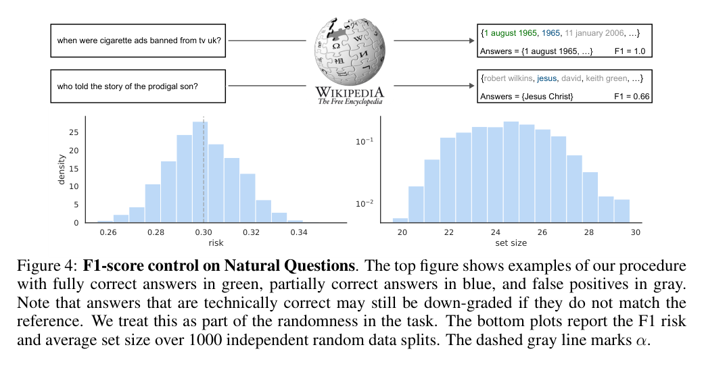
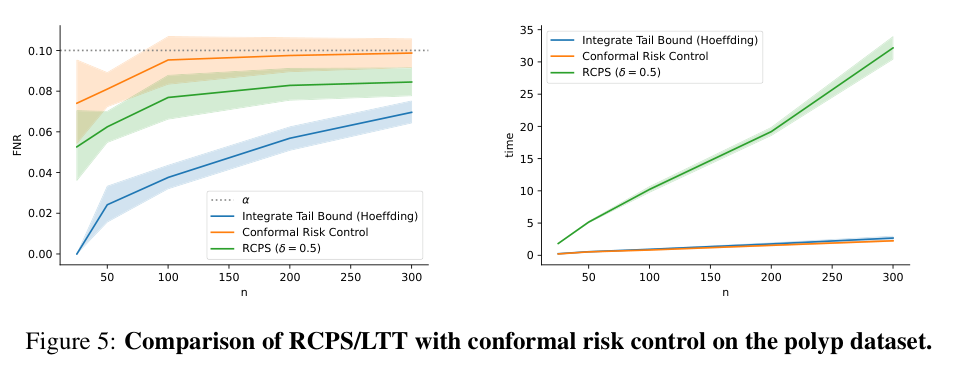
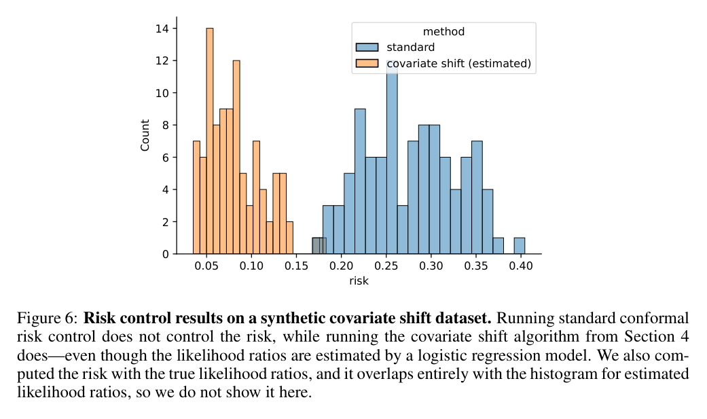

# Conformal Risk Control：深度解读

> **作者**：Anastasios Angelopoulos, Stephen Bates, Adam Fisch, Lihua Lei, Tal Schuster  
> **会议/年份**：International Conference on Learning Representations, 2024, published conference paper  
> **论文链接**：https://proceedings.iclr.cc/paper_files/paper/2024/hash/f3549ef9b5ff520a7e41ff3cc306ab2b-Abstract-Conference.html  
> **实际使用来源**：官方 HTML、官方 PDF、官方 supplementary ZIP、supplementary 中 `core/get_lhat.py` 摘出文件  
> **页码约定**：全文使用 1-based PDF 页码；`PDF p.N` 对应 `assets/pages/page-NNN.png`  
> **论文类型**：理论方法论文，辅以实证 worked examples  
> **学科 Lens**：computer-science-ai；theory；method  
> **读者画像**：面向 CogGuard Harmfulness 迁移的跨领域科研读者  
> **解读目标**：transfer  
> **视觉能力模式**：visual  
> **解读置信度**：高；官方 PDF、HTML、supplementary ZIP 已保存并哈希，关键图已直接视觉核验

## 1. 核心思想一句话总结（Elevator Pitch）

> CRC用校准集选择阈值，凭交换性有限样本控期望风险。

问题链条是：传统 conformal prediction 控制“是否覆盖真值”的误覆盖概率；很多任务更关心 FNR、图距离、F1 损失这类非二元风险；作者把输出集合随参数变保守时损失单调下降这一结构抽象出来；用校准集上的经验风险加一个有限样本校正选择 $\hat{\lambda}$；在交换性、单调、有界等条件下证明新样本期望损失不超过 $\alpha$；边界是它只校准已定义好的 risk/loss，不能替代任务定义、标签来源或分布外鲁棒性。

## 2. 论文背景与动机（Background & Motivation）

### 2.1 具体问题

论文研究的是一种后处理校准问题：给定已经训练好的模型 $f$、输入输出对 $(X,Y)$、一族由参数 $\lambda$ 控制的集合输出 $C_\lambda(X)$，以及一个损失 $\ell(C_\lambda(X),Y)$，如何只用一个独立校准集选择 $\hat{\lambda}$，使新测试点的期望损失满足

$$
\mathbb{E}\left[\ell(C_{\hat{\lambda}}(X_{n+1}),Y_{n+1})\right]\leq \alpha .
$$

这不是训练新模型，也不是定义标签，而是在已有模型、已有标签、已有损失函数之上选择阈值或集合大小。[Eq. (2), PDF p.1]

### 2.2 为什么重要

现实价值在于，很多安全或选择性预测任务的失败成本不是“真值是否被集合覆盖”这一个二元事件。例如多标签分类关心漏掉真实标签的比例，分割关心 false negative rate，问答可能关心 token-level F1 损失。CRC 允许部署者把这些任务指标作为风险函数，而不是强行还原成 coverage。[Abstract, PDF p.1；Section 3, PDF p.4-p.7]

学术价值在于，它把 split conformal prediction 的有限样本、分布无关、交换性论证推广到更广的单调损失族。作者强调 conformal prediction 的 guarantee 是式(1)的 miscoverage bound，而 CRC 的 guarantee 是式(3)的 expected risk bound；前者是后者在 indicator miscoverage loss 下的特例。[Eq. (1)-(3), PDF p.1-p.2；Appendix A, PDF p.10]

典型场景：一个 harmfulness 系统已经输出每条内容的风险分数，产品方希望“被放行内容中漏检 harmful 的期望比例不超过 5%”，或“自动处理集合的平均人工复核损失不超过阈值”。CRC 可以帮助选择分数阈值、候选集合大小或 abstention 规则，但前提是有一份与未来部署样本可交换的 calibration split，并且 harmfulness 的 Gold 标签和损失函数已经固定。

### 2.3 论文之前的研究版图

| 路线 | 代表方法 | 有效之处 | 关键局限 | 本文如何回应 |
|---|---|---|---|---|
| Split conformal prediction | Vovk 等、Papadopoulos 等、Lei 等 | 有有限样本覆盖保证 | 目标主要是 miscoverage | 把 miscoverage 作为一种特殊 loss，推广到期望风险 [PDF p.1-p.2, Appendix A] |
| RCPS/LTT 高概率风险控制 | Bates 等 2021；Angelopoulos 等 2021a | 控制校准样本随机性上的高概率风险 | 对单调风险更保守、实现更复杂 | CRC 给 expectation bound，算法更简单但保证类型不同 [Appendix B, PDF p.13-p.14] |
| 分布偏移下 conformal 方法 | covariate-shift conformal 等 | 可在某些 shift 下修正 | 需要 shift 信息或额外假设 | CRC 给 likelihood ratio/TV 扩展，不声称任意 shift 自动有效 [Section 4.1, PDF p.8] |

### 2.4 从痛点到研究问题

旧方法依赖 coverage 这个特殊风险或浓缩不等式高概率控制，遇到 FNR、F1、图距离等自然指标时要么不匹配，要么过于保守；作者发现若损失随 $\lambda$ 单调不增，校准集经验风险的交换性排序论证仍可使用；因此提出用有限样本校正后的经验风险选择 $\hat{\lambda}$，得到期望风险控制。

作者主张：CRC 控制任意 bounded monotone loss 的 expected value，并且 split conformal prediction 是其特例。[Abstract, PDF p.1；Eq. (1)-(4), PDF p.1-p.2]

论文直接证据：Theorem 1 给出有限样本保证，Theorem 2/Proposition 1 给出 tightness，Figures 1-4 给出四个 worked examples。[Theorem 1, PDF p.3；Figures 1-4, PDF p.5-p.7]

本文推断：在 CogGuard Harmfulness 中，CRC 的角色应是“风险校准与选择协议”，不是 harmfulness classifier、Gold label generator 或 OOD robustness method。

## 3. 核心方法/理论/研究设计详解（Core Method, Theory, or Study Design）

### 3.1 总体框架

理论主线是：

```text
已训练模型与可调后处理 C_lambda
→ 定义有界、右连续、随 lambda 非增的损失 L_i(lambda)
→ 在 calibration split 上计算经验风险 R_hat_n(lambda)
→ 用有限样本校正选择 lambda_hat
→ 在 exchangeable 新样本上得到 E[L_{n+1}(lambda_hat)] <= alpha
→ 用 worked examples 展示 FNR、图距离、F1 等风险
```

### 3.2 核心流程和最小例子

最小例子：有 4 条校准样本和一个 harmfulness score 模型。令 $\lambda$ 是“放行阈值”的保守程度，$\lambda$ 越大，系统越倾向于 abstain 或加入人工复核集合。定义损失 $L_i(\lambda)=1$ 表示第 $i$ 条真实 harmful 内容被自动放行，$0$ 表示没有漏放；当 $\lambda$ 增大，漏放只会减少，所以 $L_i$ 单调不增。若风险目标是 $\alpha=0.1$，$B=1$，$n=4$，CRC 不会只要求校准均值 $\hat{R}_4(\lambda)\leq 0.1$，而是要求

$$
\frac{4}{5}\hat{R}_4(\lambda)+\frac{1}{5}\leq 0.1,
$$

这个例子下不可能满足，所以必须选择最保守的 $\lambda_{\max}$，或者扩大校准集、放宽风险目标、重定义损失。这说明 CRC 的有限样本校正会在小样本低风险目标下非常保守。

### 3.3 关键概念

#### 3.3.1 风险定义

CRC 的风险不是 classifier accuracy，而是部署者预先定义的损失期望。论文从式(2)开始把目标写成 $\mathbb{E}[\ell(C_{\lambda}(X_{n+1}),Y_{n+1})]\leq\alpha$，再在式(3)抽象成随机损失函数 $L_i(\lambda)$。[Eq. (2)-(3), PDF p.1-p.2]

对 CogGuard 来说，风险可以是漏放 harmful 的比例、自动放行集合中的 false negative rate、abstention 后仍错误处理的损失、或多标签 harmful categories 的漏检率。风险不能是事后含混的“安全性变好”；它必须能在 calibration split 上计算。

#### 3.3.2 单调损失

论文要求 $L_i(\lambda)$ 对 $\lambda$ non-increasing：$\lambda$ 越保守，损失不升高。[Section 1.1, PDF p.2；Theorem 1, PDF p.3] 这符合“集合变大，漏检减少”的任务，但不自动符合所有 harmfulness 指标。例如提高阈值可能减少 false negative，却增加 false positive 或人工复核成本；若把二者混成一个非单调业务分数，基本 CRC 保证失效。

#### 3.3.3 校准集

校准集是与未来测试点同分布或至少 exchangeable 的独立样本，用来选择 $\hat{\lambda}$。它不能与训练集混用来调模型，也不能来自已经被 campaign、platform、time shift 改变的旧分布后还声称保证。对 selective Harmfulness，最小可行 split 是：训练/开发用于模型和提示，calibration 用于一次性选择阈值或 abstention 规则，test/online audit 用于外部复核；校准 split 的抽样单位应匹配未来风险单位，例如按 campaign、用户、时间窗口或内容源去重分组，避免同源泄漏。

#### 3.3.4 随机性与交换性条件

Theorem 1 用 exchangeable random loss functions，而不是简单说“i.i.d. 数据”。证明把 $n+1$ 个损失函数作为可交换 multiset，利用新样本在这些函数中条件均匀的位置来得到风险上界。[Theorem 1 proof, PDF p.3] 若平台政策、攻击策略、审核指南、语言分布或 campaign 发生系统性变化，交换性可能破裂。

### 3.4 关键形式化内容

#### 公式 1：split conformal miscoverage guarantee

$$
\mathbb{P}\left(Y_{n+1}\notin C(X_{n+1})\right)\leq \alpha .
$$

来源：Eq. (1), PDF p.1。

符号：$Y_{n+1}$ 是新测试点真实标签；$C(X_{n+1})$ 是由模型和校准数据构造的预测集合；$\alpha$ 是用户指定错误率。

作用：这是传统 conformal prediction 控制的对象。它只问真值是否在集合里，是二元事件。

最小例子：100 个未来样本中，平均最多 10 个真标签不在预测集合中，对应 $\alpha=0.1$。它不告诉你漏掉多少个多标签类，也不告诉你 answer F1 损失。

边界：当 harmfulness 有多个类别、严重程度或人工复核成本时，单纯 miscoverage 往往不是业务风险。

#### 公式 2：CRC 的风险目标

$$
\mathbb{E}\left[\ell(C_{\lambda}(X_{n+1}),Y_{n+1})\right]\leq \alpha .
$$

来源：Eq. (2), PDF p.1。

符号：$\ell$ 是预定义损失；$C_\lambda$ 是由参数 $\lambda$ 控制的集合输出；期望覆盖新样本和校准随机性；$\alpha$ 是可接受风险。

作用：把“覆盖真值”推广为“期望损失不超过目标”。如果 $\ell$ 是漏检比例，则 $\alpha=0.1$ 表示平均漏检比例不超过 10%。

最小例子：一条样本有 5 个真实 harmful 子类，模型集合只包含 4 个，则 FNR loss 是 $1-4/5=0.2$。CRC 控制的是未来样本这种 loss 的期望。

边界：$\ell$ 必须可在 calibration labels 上计算；没有 Gold harmfulness 标签就没有该公式的可执行对象。

#### 公式 3：抽象随机损失函数保证

$$
\mathbb{E}\left[L_{n+1}(\hat{\lambda})\right]\leq \alpha .
$$

来源：Eq. (3), PDF p.2。

符号：$L_i:\Lambda\to(-\infty,B]$ 是第 $i$ 个样本诱导的损失函数；$\Lambda$ 是参数空间；$B$ 是损失上界；$\hat{\lambda}$ 由前 $n$ 个函数选择。

作用：让证明不依赖具体任务，只依赖 $L_i$ 的单调、有界、交换性结构。

最小例子：每条 calibration 样本都给出一条“阈值越高漏检越少”的曲线，CRC 在这些曲线上选一个阈值，再保证新曲线上的期望损失。

边界：保证是 marginal expectation，不是每个 subgroup、每个 campaign 或每次 calibration draw 都满足。

#### 公式 4：lambda 选择规则

$$
\hat{\lambda}=\inf\left\{\lambda:
\frac{n}{n+1}\hat{R}_n(\lambda)+\frac{B}{n+1}\leq\alpha
\right\}
=\inf\left\{\lambda:\hat{R}_n(\lambda)\leq\alpha-\frac{B-\alpha}{n}\right\}.
$$

来源：Eq. (4), PDF p.2；supplementary `core/get_lhat.py` 实现同一有限样本校正。

符号：$\hat{R}_n(\lambda)=n^{-1}\sum_{i=1}^n L_i(\lambda)$ 是校准经验风险；$B$ 是 worst-case loss 上界；$n$ 是校准样本数。

作用：不是选择经验风险刚好低于 $\alpha$ 的阈值，而是留出 $B/(n+1)$ 的有限样本保守项。$n$ 越大，保守项越小。

最小例子：$n=1000,B=1,\alpha=0.1$ 时经验风险阈值约为 $0.0991$；$n=10,B=1,\alpha=0.1$ 时阈值约为 $0.01$，会非常保守。

边界：如果集合为空，论文定义 $\hat{\lambda}=\lambda_{\max}$。[PDF p.2] 这在实践中意味着选择最保守输出，而不是宣称任务不可失败。

#### 公式 5：Theorem 1 条件与有限样本保证

$$
L_i(\lambda_{\max})\leq\alpha,\quad \sup_\lambda L_i(\lambda)\leq B<\infty,
\quad \Rightarrow\quad
\mathbb{E}[L_{n+1}(\hat{\lambda})]\leq\alpha .
$$

来源：Theorem 1 and Eq. (5), PDF p.3。

符号：$\lambda_{\max}$ 是最保守可选参数；右连续和 non-increasing 是 theorem 文本中列出的函数条件。

作用：说明只要最保守设置能达到风险目标且损失有界，CRC 的 $\hat{\lambda}$ 选择就有有限样本 guarantee。

最小例子：harmfulness 系统允许“全部交人工复核”，且该操作下漏放损失为 0，则 achievability 成立；若系统必须自动判定且某些样本无论阈值如何都会漏放，$L_i(\lambda_{\max})\leq\alpha$ 可能失败。

边界：非单调损失下 Proposition 2 显示基本 CRC 可以让风险接近 $B$，即控制可被任意破坏。[Proposition 2, PDF p.4]

### 3.5 核心创新

1. 把 conformal prediction 的 coverage guarantee 重写成 expected monotone loss control，使 FNR、图距离、F1 等任务风险进入同一校准协议。
2. 给出极短的 $\hat{\lambda}$ 选择规则和有限样本证明；supplementary 里的核心实现只有几行。
3. 明确区分 expectation CRC 与 RCPS/LTT high-probability control，提供 sample-efficiency 与保证类型的 trade-off。
4. 给出 distribution shift、quantile risk、multiple/adversarial risk、U-risk 的扩展，但不把这些扩展包装成任意 shift 自动有效。

## 4. 证据与结果分析（Evidence & Results）

### 4.1 研究设计与证据协议

理论证据来自 Theorem 1 的有限样本 proof、Theorem 2/Proposition 1 的 tightness、Proposition 2 的非单调反例，以及 Section 4/Appendices 的扩展证明。[PDF p.3-p.4, p.8-p.9, p.16-p.21]

实验证据是四个 worked examples：肠息肉分割 FNR、MS COCO 多标签 FNR、hierarchical ImageNet 图距离、Natural Questions token-level F1 风险。每个例子报告 1000 independent random data splits 上的 risk histogram 和 set size histogram。[Figures 1-4, PDF p.5-p.7]

### 4.2 全量图表覆盖清单

| 编号 | 页码 | 作用 | 关键? | 报告位置 | 处理说明 |
|---|---:|---|:---:|---|---|
| Figure 1 | PDF p.5 | 肠息肉分割 FNR 控制 | 是 | 4.3 | visual complete，已嵌入 selected crop |
| Figure 2 | PDF p.5 | MS COCO 多标签 FNR 控制 | 是 | 4.3 | visual complete，已嵌入 selected crop |
| Figure 3 | PDF p.6 | hierarchical ImageNet 图距离控制 | 是 | 4.3 | visual complete，已嵌入 selected crop |
| Figure 4 | PDF p.7 | Natural Questions F1 风险控制 | 是 | 4.3 | visual complete，已嵌入 selected crop |
| Figure 5 | PDF p.14 | CRC 与 RCPS/LTT 对比 | 是 | 4.4 | visual complete，已嵌入 selected crop |
| Figure 6 | PDF p.15 | 自动抽取误检，正文写“Figure 6 shows results” | 否 | 本清单 | 保留 manifest 记录，不作为视觉证据 |
| Figure 6 | PDF p.16 | synthetic covariate shift 风险控制 | 是 | 4.5 | visual complete，已嵌入 selected crop |

### 4.3 Figures 1-4：四个 worked examples



Figure 1 回答“CRC 能否把分割任务的 FNR 控制在 $\alpha=0.1$ 附近”。上方是分割案例，白色为正确像素，蓝色为 false positives，红色为 false negatives；下方左图是 risk histogram，灰色虚线标出 $\alpha$，右图是 set size as a fraction of polyp size。正文报告使用 PraNet，$n=1000$ calibration points，781 个 validation points，1000 trials 的 risk mean/std 为 0.0987/0.0114。[Figure 1, PDF p.5；Section 3.1, PDF p.5] 支持强度：强支持该 worked example 下的 FNR expectation control；不支持“医学分割部署已安全”。



Figure 2 展示多标签分类中集合输出的 FNR 控制。下方 risk histogram 集中在 0.1 附近，set size histogram 显示平均集合大小成本。正文报告用 TResNet-L，$n=4000$ calibration points 和 1000 validation points，1000 trials 的 risk mean/std 为 0.0996/0.0052。[Figure 2, PDF p.5；Section 3.2, PDF p.6] 支持强度：强支持多标签 FNR 可作为单调损失被 CRC 控制；不支持任意标签体系或开放集类别迁移。



Figure 3 把错误类别的层级距离变成风险。上方展示类别集合和 hierarchy tree；下方左图 risk 约在 $\alpha=0.05$ 附近，右图是 height 成本。正文报告 $n=30000$ calibration points，20000 evaluation points，1000 trials 的 risk mean/std 为 0.0499/0.0011。[Figure 3, PDF p.6；Section 3.3, PDF p.7] 支持强度：强支持当层级距离 loss 单调且有界时可被 CRC 控制；不支持层级本身就是正确伦理/安全 taxonomy。



Figure 4 展示开放域 QA 中控制 F1 risk。上方是问题、Wikipedia 检索和答案集合案例；下方左图 risk 在 0.3 附近，右图是 set size。正文报告使用 DPR/Natural Questions splits，$n=2500$ calibration points，1110 evaluation points，1000 trials 的 risk mean/std 为 0.2996/0.0150。[Figure 4, PDF p.7] 支持强度：部分到强支持 QA worked example；但作者也说明技术上正确的答案可能因不匹配 reference 被降级，这把标注噪声纳入任务随机性，不等于解决语义正确性。

### 4.4 Figure 5：与 RCPS/LTT 的比较



Figure 5 左图比较 FNR 随 $n$ 的变化，右图比较运行时间。橙色 CRC 更接近 $\alpha=0.1$，蓝色 integrate tail bound 更保守，绿色 RCPS 也低于目标但时间增长明显。Appendix B 的文字结论是 CRC 在 expectation bound 场景更 sample-efficient、更简单，而 RCPS/LTT 提供 high-probability control，保证类型不同。[Appendix B, PDF p.13-p.14；Figure 5, PDF p.14] 支持强度：强支持“CRC 与 RCPS/LTT 的 trade-off 不同”；不支持“CRC 全面优于 RCPS/LTT”，因为高概率保证和非单调风险能力不是同一目标。

### 4.5 Figure 6：distribution shift 不是免费保证



Figure 6 是对 CogGuard 迁移最重要的负面边界。蓝色 standard CRC 的 risk histogram 明显高于 0.1，橙色 covariate shift estimated 方法集中在 0.05-0.12 附近。caption 明确说 standard conformal risk control does not control the risk，而 Section 4.1 的扩展需要 likelihood ratios 或 total variation 信息。[Section 4.1, PDF p.8；Figure 6, PDF p.16] 支持强度：强支持“任意 distribution shift 下基本 CRC 不自动有效”。

### 4.6 主张-证据审计

| 核心主张 | 最强证据 | 支持等级 | 最大替代解释 | 最快证伪/补强方案 |
|---|---|---|---|---|
| C1: CRC 校准单调有界损失的期望风险 | Eq. (2)-(4), Theorem 1 | 强支持 | 实践 loss 不单调或 Gold 不可靠 | 在目标任务上画出每个样本 loss-vs-lambda 曲线 |
| C2: 有限样本保证依赖 exchangeability | Theorem 1 proof | 强支持 | 线上数据存在 campaign/platform/time shift | 时间前推校准和分组保留测试 |
| C3: 非单调 loss 下基本 CRC 失败 | Proposition 2 | 强支持 | 实际 loss 近似单调 | 检查单调违例率，必要时 monotonize 并评估保守性 |
| C4: 四个 worked examples 风险接近 alpha | Figures 1-4 | 部分支持 | 示例任务较窄且模型/数据已固定 | 在独立数据、更多 seeds、预注册 split 上复核 |
| C5: shift 需要显式修正 | Section 4.1, Figure 6 | 强支持 | 合成 shift 不能代表真实平台 shift | 用真实 campaign/time split 估计权重并外部审计 |
| C6: CogGuard 可用 CRC 做 selective Harmfulness 风险校准 | Eq. (2)-(4), Theorem 1 | 部分支持 | Harmfulness label 本身不稳定 | 固定标注指南、Gold 流程、抽样单位和 drift monitor |

### 4.7 可靠性、复现性与争议点

最可靠的结论是 Theorem 1：在列明条件下，式(4) 的 $\hat{\lambda}$ 有有限样本 expected risk control。最弱或最易误读的结论是“CRC 能处理分布偏移”：论文确实给扩展，但 Figure 6 也显示 standard CRC 在 shift 下失败。

复现需要官方 PDF、supplementary ZIP、固定数据 split、基础模型、风险函数实现和 random split 协议。已核验 supplementary 中 `core/get_lhat.py` 的实现与式(4)一致；完整 supplementary ZIP 已保存，但因 Windows 长路径限制未全量解压所有 output PDF，未影响核心算法和报告图表核验。

## 5. 论文的贡献与影响（Contribution & Impact）

### 5.1 主要贡献

1. 问题层贡献：把 conformal prediction 从 coverage 扩展到 expected monotone risk control。
2. 方法层贡献：给出简单的 $\hat{\lambda}$ 选择规则，校正项为 $B/(n+1)$ 级别，并给出有限样本证明。
3. 理论层贡献：给出 tightness、非单调失败反例、monotonization corollary，以及 distribution shift、quantile、multiple/adversarial、U-risk 扩展。
4. 实证层贡献：用 CV/NLP 的四个 worked examples 展示 FNR、图距离和 F1 风险可被协议控制。

### 5.2 对 CogGuard Harmfulness 的迁移边界

CRC 可以用于 selective Harmfulness 的三类接口：第一，选择 harmfulness score threshold，使漏放 harmful 的期望损失受控；第二，输出候选 harmful category set，使多标签漏检率受控；第三，选择 abstention/人工复核集合，使自动处理风险受控。

必须强调迁移边界：CRC 不是 harmfulness classifier，不创造 Gold，不定义 harmfulness taxonomy，不解决 label ambiguity，不解决 OOD 本身，也不能在任意 campaign/platform/time shift 下自动保持保证。它只在“已有模型、已有损失、已有 calibration split 与未来样本可交换”的条件下校准选择规则。

需要的 calibration split：从目标部署分布中独立抽样；标注指南和 Gold 生成流程固定；不用于训练或调 prompt；按内容源、campaign、用户或时间窗口分组去重；若未来按时间上线，则保留时间前推 test；若平台或政策改变，则重新校准或使用带 shift 信息的扩展。对高风险 harmfulness，建议同时保留在线审计和 subgroup risk ledger，因为 CRC 的主保证是总体期望，不自动给每个子群体或攻击类型保证。

### 5.3 值得探索的未来方向

1. 原生下一步：把 CRC 与 subgroup/multiple risk control 结合，分别控制 violent、self-harm、hate、sexual 等类别的漏放风险。最小验证是在固定 Gold split 上对每类风险运行单独或 worst-case CRC。
2. 跨领域迁移：把 abstention cost 纳入单调或近单调 loss。破裂点是 false negative 与 review burden 往往方向相反；最小验证是检查 loss-vs-threshold 是否单调。
3. 更强证据：在真实 campaign/time shift 上测试 basic CRC、weighted CRC、重新校准三种策略。最小验证是用过去窗口校准、未来窗口评估，并报告权重估计误差。
4. 实践应用：把 CRC 输出接入 policy deployment gate，但只作为阈值选择层。最小验证是离线 shadow deployment，比较目标风险、人工复核量、drift 指标和 subgroup failure cases。

## 6. 结论（Conclusion）

CRC 的核心价值是把“用校准集选择一个保守程度”这件事从 conformal coverage 推广到任意预先定义的单调有界损失，并在交换性条件下给出有限样本期望风险保证。最强证据是 Theorem 1 和式(4)，Figures 1-4 是有用 worked examples，Figure 6 则提醒 standard CRC 不会自动处理 shift。对 CogGuard Harmfulness，CRC 应被放在 selective prediction 的阈值/集合/abstention 校准层，而不是分类器、Gold 标签机制或 OOD 防线。

> **最终判断**：核心参考；可有条件迁移到 selective Harmfulness 风险校准，但必须先固定 loss、Gold、calibration split 和 drift 边界。
>
> **读完应记住的一句话**：CRC 校准的是“已有损失下选多保守”，不是“什么是 harmful”。
