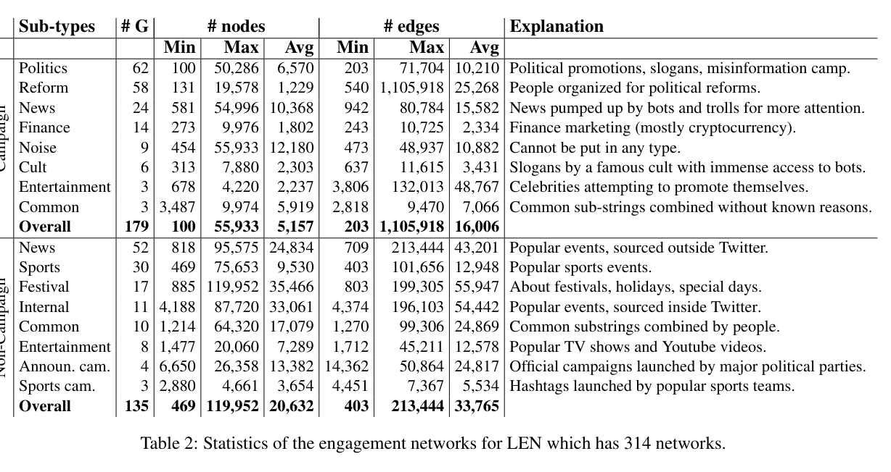
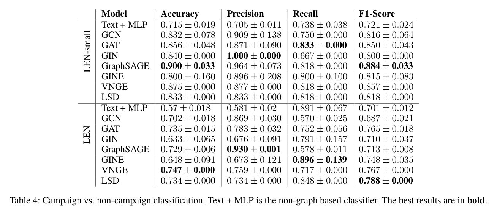
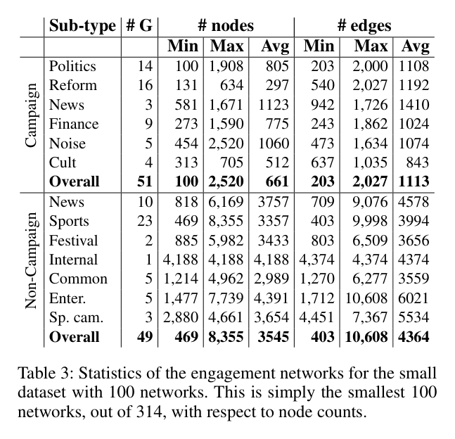
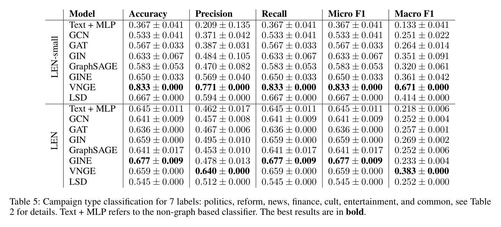
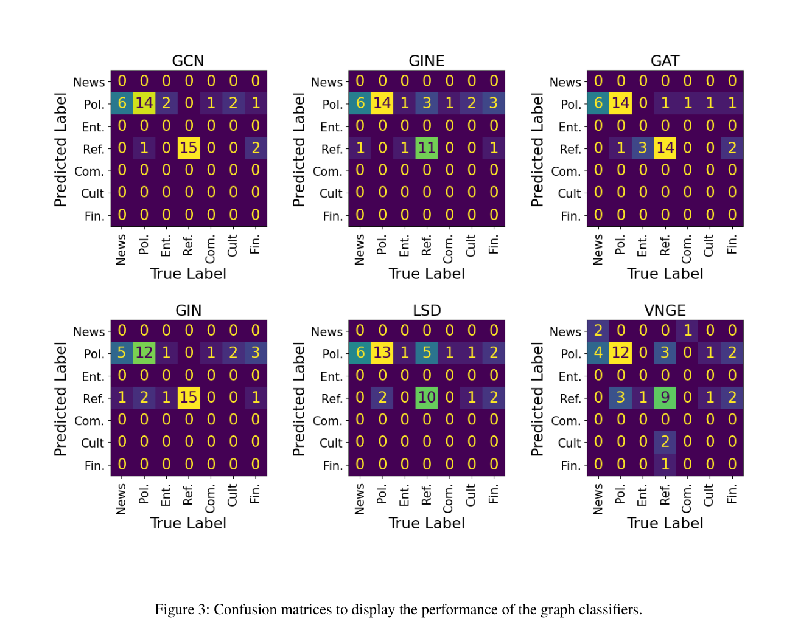
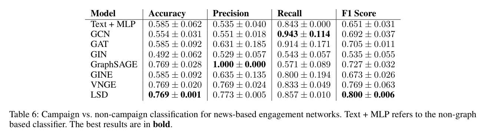
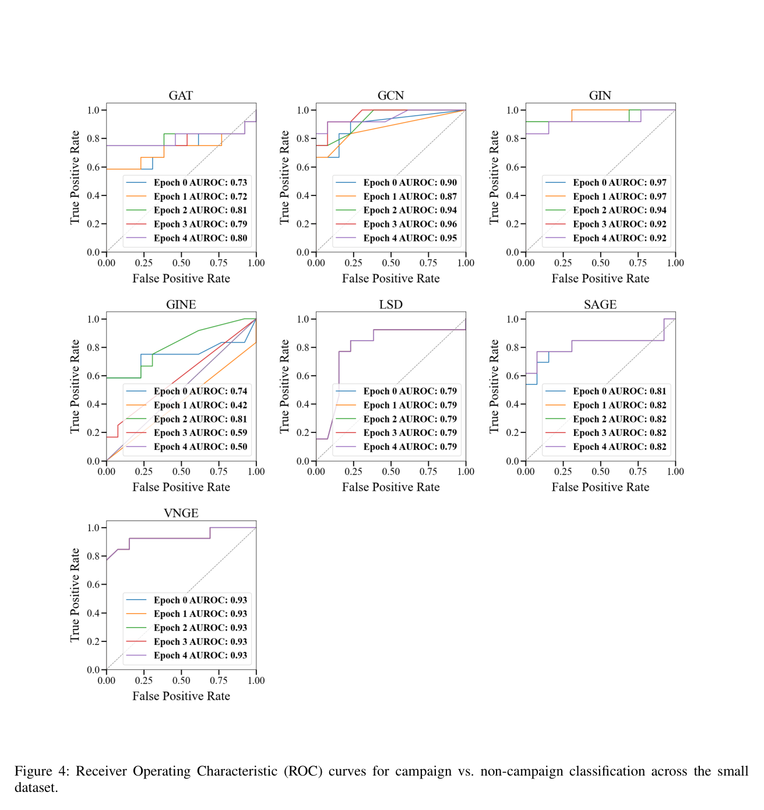
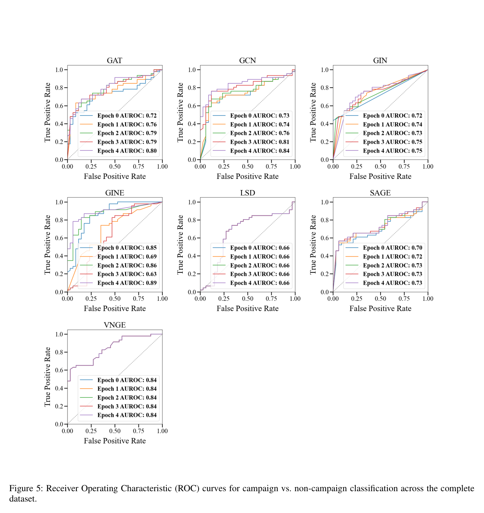
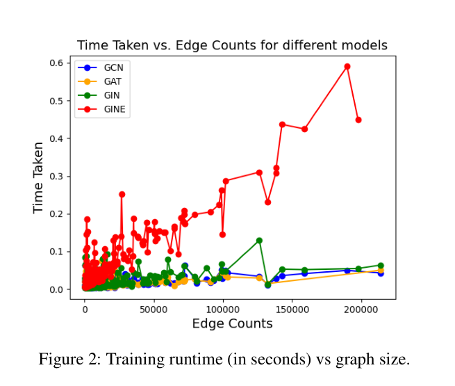
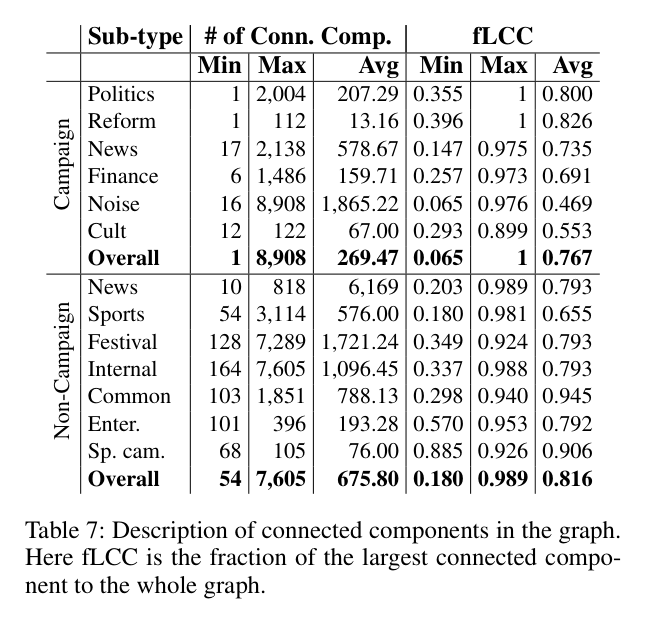

# Large Engagement Networks for Classifying Coordinated Campaigns and Organic Twitter Trends：深度解读

> **作者**：Atul Anand Gopalakrishnan, Jakir Hossain, Tuğrulcan Elmas, Ahmet Erdem Sarıyüce  
> **会议/期刊与年份**：ICWSM 2025, Proceedings 19(1): 688-702, DOI 10.1609/icwsm.v19i1.35839  
> **论文链接**：https://ojs.aaai.org/index.php/ICWSM/article/view/35839  
> **实际使用来源**：AAAI/OJS PDF `sources/paper/aaai-ojs-35839.pdf`；arXiv:2503.00599v2；官方数据页 `sources/pages/large-engagement-dataset.html`；官方代码快照 `sources/code/LEN-1dfe57a.zip`  
> **页码约定**：全文使用 1-based PDF 页码；PDF p.1 对应论文印刷页 688  
> **论文类型**：数据集或基准为主，方法/模型评测为次  
> **学科 Lens**：社会与行为科学；计算机科学与人工智能  
> **读者画像**：domain-researcher，面向 coordination/harmfulness 方向严格审计  
> **解读目标**：review  
> **视觉能力模式**：visual  
> **解读置信度**：中高；正式 PDF、图表、代码快照已核验，但未下载 101GB 原始图数据，且官方数据页与正式 PDF 存在 305 vs. 314 图版本冲突

## 1. 核心思想一句话总结（Elevator Pitch）

> **用假趋势标注话题图，证明大图 campaign 分类仍困难。**

## 2. 论文背景与动机（Background & Motivation）

### 2.1 具体问题

这篇论文处理的是 **topic/hashtag 级 campaign-vs-organic trend classification**：输入是围绕一个 Twitter/X trend 构建的 engagement network，输出是该 trend 是否属于 coordinated campaign，或 campaign 的粗类型。它不是在原始社交流中自动发现协调群体，也不是判断内容是否 harmful、是否 misinformation、是否 malicious intent 的 gold 标注任务。[Abstract, PDF p.1]

论文的核心痛点是 ground truth。作者认为一般“看起来协调”的社交行为很难确认真实组织意图，于是利用一种更容易观测的攻击：ephemeral astroturfing。攻击者用 bots 短时间发布 lexicon-generated tweets，把某个 topic 推上趋势榜后删帖；作者用这种攻击检测到的 fake trends 作为 campaign topic 的锚点，再人工筛选 non-campaign trends。[Campaigns Collection Methodology, PDF p.4-5]

### 2.2 为什么重要

- **现实价值**：如果 trend 是被协调放大的 campaign，平台、研究者或记者需要知道它与自然热门事件不同；但这种判断只能用于 campaign characterization，不能直接升级为 harmfulness detection。
- **学术价值**：LEN 把社交媒体协调问题转成 large graph classification benchmark，挑战传统图分类数据集中“小图、低边数”的评价文化。[Table 1, PDF p.2]
- **典型场景**：研究者拿到 2023 年土耳其 Twitter 趋势的互动图，想问“这个话题更像被 campaign 推动，还是更像自然热门事件”，而不是“哪些用户协调”或“该话题是否有害”。

### 2.3 论文之前的研究版图

| 路线 | 代表方法 | 有效之处 | 关键局限 | 本文如何回应 |
|---|---|---|---|---|
| 图分类基准 | MUTAG、NCI1、REDDIT、MalNet | 提供 graph classification 标准任务 | 多数图很小，社交 graph benchmark 不等于 campaign trend | LEN Original 平均约 11,769 nodes / 23,594 edges，作为更大规模基准 [Table 1, PDF p.2] |
| GNN/图嵌入分类 | GCN、GAT、GIN、GraphSAGE、GINE、VNGE、LSD | 可学习或比较图级表示 | 大图全局信息、长程依赖、计算成本困难 | 论文用这些模型作 baseline，不提出新分类器 [Graph Classifiers, PDF p.6-7] |
| Trend manipulation / astroturfing | Elmas et al. 2021/2023、Jakesch et al. 2021 | 能解释 fake trends 或跨平台组织 | campaign ground truth 稀缺，organic 对照难界定 | 用 ephemeral astroturfing 检测 campaign，用人工规则筛 non-campaign [PDF p.4-5] |

### 2.4 从痛点到研究问题

> **旧方法依赖难确认的协调意图 → 在真实 trend 上缺少可靠标签 → 作者发现 ephemeral astroturfing 有可检测删帖模式 → 因而把 fake-trend topics 与人工 organic trends 转成 engagement networks 并做图分类评测。**

- **作者主张**：LEN 是 large engagement networks benchmark，可帮助区分 coordinated campaigns 与 organic Twitter trends，并挑战大图分类方法。[Abstract, PDF p.1]
- **论文直接展示的事实**：正式 PDF 报告 314 图，其中 179 campaign、135 non-campaign；二分类在 full LEN 上最佳 F1 为 0.788，campaign type 在 full LEN 上最佳 macro-F1 为 0.383。[Table 2, 4, 5]
- **本文推断**：LEN 对 harmfulness 研究有价值的是“协调/放大方式的结构特征”，但不能替代 harmful intent 或 harm outcome 标注。

## 3. 核心方法/理论/研究设计详解（Core Method, Theory, or Study Design）

### 3.1 总体框架

方法链条是：

```text
Twitter trend / topic → campaign 与 non-campaign topic 标注 → 收集该 topic 的两天 tweets → 用户互动有向图 → 节点/边属性编码 → 图级分类评测
```

### 3.2 核心流程或论证链

以一个 fake trend hashtag 为例：

1. **起点**：作者用 Twitter API 1% 实时样本监测土耳其 tweets，寻找 4 条连续、同 hashtag 或 unigram、随后删除的 lexicon tweets；若有 100% Twitter 数据，作者估计相当于数百条短时间同模式 tweets。[PDF p.4]
2. **campaign 标签**：2023 年 3-5 月土耳其大选前识别 190 个 fake trends；7 月收集这些 fake trends 两天内 tweets；删除少于 1000 posts 的 20 个 trends，剩余 179 trends 标为 campaigns。[PDF p.4-5]
3. **non-campaign 标签**：作者不能证明“未检测到 astroturfing 就无协调”，因此人工选取更可能 organic 的 trends：外部新闻、体育、节日、内部讨论转主流媒体、常见 hashtag 等，合计 135 non-campaigns。[PDF p.5]
4. **图构造**：每个 trend 变成一个有向 graph；节点是 Twitter users；A→B 表示 A retweeted/replied/quoted B；同一用户对重复互动只保留最新一次，保留约 74% edges。[Building Networks, PDF p.5]
5. **属性与模型**：节点属性包括 bio 的 LaBSE embedding、follower/following/tweet count、verification；边属性包括互动类型、tweet text 的 LaBSE embedding、impression/engagement/likes/timestamp/sensitive。模型包括 Text+MLP、GCN/GAT/GIN/GraphSAGE/GINE、VNGE、LSD。[PDF p.5-7]
6. **评价**：75/25 stratified random graph split；binary 用 accuracy/precision/recall/F1；campaign type 用 accuracy、weighted precision/recall、micro-F1、macro-F1。[Experimental Setup, PDF p.5-6]

### 3.3 关键步骤、组件或概念

#### 3.3.1 标签单位：topic/trend，不是账号、边或 tweet

- **解决的问题**：避免把单个用户是否 bot、单条 tweet 是否 misinformation 与 trend 是否 campaign 混在一起。
- **输入/前提与产出**：输入是 trend topic；输出是 campaign/non-campaign 或 campaign subtype。
- **关键假设**：ephemeral astroturfing 检测到的 fake trend 背后有 campaign；人工选出的外部事件 trends 更可能 organic。
- **成本与风险**：campaign label 可能混入 genuine support；non-campaign 只是启发式负例，不能证明无协调。
- **论文证据**：作者在 ethics 中明确说 campaign 虽由 bots 支持、某种程度 inauthentic，但不能把所有 campaign 当作 fully inauthentic，也不能用分类器贬低其他运动。[Ethics Statement, PDF p.12]

**Before / After / Diff / Trade-off**

- **Before**：难以直接标注“谁协调了什么意图”。
- **After**：用 fake trend 检测给 topic 贴 campaign 标签。
- **Diff**：从 intent 识别降为 topic-level proxy labeling。
- **Trade-off**：标签更可操作，但语义变窄，不能直接推 harmfulness。

#### 3.3.2 Engagement network 构造



*Table 2（Statistics of the engagement networks for LEN which has 314 networks, PDF p.4）。该表给出正式 PDF 主版本的 179 campaign 与 135 non-campaign 图统计。*

- **解决的问题**：把 trend 周围的用户互动转成 graph classification 输入。
- **内部机制**：节点为用户；边为 retweet/reply/quote；重复 user pair 只留 latest engagement；节点和边都带结构外属性。
- **关键观察**：full LEN 的 non-campaign 图平均更大，20,632 nodes / 33,765 edges，高于 campaign 的 5,157 nodes / 16,006 edges。[Table 2, PDF p.4]
- **风险**：模型可能学习 graph size、event popularity 或平台采样偏差，而不是真正 campaign 机制；作者也承认 non-campaign 偏向 popular events，网络更大。[Limitations, PDF p.9]

#### 3.3.3 分类器与 split

- **模型路径**：2-layer GNN 生成 node embeddings，global mean pooling 生成 graph embedding，2-layer MLP 输出类别；GINE 使用 edge_attr，其他 GNN 主要用 node features。[Graph Classifiers, PDF p.6-7; code lines 431-451]
- **split**：论文写 stratified random sampling，75% train / 25% test。[PDF p.5-6]
- **代码核对**：`load_split_data` 在 seed loop 之前执行 `train_test_split(..., test_size=0.25)`；seed loop 之后只重设随机种子与训练模型，因此五次平均很可能不是五个独立 split。代码还注释掉 validation loss，`val_data` 为 None。[train_twitter_MPNN.py lines 182, 347, 440-453]
- **泄漏风险**：随机 graph split 未按时间、事件族、campaign sponsor、shared users 或 shared topic families 隔离；如果多个 trends 由相近社群或同一时段事件驱动，测试可能受关联结构泄漏影响。论文未报告 cross-time、cross-platform、leave-campaign-family-out 或 user-disjoint split。

### 3.4 关键形式化内容

这篇论文没有理论公式；关键形式化对象是操作化定义。

**定义 1：Engagement network**

$$
G_t = (V_t, E_t, X_t, A_t),\quad (u_i,u_j)\in E_t \Leftrightarrow u_i \text{ retweeted/replied/quoted } u_j \text{ around trend } t
$$

**来源**：Building Networks, PDF p.5；公式为本文重述，不是论文原式。

**符号**

- $t$：一个 trend topic 或 hashtag。
- $V_t$：围绕该 trend 出现的 users。
- $E_t$：latest engagement 有向边集合。
- $X_t$：节点属性，包括 bio embedding 与账号元数据。
- $A_t$：边属性，包括互动类型、tweet text embedding、计数与时间/敏感标记。

**这条定义在做什么**：它把 topic-level 社交互动转成图分类样本。

**边界**：如果 harmfulness gold 需要内容危害、目标群体、意图、现实影响或平台政策违反，这个定义都没有覆盖；它只编码 engagement structure 与部分文本/元数据。

### 3.5 核心创新

1. **数据构建创新**：把 ephemeral astroturfing fake trends 转成 campaign-labeled graph benchmark；代价是标签依赖特定攻击模式。
2. **任务创新**：从传统小图分类转向 large Twitter engagement networks；代价是 API 与大数据复现成本高。
3. **评测创新**：同时给 binary、campaign type、news-based 子集和多种 GNN/spectral baselines；代价是没有强泛化 split 或机制消融。

判断：主要是 **新数据集/基准** 与 **跨领域任务重组**，不是全新 GNN 架构，也不是统一 harmfulness SOTA。

## 4. 证据与结果分析（Evidence & Results）

### 4.1 研究设计与证据协议

- **研究问题/假设**：大规模 engagement graph 是否能区分 campaign 与 non-campaign；是否能分类 campaign subtype；news 同主题条件下是否更难。
- **研究对象与材料**：2023 年 3-5 月土耳其 Twitter trends；campaign 由 fake trends 检测得到，non-campaign 由人工启发式筛选得到。[PDF p.4-5]
- **设计与划分**：stratified random graph split 75/25；未报告时间外推、平台外推、campaign-family 外推。
- **测量与评价**：binary 指标衡量 campaign label 预测，不衡量 harmfulness；multi-class macro-F1 更能暴露 minority classes。
- **比较对象**：Text+MLP、GCN/GAT/GIN/GraphSAGE/GINE、VNGE、LSD；GNN 超参搜索学习率与 hidden dim，VNGE/LSD 搜索 random steps 与 Lanczos steps。[PDF p.7]
- **资源、伦理与成本**：论文报告 Linux/Intel Xeon Gold 6130/192GB RAM/Nvidia A100 GPU；数据采集已因 Twitter API 限制难以复现；公共发布版哈希用户标识。[PDF p.6, p.9, p.12]
- **不确定性协议**：表格给均值±标准差；但代码显示 split 可能不随 seed 重采样，且没有置信区间、统计检验或外部分布验证。

### 4.2 全量图表覆盖清单

| 编号 | 页码 | 作用 | 关键？ | 报告位置 | 处理说明 |
|---|---:|---|:---:|---|---|
| Table 1 | p.2 | 与常见图分类数据集比较规模 | 否 | §2.3 | 已视觉核验；背景定位 |
| Figure 1 | p.3 | ephemeral astroturfing 例子 | 否 | §3.3 | 已视觉核验；不作结果证据 |
| Table 2 | p.4 | LEN 主数据统计与 subtype 描述 | 是 | §3.3/§4.3 | 已视觉核验并嵌入 |
| Table 3 | p.5 | LEN-small 统计 | 是 | §4.3 | 已视觉核验 |
| Table 4 | p.6 | campaign-vs-non-campaign 主结果 | 是 | §4.3 | 已视觉核验并嵌入 |
| Figure 2 | p.6 | runtime vs. edge counts | 是 | §4.7 | 已视觉核验 |
| Table 5 | p.7 | campaign type 分类结果 | 是 | §4.3 | 已视觉核验并嵌入 |
| Table 6 | p.8 | news-based binary 子集结果 | 是 | §4.3 | 已视觉核验并嵌入 |
| Figure 3 | p.8 | campaign type 混淆矩阵 | 是 | §4.3 | 已视觉核验并嵌入 |
| Figure 4 | p.13 | LEN-small ROC/AUROC | 是 | §4.3 | 已视觉核验；附录证据 |
| Figure 5 | p.14 | full LEN ROC/AUROC | 是 | §4.3 | 已视觉核验；附录证据 |
| Table 7 | p.15 | 连通分量/fLCC 结构统计 | 是 | §4.7 | 已视觉核验 |

### 4.3 核心证据与主结果

#### Table 4：campaign-vs-non-campaign 二分类



1. **研究问题**：engagement graph 能否区分 campaign 与 non-campaign trend。
2. **如何读**：分为 LEN-small 与 LEN 两块；列为 Accuracy、Precision、Recall、F1-Score；粗体是每块每列最佳。
3. **关键证据**：LEN-small 最佳 Accuracy 0.900、F1 0.884，均为 GraphSAGE；full LEN 最佳 Accuracy 0.747 为 VNGE，最佳 F1 0.788 为 LSD。[Table 4, PDF p.6]
4. **支持的主张**：支持 C3，即分类可行但 full LEN 上表现中等。
5. **支持强度**：强支持“该协议下可分类”；弱支持“可部署检测”，因为缺少时间/平台/事件外推和误判成本分析。
6. **不能推出什么**：不能推出模型发现了协调组织者，不能推出预测为 campaign 的 trend harmful。

#### Table 3：LEN-small 的小规模平衡子集



Table 3 说明 LEN-small 不是随机抽样，而是从 314 个网络中按节点数取最小的 100 个网络，包含 51 campaign 与 49 non-campaign。[Table 3, PDF p.5] 这使 LEN-small 的高分不能直接代表 full LEN：它同时改变了规模、类别分布和计算难度，因此更适合作为快速实验子集，而不是主泛化结论。

#### Table 5 与 Figure 3：campaign type 分类





1. **研究问题**：campaign 图能否进一步区分 politics、reform、news、finance、cult、entertainment、common。
2. **关键证据**：LEN-small 中 VNGE macro-F1 0.671；full LEN 中最佳 macro-F1 仅 0.383，为 VNGE。Figure 3 的 6 个混淆矩阵显示预测大量集中在 Politics 或 Reform，News/Entertainment/Common/Cult/Finance 等类常被忽略。[Table 5, Figure 3, PDF p.7-8]
3. **支持的主张**：强支持 C4，即 type 分类明显弱于 binary，类别不平衡严重。
4. **不能推出什么**：不能把 Politics/Reform/Finance/Cult 等 subtype 当 harmful intent 等级；论文只说某些类型可能有负面社会影响，例如 false political campaigns。[PDF p.7]

#### Table 6：news-based binary 子集



1. **研究问题**：当 campaign news 与 organic news 主题相近时，分类是否更难。
2. **关键证据**：作者从 52 个 non-campaign news 中随机采样 24 个，与 24 个 campaign news 平衡；最佳 Accuracy 0.769，最佳 F1 0.800，为 LSD；多数 GNN F1 低于 full binary 表的最好值。[Table 6, PDF p.8-9]
3. **支持强度**：部分支持“同主题 news 子集更难”；样本只有 48 图，且 non-campaign random sample 未报告多次采样不确定性。

#### Figure 4/5：ROC 附录





Figure 4/5 给出 small/full 二分类的 ROC/AUROC，多模型多 epoch 曲线已核验。[Figure 4, PDF p.13; Figure 5, PDF p.14] 它们补充说明 ranking 性能：LEN-small 上若干模型 AUROC 很高，而 full LEN 上 AUROC 更集中在中等区间。但这些图没有替代 Table 4 的 F1/precision/recall，也不解决 random split 的泛化问题。

#### Figure 2 与 Table 7：计算成本和连通结构边界



Figure 2 显示 GINE 的训练时间随 edge counts 增长更明显，而 GCN/GAT/GIN 的变化较小。[Figure 2, PDF p.6] 这支持“large engagement network 不只是精度任务，也是计算成本任务”的边界，但该图只报告训练时间散点，未给显存、batch、完整硬件利用或端到端预处理成本。



Table 7 给出连通分量数量和 fLCC；campaign overall fLCC 平均 0.767，non-campaign overall fLCC 平均 0.816。[Table 7, PDF p.15] 这说明两类图都常有较大 largest connected component，但非 campaign 图平均更连通一些；它是结构背景证据，不足以单独证明 coordination mechanism。

### 4.4 对照、消融、稳健性或反例

- **被隔离的变量**：模型类型被比较，但数据 split、topic family、时间、平台、事件规模没有被系统隔离。
- **对照是否有效**：Text+MLP 提供非图 baseline；VNGE/LSD 提供非神经图 baseline；但没有 size-only、degree-only、metadata-only、text-only-without-size 控制，因此无法排除模型主要利用图规模或热门事件差异。
- **结果真正证明了什么**：在作者构建的 random split 下，若有节点/边属性与 engagement 结构，若干模型能中等水平预测 paper-defined labels。
- **仍有替代解释**：non-campaign 事件普遍更大；campaign 与 non-campaign 的采样与人工筛选流程不同；同时间政治环境可能导致分布特征被模型利用。
- **缺失关键检验**：leave-month-out、leave-subtype-out、user-disjoint、event-source-disjoint、cross-country、post-API-era replication、harmfulness gold overlay。

### 4.5 定性证据、失败案例与边界

Figure 1 只是说明 ephemeral astroturfing 的样例，不证明所有 campaign 都 harmful，也不证明模型能发现 bots。作者反而明确写道 bots 在 7 月完整收集时已经被删除，且不是 campaign 图中的 integral actors，而是用于制造 fake trends 的噪声来源。[PDF p.4-5]

论文最重要的边界在 ethics：campaigns 虽由 bots 支持、某种程度 inauthentic，但不能把全部 campaign 贴成 fully inauthentic，更不能用训练出的 classifier 去否定其他社会运动。[Ethics Statement, PDF p.12] 对 CogGuard Harmfulness 来说，这句话是红线。

### 4.6 主张-证据审计

| 核心主张 | 最强证据 | 支持等级 | 最大替代解释 | 最快证伪/补强方案 |
|---|---|---|---|---|
| C1: LEN 是大图分类基准 | Table 1-3 | 强支持 | 数据页与 README 报 305 图，PDF 报 314 图 | 下载 release 数据核对 graph_labels 与文件数 |
| C2: campaign label 来自 fake trend proxy | 方法正文与 ethics | 部分支持 | ephemeral detector 漏掉其他协调策略；non-campaign 不是无协调证明 | 对 non-campaign 做人工/外部证据复审和不同协调模式扫描 |
| C3: binary 分类可行但中等 | Table 4, Figure 4/5 | 强支持 | random split 泄漏 topic/time/user 社群特征 | 做 time-split、leave-event-out、size-only baseline |
| C4: type 分类更弱 | Table 5, Figure 3 | 强支持 | minority classes 太少，macro-F1 不稳定 | 采样平衡、层级标签、置信区间、更多 campaign types |
| C5: 复现风险高 | Limitations + code | 强支持 | 代码可能不是论文实验完整版本 | 固定可运行环境、数据 manifest、脚本化重现实验 |
| C6: 非 Harmfulness SOTA | 任务定义 + ethics | 强支持 | 可作为 harmfulness 研究的候选特征资源 | 另建 harmfulness annotation 并做外部验证 |

### 4.7 可靠性、复现性与争议点

- **最可信的结论**：LEN 正式 PDF 版本确实构建了 topic-level engagement graph benchmark，且 full LEN 上常见模型只得到中等二分类结果。
- **最弱或最可能被高估的结论**：把 classification performance 解读为 coordination discovery 或 harmfulness detection。论文没有发现协调群体，也没有 harmful intent gold。
- **泄漏与偏差**：random graph split 可能泄漏同一时间、同一社群、同类政治事件或 shared user patterns；non-campaign 偏向热门事件导致 size/popularity confounding。
- **复现性**：官方代码 HEAD 为 `1dfe57aaad7398ddf9914e639dc0604f52271d55`；archive hash 为 `a7f718b7d3aee262d38377fa146f3b0acd6ca1d3e7a7fabaf6ca88896408b4b2`。`requirements.txt` 有无效/不完整 pin，`data_type == all` 分支代码写 `All_dir` 而变量是 `all_dir`，validation 注释掉，split 在 seed loop 前生成，均降低可复现性。[code snapshot]
- **版本冲突**：正式 PDF 与 arXiv v2 报 179+135=314 图；官方数据页和 README 快照报 170+135=305 图。报告采用正式 PDF 为主版本，但数据复现必须先解决该冲突。

## 5. 论文的贡献与影响（Contribution & Impact）

### 5.1 主要贡献

1. **问题层贡献**：把 coordinated campaign vs. organic trend 定义成 topic-level graph classification，而非账号级 bot detection。
2. **方法层贡献**：不是提出新模型，而是给出 graph construction 与 baseline evaluation pipeline。
3. **证据/资源层贡献**：公开大规模 Turkish Twitter engagement graph 数据与代码，虽然当前数据页版本与正式 PDF 不一致。

### 5.2 对领域与实践的影响

- **近期研究影响**：可作为 coordination characterization、large social graph classification、campaign-vs-organic benchmark 的参考。
- **长期学术影响**：提醒图分类基准需要从小分子/小社交图扩展到真实平台大图，但也暴露评价协议必须更重视时间与事件泛化。
- **实践价值**：能为平台风控或研究筛查提供候选信号，但需要人工复核、误判成本定义和独立 harmfulness annotation。
- **不宜迁移的场景**：跨平台、跨国家、当前 X API 时代、非 ephemeral astroturfing 协调、内容危害判断、IO membership 推断。

### 5.3 值得探索的未来方向

1. **论文原生下一步：更强 split**
   当前假设：random graph split 足以评估泛化。破裂点：同时间/同事件/同社群泄漏。新问题：模型能否识别未见时间段与未见 campaign family。最小验证：leave-month-out 与 leave-subtype-out。
2. **跨领域迁移：harmfulness overlay**
   当前假设：campaign subtype 可提示社会风险。破裂点：type 不等于 harm。新问题：哪些 campaign 具有 false claim、targeted harassment、manipulation harm。最小验证：抽样建立独立 harm taxonomy 与双人标注。
3. **更强证据：confounder 控制**
   当前假设：图结构承载 campaign 信号。破裂点：模型只用 size、activity volume、verified ratio 或事件热度。最小验证：size-only、degree-only、metadata-only、text-only 与结构-only 消融。
4. **复现工程：固定来源包**
   当前假设：公开代码和数据足够复现。破裂点：版本冲突和依赖缺口。新问题：如何生成可审计 graph manifest。最小验证：下载全部 graph labels、文件数、hash、运行脚本并比对 Table 4-6。

## 6. 结论（Conclusion）

LEN 的价值在于把 ephemeral astroturfing 锚定的 fake trends 与人工 organic trends 转成大规模 Twitter engagement graph benchmark，并展示常见 GNN/图嵌入方法在该任务上并不稳健。最强证据是 Table 2 的数据规模、Table 4 的 binary 结果、Table 5/Figure 3 的 type 分类失败模式；最弱环节是 random split 泛化、数据页版本冲突和 official code 可复现性。对 CogGuard Harmfulness，这篇论文只能作为 coordination-characterization 参考，不能当 harmful intent gold、不能当 coordination discovery、也不能称为统一 Harmfulness SOTA。

> **最终判断**：值得精读并有条件借鉴；引用时必须限定为 campaign-vs-organic engagement graph classification benchmark。
>
> **读完应记住的一句话**：LEN 标的是“话题是否像被 campaign 推上趋势”，不是“内容是否有害”。
