# Coordinated Reply Attacks in Influence Operations: Characterization and Detection：深度解读

> **作者**：Manita Pote, Tugrulcan Elmas, Alessandro Flammini, Filippo Menczer  
> **会议/期刊与年份**：ICWSM 2025, Proceedings of the Nineteenth International AAAI Conference on Web and Social Media  
> **论文链接**：DOI 10.1609/icwsm.v19i1.35889；arXiv 2410.19272  
> **实际使用来源**：AAAI/ICWSM 正式 PDF；arXiv PDF 仅作版本核对；Zenodo 数据 DOI 10.5281/zenodo.13896308 与版本 DOI 10.5281/zenodo.13896309；官方代码 https://github.com/osome-iu/io-coordinated-replies，main 提交 a834156  
> **页码约定**：全文使用 1-based PDF p.N；PDF p.1 对应论文印刷页 1586  
> **论文类型**：实证观察 + 监督检测方法 + 数据/复现资源  
> **学科 Lens**：social-behavioral 为主；computer-science-ai 为辅  
> **读者画像**：面向 CogGuard harmfulness 任务迁移审计的 research-generalist  
> **解读目标**：understand + review + transfer  
> **视觉能力模式**：visual  
> **解读置信度**：中高。正式 PDF、数据说明和代码仓库可得；未完整下载数 GB 原始数据，因此复现性评估停留在资源与协议审计层面。

## 1. 核心思想一句话总结（Elevator Pitch）

> 本文用Twitter IO回复数据刻画并检测协同回复攻击。

## 2. 论文背景与动机（Background & Motivation）

### 2.1 具体问题

论文研究的是 coordinated reply attacks：一组账号对特定个人或实体的帖子集中回复，以压倒目标、推送叙事或制造参与度。作者把它放在 Twitter 已公开的 state-sponsored influence operations 语境中研究，并提出三个问题：RQ1 识别被协同回复的目标与话题；RQ2 在潜在目标的推文集合中识别收到协同回复的推文；RQ3 在被攻击推文的回复者中识别参与协同行动的账号 [PDF p.1-p.2]。

任务单位必须分开看。RQ2 的单位是 tweet，标签是 targeted tweet vs control tweet。RQ3 的单位是 replier account，标签是 IO replier vs normal replier。论文没有给 community、thread community 或用户群体分配 harmfulness 标签，也没有把伤害意图作为监督标签 [PDF p.3, PDF p.8]。

### 2.2 为什么重要

现实价值在于，协同回复会让被攻击者和旁观者误判公众反应，尤其当政治人物、记者或媒体账号通过社交媒体征询公众意见时，集中回复可能扭曲对民意的感知；作者还指出这种行为可能增加恶意信息曝光、污染对话、骚扰目标并使目标不愿继续发声 [PDF p.10]。

学术价值在于，此前 IO 检测多关注账号、内容、网络协调或整体宣传活动，较少专门处理“回复目标”这一互动策略。本文把目标推文和回复者拆成两个监督检测任务，并提供数据与代码以复现实验 [PDF p.2, PDF p.13]。

### 2.3 论文之前的研究版图

| 路线 | 代表方法 | 有效之处 | 关键局限 | 本文如何回应 |
|---|---|---|---|---|
| IO 账号或内容检测 | troll account/tweet classifiers, behavioral cues, linguistic cues | 可识别已知 IO 行为或内容风格 | 常依赖 IO 语境、语言或账号整体特征 | 本文使用 reply/comment engagement 特征，声称不使用 IO-specific features 或 sentiment cues [PDF p.2] |
| 协调行为发现 | network modularity, multi-view clustering, sequence/action frameworks | 能找相似行为群体 | 通常聚类账号，不直接回答某条推文是否被集中回复 | 本文改为分类 individual posts 和 individual accounts [PDF p.2] |
| 平台/政策报告 | Stanford Internet Observatory 等定性报告 | 描述协同回复作为 IO tactic | 不提供大规模检测协议 | 本文用 43 个 Twitter IO 数据集量化刻画并训练分类器 [PDF p.3] |

### 2.4 从痛点到研究问题

**作者主张**：协同回复攻击是 IO 中常见但未被充分量化和检测的 tactic；被攻击目标多为有影响力公众人物；两个监督分类器能分别检测目标推文和参与回复攻击的账号 [PDF p.1-p.2]。

**论文直接展示的事实**：数据来自 43 个 Twitter Moderation Research Consortium state-sponsored IO 数据集；正例推文定义为收到五个或更多 IO 账号直接回复的非 IO 账号推文；控制推文来自同一目标在最后一次 IO 回复后的推文；两个主模型报告 AUC 0.88 和 0.97 [PDF p.3, Table 2, Table 5]。

**本文推断**：对 CogGuard harmfulness 来说，这篇论文更适合作为“协同回复攻击策略检测”与“目标/回复者粒度设计”的参考，而不是 community harmfulness 标注依据。IO membership 是平台归因和数据来源标签，不等同于每个账号或每条回复的 harmful intent。

## 3. 核心方法/理论/研究设计详解（Core Method, Theory, or Study Design）

### 3.1 总体框架

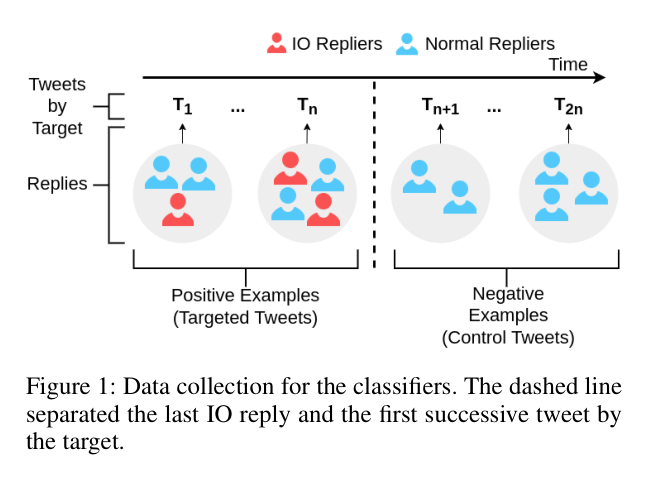

*Figure 1（Data collection for the classifiers, PDF p.3）。图中以虚线分隔同一 target 的最后一条 IO reply 之前和之后；左侧作为正例 targeted tweets，右侧作为负例 control tweets。*

主流程是：Twitter IO 数据集中的 suspended IO accounts → 取 IO accounts 对 non-IO accounts 的 direct replies → 将收到至少 5 个 IO direct replies 的原推文定义为 targeted tweets → 从同一 targets 在最后 IO reply 后发布且至少 5 个回复的推文中取 control tweets → 为 tweet classifier 聚合推文和回复特征 → 对 targeted tweets 的回复者构造 IO replier/normal replier 特征 → 分别用 10-fold cross-validation 评估 [PDF p.3, Figure 1]。

这个流程的关键是把“攻击是否发生”操作化为 Twitter 已标记 IO 账号的集中直接回复。它绕开了人工判断单条回复恶意意图的问题，但也把平台归因、账号下架历史和可访问性限制带入标签定义。

### 3.2 核心流程或论证链

1. **起点**：43 个 Twitter 发布的 state-sponsored IO 数据集，时间覆盖 2018 年 10 月至 2021 年 12 月，包含 Twitter 称为外部影响行动账号的元数据和推文 [PDF p.3]。
2. **目标数据集**：保留 IO 账号对非 IO 账号推文的 direct replies。作者报告 17,873,714 条 IO replies，44,425 个 IO accounts，15,256,547 条被回复推文，1,763,084 个 distinct targets；进一步抽取 15,016 个 targets 和 96,041 条收到至少五个 IO direct replies 的 targeted tweets [PDF p.3]。
3. **分类数据集**：以 targeted tweets 为正例；以同一 targets 在最后一次 IO reply 之后发布、至少五个回复的推文为负例 control tweets，并按 target 平衡控制推文数量。最终 RQ2 数据含 3,866 条 targeted tweets 与同数 control tweets，涉及 1,507 targets [PDF p.3]。
4. **RQ2 输出**：tweet classifier 判断一条候选推文是否收到 coordinated replies。特征包含 3 个 tweet-level engagement 特征和 96 个 reply-level 聚合特征，共 99 个 [PDF p.5]。
5. **RQ3 输出**：replier classifier 判断在 targeted tweets 下回复的账号是否属于 IO replier。正例是 IO repliers，负例是 normal repliers；作者报告 targeted tweet dataset 中 IO repliers 只占 0.8%，为 7,670 vs 874,248，因此使用 downsampling 和 oversampling 处理不平衡 [PDF p.8-p.9]。

### 3.3 关键步骤、组件或概念

#### 3.3.1 正例定义：收到五个或更多 IO 直接回复的推文

- **解决的问题**：把“协同回复攻击”转化成可训练标签。
- **输入/前提与产出**：输入为 Twitter IO 账号集合及其 direct replies；输出为 targeted tweet label。
- **内部机制**：如果多个被 Twitter 标记为同一 IO 语境中的账号集中回复同一非 IO 目标，作者将其视为 coordinated reply attack tactic 的发生 [PDF p.3]。
- **关键假设**：Twitter IO 归因可作为 ground truth；五条回复阈值虽被作者称为 arbitrary，但 Figure 7 做了阈值稳健性检查。
- **成本与风险**：这不是 harmfulness label，也不是意图标签；它更像 “IO-origin coordinated reply exposure” 标签。

#### 3.3.2 负例构造：同一目标后续控制推文

- **解决的问题**：避免把目标账号本身的受欢迎程度误当作攻击信号。
- **输入/前提与产出**：同一 target 在最后一次 IO reply 之后发布且至少 5 个回复的推文；输出为 control tweet label [PDF p.3, Figure 1]。
- **内部机制**：同一 target 内匹配，且每个 target 取与正例数量相同的 control tweets。
- **关键假设**：最后一次 IO reply 之后的推文没有收到 coordinated replies by IO accounts；但这只排除了已知 IO 账号，不排除未知协同群体。
- **失效点**：作者承认 control tweets 来自此前被攻击作者，可能有偏；控制数据与攻击数据有约 21 个月的中位时间差，可能存在 temporal alignment 问题 [PDF p.10]。

#### 3.3.3 Tweet classifier：从回复分布识别被攻击推文

- **输入/产出**：输入是一条原推文及其直接回复集合的聚合特征；输出是 targeted/control 二分类。
- **特征机制**：tweet-level 有 reply_count、retweet_count、like_count；reply-level 有 engagement、entities、delay、similarity 四类属性，每类按分布统计量聚合。相似度使用 LaBSE embedding 的 cosine similarity 来捕捉回复叙事相似性 [PDF p.5]。
- **模型与指标**：Logistic Regression、Random Forest、AdaBoost、Decision Tree、Naive Bayes；z-score 标准化；10-fold cross-validation；precision、recall、F1、AUC；阈值调到 mean F1 最大 [PDF p.5-p.6]。
- **最强结果**：Random Forest 100 trees 得到 precision 0.73、recall 0.87、F1 0.80、AUC 0.88 [Table 2, PDF p.6]。

#### 3.3.4 Replier classifier：从账号和回复行为识别参与者

- **输入/产出**：输入是 targeted tweets 下每个 replier 的 profile metadata 与回复集合特征；输出是 IO replier/normal replier 二分类。
- **特征机制**：profile metadata 包含 age、follower_rate、following_rate、activity_rate；reply-level 特征包括 delay、engagement、entities、similarity，最终 76 features [PDF p.8-p.9]。
- **类别不平衡处理**：原始比例约 0.8% IO repliers；作者构造 10 个 downsampled balanced datasets，并也尝试 oversampling [PDF p.8-p.9]。
- **最强结果**：downsampling + Random Forest 得到 precision 0.93、recall 0.92、F1 0.92、AUC 0.97；oversampling 的 Random Forest F1 只有 0.71，precision 0.70、recall 0.72 [Table 5, PDF p.9]。

**Before / After / Diff / Trade-off**

- **Before**：多数 IO 检测聚焦账号整体、内容或网络相似性。
- **After**：本文把目标推文与回复者拆成两个监督任务，使用 reply-centric aggregate features。
- **Diff**：从“识别一批协同账号”转为“先找被协同回复的推文，再找该语境下的参与账号”。
- **Trade-off**：更贴合 reply attack tactic，但依赖已知 IO 数据、控制推文构造和 Twitter/X 数据可访问性；不能直接泛化为社区 harmfulness 或未知平台的恶意意图识别。

### 3.4 关键形式化内容

#### 定义 1：Targeted tweet

**来源**：Data Collection, PDF p.3。

一条非 IO 账号发布的 tweet 如果收到五个或更多来自 Twitter IO 数据集中账号的 direct replies，作者将其定义为 targeted tweet，并假设其收到 coordinated reply attack。

**符号化重构**：给定 tweet `t`，设 `R_IO(t)` 为被 Twitter IO 数据集标记的账号对 `t` 的直接回复集合。若 `|R_IO(t)| >= 5`，则 `y_tweet(t)=1`；否则它不自动成为负例，负例另由同一 target 后续 control tweets 构造。

**最小例子**：某记者的一条推文收到 8 个已知 IO 账号直接回复，则进入 targeted tweets；该记者在最后一次 IO reply 后发布的一条有 6 个普通回复且没有已知 IO reply 的推文，可作为 control tweet 候选。

**边界**：阈值 5 是任意设定；Figure 7 检查 5 到 20 的阈值变化，但这只说明模型指标对该阈值相对稳定，不证明阈值具有社会学或安全语义上的唯一正确性。

#### 定义 2：Reply-level similarity

**来源**：Classifier Features, PDF p.5 与 RQ3 features, PDF p.8-p.9。

作者用 LaBSE 为回复文本生成 embedding，并计算同一目标推文下两条回复之间的 cosine similarity；随后把每条 tweet 或每个 replier 相关的 similarity 分布聚合成统计特征。

**作用**：相似回复被视为 inauthentic engagement 的常见特征，因此 similarity 是两个分类器的重要输入，尤其在 replier classifier 中贡献最大 [Figure 9, Figure 10, Table 6]。

**边界**：相似文本可以来自协同模板，也可能来自共同话题、引用同一口号、语言翻译或事件语境；因此 similarity 支持 tactic detection，不单独证明 harmful intent。

#### 定义 3：支持强度标签

本报告把核心主张分为强支持、部分支持、弱支持、未支持。强支持表示论文内有明确数据构造、结果表或核查图表支撑；部分支持表示结果成立但依赖强假设或缺少外部验证；弱支持表示主要来自作者推断或有限 case study；未支持表示论文没有提供对应证据。

### 3.5 核心创新

1. **问题定义创新**：将 coordinated reply attacks 明确拆成 target tweet detection 与 participating replier detection 两个监督任务，而不是只做账号聚类。
2. **特征创新**：围绕 replies 构造 engagement、entities、delay、similarity 的分布统计量，使 detection 更贴近“回复攻击”这一 tactic。
3. **资源贡献**：提供 Zenodo 数据和 GitHub 复现实验代码；数据说明列出 RQ1/RQ2/RQ3 文件、记录数、标签字段和 10-fold cross-validation 建议。
4. **迁移价值**：对 CogGuard 最有价值的是“任务单位与标签边界”的设计，而不是直接复用 IO 标签作为 harmfulness ground truth。

## 4. 证据与结果分析（Evidence & Results）

### 4.1 研究设计与证据协议

- **研究问题/假设**：RQ1 刻画 targets 与 topics；RQ2 检测 targeted tweets；RQ3 检测参与回复攻击的 repliers。
- **研究对象与材料**：Twitter 公开的 43 个 state-sponsored IO 数据集、Twitter API 补充抓取的目标/推文/回复/用户元数据、作者人工标注的 Serbia/Egypt target profiles、Zenodo 发布的 cleaned/derived 数据。
- **设计与划分**：主实验使用 10-fold cross-validation；cross-campaign 实验按 campaign 训练测试；RQ2 构造 balanced tweet dataset；RQ3 对极不平衡 replier dataset 使用 downsampling/oversampling。
- **测量与评价**：precision、recall、F1、AUC；阈值为最大化 mean F1；部分分布比较用 Kolmogorov-Smirnov tests。
- **伦理与复现**：论文称 IRB exemption，协议 12410 和 1102004860；代码和数据公开；实验均值来自 10-fold cross-validation 并报告 standard errors；作者建议分类器用于人工调查辅助 [PDF p.13]。

### 4.2 全量图表覆盖清单

| 编号 | 页码 | 作用 | 关键 | 报告位置 | 处理说明 |
|---|---:|---|:---:|---|---|
| Figure 1 | PDF p.3 | 数据构造框架 | 是 | §3.1, §4.3 | visual 已核查并嵌入 |
| Figure 2 | PDF p.4 | targets/tweets/replies/delay 描述分布 | 是 | §4.3 | visual 已核查并嵌入 |
| Figure 3 | PDF p.4 | Serbia case study | 是 | §4.3 | visual 已核查并嵌入 |
| Figure 4 | PDF p.5 | Egypt case study | 是 | §4.3 | 自动裁剪不完整，已重裁并核查嵌入 |
| Table 1 | PDF p.5 | tweet classifier reply-level 属性列表 | 否 | §4.2 | 非主结果，自动裁剪不完整，不嵌入 |
| Figure 5 | PDF p.6 | targeted/control engagement 分布 | 是 | §4.3 | visual 已核查并嵌入 |
| Table 2 | PDF p.6 | tweet classifier 主结果 | 是 | §4.3 | visual 已核查并嵌入 |
| Table 3 | PDF p.6 | tweet classifier 特征集合消融 | 是 | §4.3 | visual 已核查并嵌入 |
| Figure 6 | PDF p.6 | tweet classifier permutation importance | 是 | §4.3 | 自动裁剪不完整，已重裁并核查嵌入 |
| Figure 7 | PDF p.7 | targeted threshold 稳健性 | 是 | §4.4 | 自动裁剪不完整，已重裁并核查嵌入 |
| Table 4 | PDF p.7 | tweet classifier 跨 campaign F1 | 是 | §4.4 | visual 已核查并嵌入 |
| Figure 8 | PDF p.8 | IO/normal replier 元数据分布 | 否 | §4.2 | 描述性背景，自动裁剪不完整，不嵌入 |
| Figure 9 | PDF p.8 | replier classifier permutation importance | 是 | §4.3 | visual 已核查并嵌入 |
| Table 5 | PDF p.9 | replier classifier 主结果 | 是 | §4.3 | visual 已核查并嵌入 |
| Table 6 | PDF p.9 | replier classifier 特征集合消融 | 是 | §4.3 | visual 已核查并嵌入 |
| Figure 10 | PDF p.9 | similarity 分布解释 | 是 | §4.3 | visual 已核查并嵌入 |
| Figure 11 | PDF p.10 | replier class imbalance 稳健性 | 是 | §4.4 | visual 已核查并嵌入 |
| Table 7 | PDF p.10 | replier classifier 跨 campaign F1 | 是 | §4.4 | visual 已核查并嵌入 |

### 4.3 核心证据与主结果

#### 4.3.1 RQ1：目标与话题

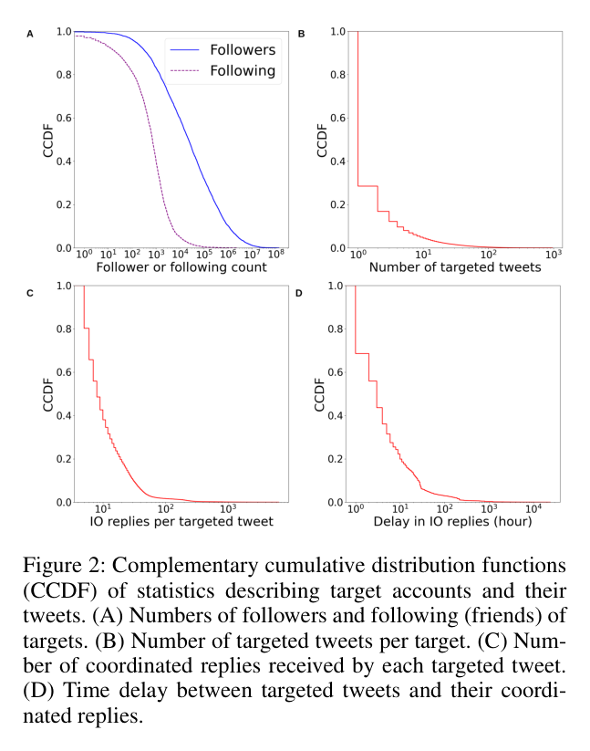

*Figure 2（PDF p.4）显示 target followers/following、每个 target 被攻击推文数、每条 targeted tweet 的 IO replies 数和回复延迟的 CCDF。*

Figure 2 支持的结论是：targets 往往比普通用户更具影响力，作者报告 followers 中位数 22,540，高于 following 中位数 707；多数 targets 只被攻击少数推文，中位数为 1；每条 targeted tweet 的 coordinated replies 中位数为 8；回复延迟中位数为 3 小时 [PDF p.4, Figure 2]。这些是描述性结果，作者也明确承认缺少 general Twitter user reference model，因此不能把“被攻击者比普通用户更有影响力”作为严格因果结论 [PDF p.4]。

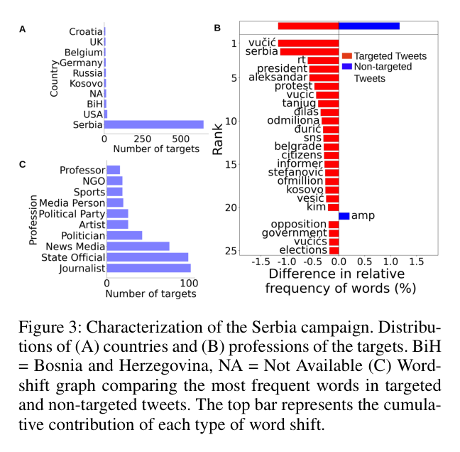

*Figure 3（PDF p.4）显示 Serbia campaign 的目标国家、职业与 targeted/non-targeted tweets 的 word-shift。*

Serbia case study 中，多数目标来自 Serbia；职业分布以 journalists 102、state officials 99、news media organizations 76、politicians 43 为主；word-shift 指向 Vucic、SNS、2017 election、protest、Serbia-Kosovo diplomatic crisis 等政治主题 [PDF p.4, Figure 3]。支持强度为部分支持，因为职业/国家标注由一位作者人工完成，且只覆盖两个 case study。

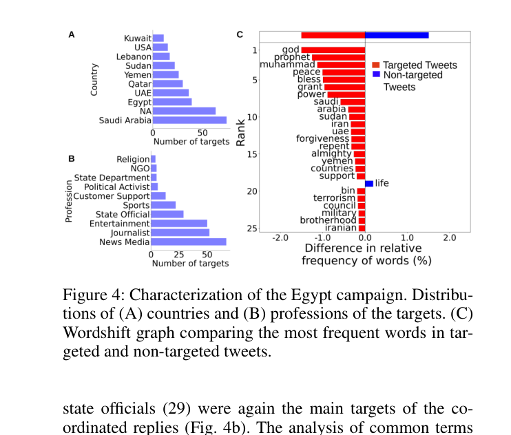

*Figure 4（PDF p.5）显示 Egypt campaign 的目标国家、职业与 targeted/non-targeted tweets 的 word-shift。*

Egypt case study 中，news media、journalists、entertainment、state officials 等成为主要目标；正文特别指出 state officials 29。word-shift 和人工检查显示话题聚焦宗教、恐怖主义、Iran Nuclear Deal、Yemen、Sudan military coup、Muslim Brotherhood 等 [PDF p.5, Figure 4]。这支持“targets 和话题与具体 campaign context 相关”，但不支持对所有平台或所有 community harmfulness 的外推。

#### 4.3.2 RQ2：tweet classifier

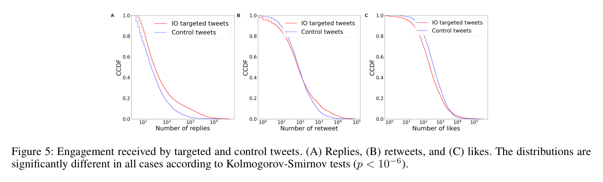

*Figure 5（PDF p.6）显示 targeted tweets 与 control tweets 的 replies、retweets、likes 分布。*

作者报告 targeted tweets 收到更多 replies，中位数 31 vs 22；control tweets 反而有更多 retweets，中位数 84 vs 75，以及更多 likes，中位数 420 vs 250；三项分布差异均通过 Kolmogorov-Smirnov tests，p < 10^-6 [PDF p.5-p.6, Figure 5]。这说明 reply attack detection 不能只看目标推文本身的总体流行度。

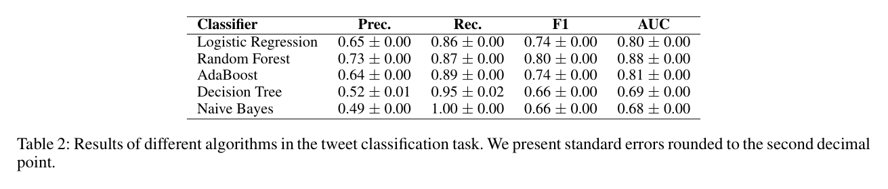

*Table 2（PDF p.6）给出 tweet classification 的算法比较。*

Random Forest 是主模型：precision 0.73、recall 0.87、F1 0.80、AUC 0.88；Logistic Regression F1 0.74、AUC 0.80；AdaBoost F1 0.74、AUC 0.81；Decision Tree 和 Naive Bayes 明显较弱 [Table 2, PDF p.6]。支持强度为强支持，前提是接受作者的正负例构造。

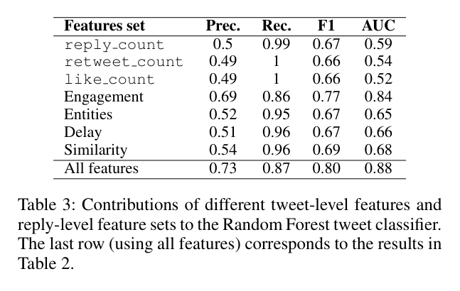

*Table 3（PDF p.6）给出 Random Forest 在不同特征集合上的 10-fold cross-validation 结果。*

单独 reply_count、retweet_count、like_count 的 AUC 只有 0.59、0.54、0.52；聚合 engagement 特征 AUC 0.84、F1 0.77；all features AUC 0.88、F1 0.80 [Table 3, PDF p.6]。这支持作者认为“回复层面的聚合信号比简单流行度更有用”。

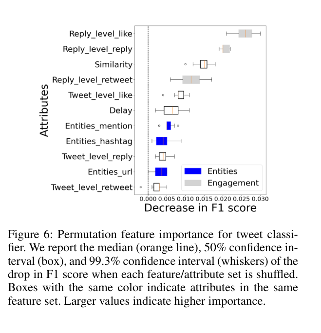

*Figure 6（PDF p.6）显示 shuffle 某组特征导致 F1 下降的分布，数值越大表示越重要。*

Figure 6 中 reply_level_like、reply_level_reply、similarity、reply_level_retweet 位于重要性前列；作者正文也说两种分析都显示 reply-level engagement 是区分因素 [PDF p.6, Figure 6]。这是对 Table 3 的机制解释，但 permutation importance 仍是相关性解释，不证明造成攻击的因果机制。

#### 4.3.3 RQ3：replier classifier

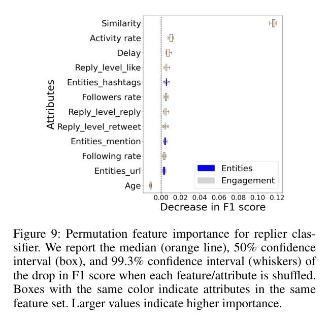

*Figure 9（PDF p.8）显示 replier classifier 的 permutation feature importance。*

Figure 9 中 Similarity 的 F1 drop 远高于其他属性；Table 6 也显示单独 Similarity 特征集达到 precision 0.85、recall 0.84、F1 0.84、AUC 0.92，而 all features 达到 F1 0.92、AUC 0.97 [Figure 9, Table 6, PDF p.8-p.9]。

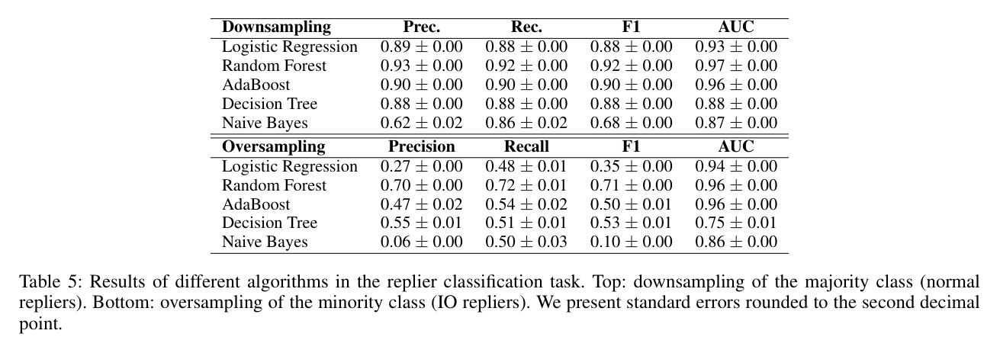

*Table 5（PDF p.9）给出 replier classification 的 downsampling 与 oversampling 结果。*

在 downsampling 下，Random Forest 得到 precision 0.93、recall 0.92、F1 0.92、AUC 0.97；oversampling 下同模型 AUC 0.96 但 F1 下降到 0.71，precision 0.70、recall 0.72 [Table 5, PDF p.9]。因此论文最强性能主张依赖 downsampled balanced datasets，而非真实 0.8% prevalence 下的端到端部署评估。

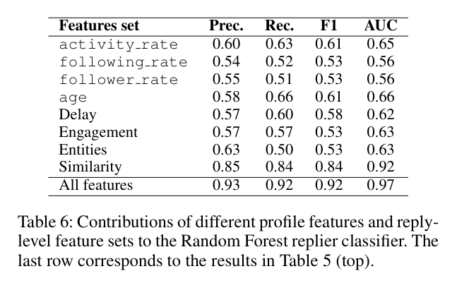

*Table 6（PDF p.9）显示 replier Random Forest 的特征集合贡献。*

profile metadata 单项特征 AUC 多在 0.56-0.66；delay、engagement、entities 也较弱；similarity 是唯一单独达到 AUC 0.92、F1 0.84 的特征集合 [Table 6, PDF p.9]。这与 Figure 10 的分布解释一致。

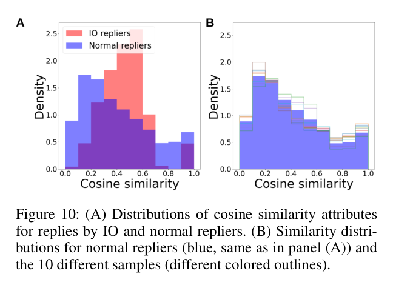

*Figure 10（PDF p.9）对比 IO repliers 与 normal repliers 的 cosine similarity 分布，并展示 10 个 normal samples 的稳定性。*

Figure 10 的 panel A 显示 IO repliers 的相似度密度相对更集中在较高 cosine similarity 区间；panel B 显示 10 个 normal samples 的蓝色/彩色 outlines 形态相近。作者据此解释：同一目标推文下，IO repliers 的回复彼此更相似，这是 replier classifier 的强信号 [PDF p.9, Figure 10]。

### 4.4 对照、消融、稳健性或反例

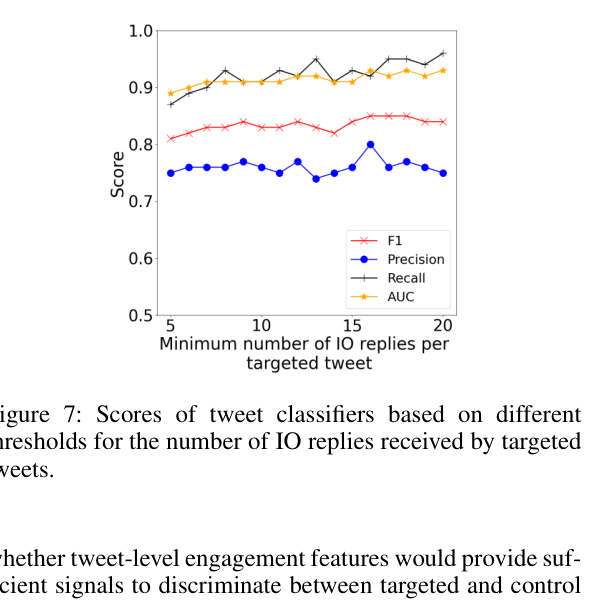

*Figure 7（PDF p.7）显示 targeted tweet 阈值从 5 到 20 个 IO replies 变化时，tweet classifier 的 precision、recall、F1、AUC。*

Figure 7 支持“阈值变化不显著改变 tweet classifier”的结论：在 5-20 范围内，AUC 约 0.89-0.93，F1 约 0.81-0.85，precision 约 0.75-0.80，recall 约 0.87-0.96。支持强度为部分支持，因为它只检验一个阈值维度，没有检验未知 IO、非 IO 协调者或不同平台的标签偏移。

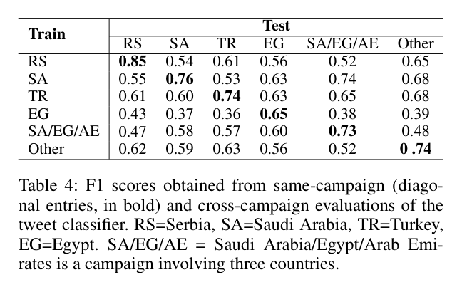

*Table 4（PDF p.7）给出 train campaign 与 test campaign 组合下的 tweet classifier F1。*

同 campaign 对角线 F1 为 RS 0.85、SA 0.76、TR 0.74、EG 0.65、SA/EG/AE 0.73、Other 0.74；跨 campaign off-diagonal F1 常下降，尤其 Egypt 相关组合较弱，例如 EG 训练测 RS 0.43、SA 0.37、TR 0.36、SA/EG/AE 0.38、Other 0.39 [Table 4, PDF p.7]。这表明 tweet classifier 有部分 campaign-general signals，但泛化不是均匀可靠。

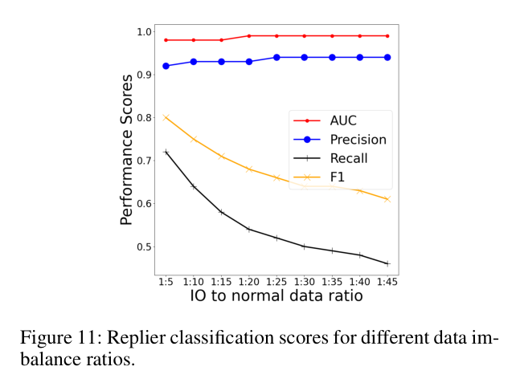

*Figure 11（PDF p.10）显示 IO:normal ratio 从 1:5 到 1:45 时 replier classifier performance。*

Figure 11 显示 AUC 和 precision 在测试的不平衡比例下保持较高，但 recall 与 F1 随 normal data 增多明显下降；例如 F1 从约 0.80 降到约 0.61。它支持“模型可处理一定不平衡”的有限主张，但同时揭示真实低 prevalence 下召回/综合性能会受影响 [Figure 11, PDF p.10]。

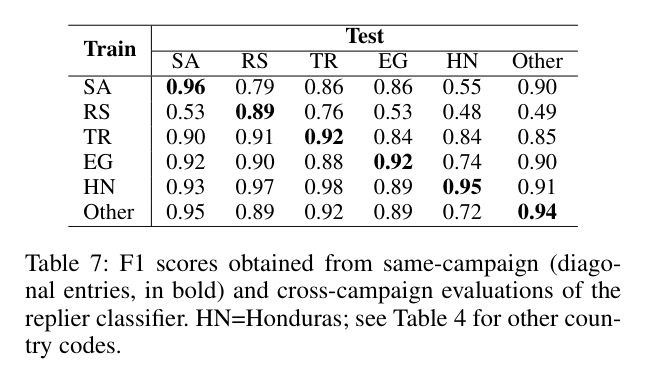

*Table 7（PDF p.10）给出 replier classifier 跨 campaign F1。*

Table 7 的 replier classifier 跨 campaign 结果总体优于 tweet classifier，同 campaign 对角线为 SA 0.96、RS 0.89、TR 0.92、EG 0.92、HN 0.95、Other 0.94；但 HN 和 Other 测试列仍出现较低 off-diagonal，如 SA→HN 0.55、RS→HN 0.48、RS→Other 0.49、Other→HN 0.72 [Table 7, PDF p.10]。因此“generalizable”应理解为在这些 Twitter IO campaigns 内有较强迁移，而不是无条件跨平台或跨社区任务迁移。

### 4.5 定性证据、失败案例与边界

论文的局限非常关键。作者承认 control tweets 来自 previously targeted authors，可能有偏；控制回复收集时间受限，尽管作者用 13 天和 32 天的到达比例缓解担忧，但仍有 survivor bias；control data 与 campaign end 的中位间隔约 21 个月，可能不代表 targeted tweets 的时间语境；tweet classifier 的数据被人工平衡；特征构造只看 direct replies，忽略 reply thread 的树状结构 [PDF p.10]。

对 harmfulness 迁移最重要的失败边界是作者在参考文献页前明确写到：主要目标是检测 coordinated replies，这种攻击常被 IO 使用，但 regular social media users organizing for activism 也可能使用相似行为；因此分类器在 wild 中应补充 human investigation，且不应被误用来把用户标记为 IO accounts without thorough investigation [PDF p.11]。

### 4.6 主张—证据审计

| 核心主张 | 最强证据 | 支持等级 | 最大替代解释 | 最快证伪/补强方案 |
|---|---|---|---|---|
| C1: 协同回复攻击主要瞄准有影响力公众人物 | Figure 2, Figure 3, Figure 4；人工标注 case studies | 部分支持 | 仅可访问 targets 和两个人工标注 campaign 可能偏 | 对全 43 campaigns 进行多标注者一致性与更广泛职业/影响力基线比较 |
| C2: Tweet classifier 能识别 targeted tweets | Table 2, Table 3, Figure 6, Figure 7, Table 4 | 强支持 | 控制推文时间差和平衡数据导致任务容易化 | 按时间切分、target-level holdout、未平衡真实 prevalence、未知 campaign 验证 |
| C3: Replier classifier 能识别参与协同回复的 IO repliers | Table 5, Table 6, Figure 9, Figure 10, Figure 11, Table 7 | 强支持 | IO membership 与文本相似/账号年龄等已知归因偏差高度耦合 | 在新下架前数据、人工调查样本和不同平台上测 calibrated precision/recall |
| C4: 方法具有跨 campaign 泛化能力 | Table 4, Table 7 | 部分支持 | 某些 campaign 组合明显掉分，且都是 Twitter IO 数据集内部迁移 | 留一国家/语言/时间段验证；跨平台复现 |
| C5: 相似回复是关键机制信号 | Table 6, Figure 9, Figure 10 | 部分支持 | 共同话题、模板政治口号或语言翻译也能产生相似度 | 加入话题控制、事件固定效应、人工区分模板协调与自然同题回复 |
| C6: 论文可支持 CogGuard harmfulness | 无直接 harmfulness 标签；只有 IO tactic 与安全影响讨论 | 弱支持 | harmfulness 与 IO reply tactic 是不同构念 | 另建 harmfulness 标注层，不把 IO membership 当 harmful intent |

### 4.7 可靠性、复现性与争议点

最可信的是两个内部检测任务的表内结果，尤其是 Table 2 和 Table 5，因为它们有清楚任务单位、特征、模型和 10-fold cross-validation。最弱的是外推到 harmfulness 或真实部署：论文没有 community harmfulness 标签，没有人工 harmful intent 标注，没有真实低 prevalence 的在线监测评估，也没有跨平台数据。

复现资源方面，Zenodo 元数据列出 cleaned/derived 文件：RQ2_tweet_classifier_features.csv 有 7,732 records，tweet_label 表示 targeted=1/control=0；poster_tweetid_campaign_type.csv 有 2,673,091 records，包含 replier_label 和 type；RQ3_replier_classifier_features.csv 与 RQ3_replier_info.csv 各有 881,918 records；datasheet 建议使用 10-fold cross-validation [Zenodo 10.5281/zenodo.13896309, coordinated_reply_datasheet.pdf]。GitHub README 给出依赖版本、目录结构和运行顺序，main 提交为 a834156。未核验项是未下载数 GB 数据文件、未运行 notebooks、未重新计算表格。

## 5. 论文的贡献与影响（Contribution & Impact）

### 5.1 主要贡献

1. **问题层贡献**：把 coordinated reply attacks 从 IO 报告中的 tactic 描述转为可操作化的数据与检测任务。
2. **方法层贡献**：构造 tweet-level 与 reply-level 聚合特征，特别是 delay、entities、engagement 与 LaBSE cosine similarity 的统计分布。
3. **证据/资源层贡献**：发布 Zenodo 数据、datasheet 和 GitHub 代码，支持从 cleaned/derived 数据复现实验。
4. **审计层贡献**：论文自身清楚披露了控制推文偏差、时间差、平衡数据、direct replies 限制和误用风险，这对 CogGuard 迁移很有价值。

### 5.2 对领域与实践的影响

对平台治理来说，本文提示“目标账号本身可以作为 sensors”：先检测某些公众人物的推文是否收到异常协同回复，再深入调查回复者。对研究来说，它提供了从 campaign-level IO 到 interaction-level tactic detection 的范式。

对 CogGuard harmfulness 任务的迁移建议必须保守：可以迁移“reply attack detection”作为上游风险信号；可以迁移 target/replier/tweet 的任务单位拆分；可以迁移 similarity、delay、engagement 聚合特征；但不能把 IO membership、coordinated behavior 或 high similarity 直接映射为 harmful intent，也不能把目标推文检测结果解释为 community harmfulness。

### 5.3 值得探索的未来方向

1. **论文原生下一步**：用未下架前或实时数据做 in-the-wild validation。当前假设是 cleaned Twitter IO 数据足够代表部署场景；破裂点是 survivor bias、X/Twitter API 变化和控制推文时间差；最小验证是按时间切分并报告真实 prevalence 下 precision-recall curve。
2. **跨领域迁移**：把 tweet/replier 两阶段结构迁移到 CogGuard。当前假设是 harmfulness 可以从 reply attack tactic 中获得风险信号；破裂点是 harmfulness 需要内容、目标脆弱性、意图和影响标注；最小验证是同时标注 tactic label 与 harm label，测二者相关但不等同。
3. **更强证据**：加入人工调查与多标注者一致性。当前假设是 Twitter IO labels 足以作为 ground truth；破裂点是平台归因错误或账号被错误合并；最小验证是对高分样本和低分样本抽样人工审计。
4. **实践应用**：构建“需人工复核”的监测队列而不是自动处罚系统。当前假设是模型可降低调查成本；破裂点是 activism、campaigning 或危机响应也可能产生 coordinated replies；最小验证是部署前定义误报成本和人工复核协议。

## 6. 结论（Conclusion）

本文最可靠的贡献是把 coordinated reply attack 具体化为两个可复现实验任务：识别被 IO 协同回复的推文，以及识别在这些推文下参与回复的 IO repliers。其最强证据是 Table 2 的 tweet classifier AUC 0.88 和 Table 5 的 replier classifier AUC 0.97，以及 Table 3/6、Figure 6/9/10 对特征机制的补充。其主要边界是标签来自 Twitter IO membership 与控制推文构造，而不是 harmful intent 或 community harmfulness。

> **最终判断**：值得作为 CogGuard 的 tactic-specific reply-attack detection 参考；不应直接作为 harmfulness ground truth。
>
> **读完应记住的一句话**：它检测的是“被已知 IO 协同回复”这一策略信号，不是证明社区有害性。
