# Detection and Characterization of Coordinated Online Behavior: A Survey：深度解读

> **作者**：Lorenzo Mannocci, Michele Mazza, Anna Monreale, Maurizio Tesconi, Stefano Cresci
> **期刊与年份**：ACM Computing Surveys, 2026
> **论文链接**：[DOI 10.1145/3839225](https://doi.org/10.1145/3839225)；[arXiv:2408.01257](https://arxiv.org/abs/2408.01257)
> **实际使用来源**：用户提供的 arXiv v2 PDF、MarkItDown 转换正文、逐页文本层和人工核验的关键页面
> **页码约定**：全文使用 1-based PDF 页码
> **版本说明**：所给 PDF 是 2026-04-10 的 arXiv v2，PDF 内 ACM 引用仍含占位 DOI；正式 DOI 由出版元数据另行核验
> **论文类型**：系统性综述与概念框架
> **学科 Lens**：计算社会科学；网络科学与机器学习
> **读者画像**：CogGuard 研究人员与系统工程师
> **解读目标**：审查并迁移到 Coordination Discovery / harmful Coordination Detection 研发
> **视觉能力模式**：visual
> **解读置信度**：高；关键定义、流程、指标表和开放问题已直接核验，但自动裁图清单尚未逐项完成分类

## 1. 核心思想一句话总结（Elevator Pitch）

> **该综述用“发现协同群体后再做四维表征”统一了协调行为研究。**

## 2. 论文背景与动机（Background & Motivation）

### 2.1 具体问题

论文处理的不是单一分类器，而是一个两步分析问题：输入一个或多个平台上的用户集合与按时间排序的活动，先区分协同与非协同用户，再从 `authenticity`、`harmfulness`、`orchestration`、`time-variance` 四个维度刻画已发现群体。[Definition 2.11，PDF p.8；Figure 6，PDF p.12]

这里有一个对 CogGuard 至关重要的术语差异：

- 论文把“找出协同账号、簇或社区”称为 **detection**。
- CogGuard 把相同任务称为 **Discovery**，把后续“是否为有害协同攻击”的监督定性称为 **Detection**。
- 因而，论文的 `detection -> characterization` 映射到项目语境时，应写为 `Discovery -> four-dimensional characterization -> harmfulness Detection`，不能按词面直接对齐。

### 2.2 为什么重要

- **现实价值**：协同既可能是社会运动、互助和合法商业宣传，也可能是虚假信息、仇恨、诈骗或操纵。只识别“同步”会产生严重误报。
- **学术价值**：该问题同时包含群体关系发现、隐含意图推断、动态网络分析和不确定性治理，任何单一账号标签都无法覆盖。
- **典型场景**：一组账号在六小时内共同转发相同 URL。Discovery 可以确认共同行为证据，但只有结合身份真实性、内容危害、组织结构、持续时间和人工证据，才能判断是否是 harmful CIB。

### 2.3 论文之前的研究版图

| 路线 | 典型输入与方法 | 有效之处 | 关键局限 | 综述如何统一 |
|---|---|---|---|---|
| 平台规则与操作定义 | 同 URL、同 hashtag、同步转发、账号处置 | 可快速形成案件线索 | 平台和任务特定，难以比较 | 抽象为 actors、actions、intent |
| 网络科学 | 用户相似网络、阈值/统计过滤、社区发现 | 证据可解释，适合无标签场景 | 窗口与阈值敏感，容易压平多层关系 | 统一为选用户、构图、过滤、社区发现 |
| 无监督数据挖掘 | 聚类、异常检测、表示学习 | 可发现未知模式 | 簇不等于有害，也不必然对应真实社区 | 将输出限定为 Discovery 结果 |
| 有监督学习 | IO 账号或平台处置标签、行为与内容特征 | 可量化分类性能 | 标签常是账号身份代理，不是协同边或有害意图 Gold | 单列训练目标与验证局限 |
| 表征/案例分析 | Bot score、毒性、中心性、时间变化 | 可描述发现群体 | 指标可能有测量误差和主观性 | 组织为四维 characterization |

### 2.4 从痛点到研究问题

> **平台特定启发式缺少统一含义与零模型 -> 不同数据集上无法公平比较 -> 可观测 actions 是最可靠的数字痕迹 -> 先由 actions 发现群体，再用 actors 与 intent 证据进行多维表征。**

- **作者主张**：线上协同行为可以由“多个用户为某一意图执行协同增效行动”统一定义。[Definition 2.11，PDF p.8]
- **论文直接展示的事实**：现有工作对 Twitter/X、静态、有害、非真实和有组织行为存在明显研究偏置；跨平台、动态、多模态和严格验证不足。[Figures 9-10，PDF p.30；Section 6，PDF pp.30-32]
- **本文推断**：CogGuard 不能把 Bot 概率、协调强度、毒性或 IO membership 中任一项直接当成 harmful Coordination Detection 标签。

## 3. 核心方法、定义与研究设计详解

### 3.1 总体框架

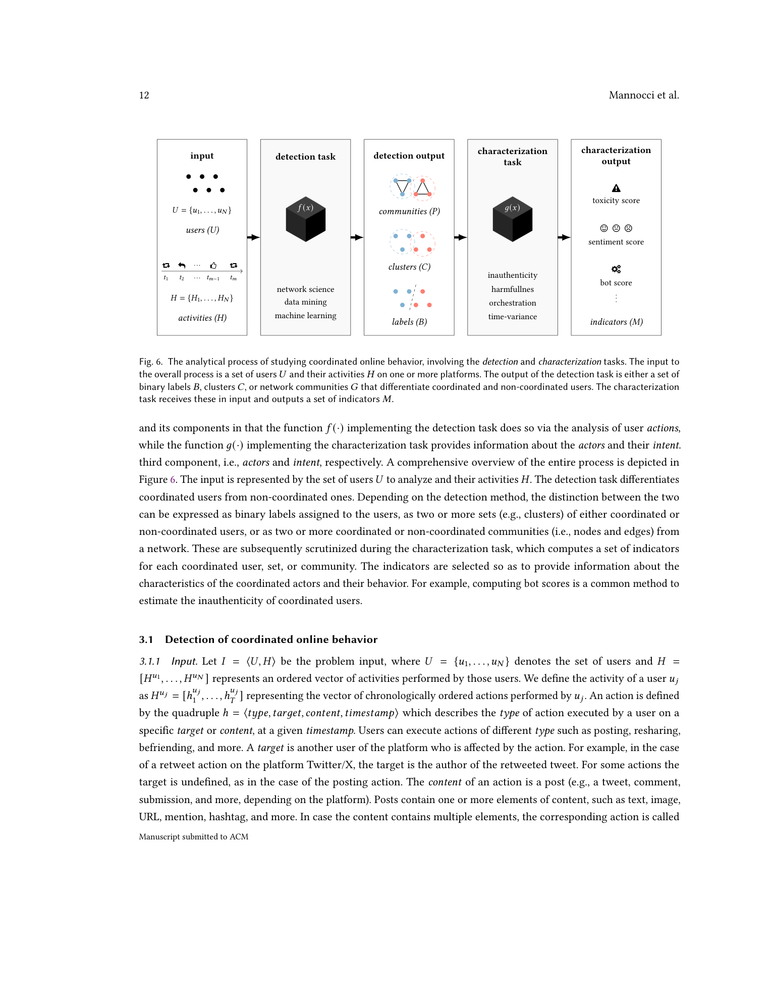

*Figure 6（PDF p.12）。输入用户与活动；检测输出标签、簇或社区；表征再输出四维及其他指标。这里嵌入经人工核验的完整页面，因为自动裁图遗漏了主体。*

Figure 6 将问题拆成两类函数：

1. `f(x)` 分析用户 actions，输出二元标签、簇或网络社区，用于区分协同与非协同用户。
2. `g(x)` 接收发现结果并分析 actors 与 intent，输出毒性、情感、Bot 分数等指标。
3. 四维不是四个互斥类别，而是对同一群体的不同测量轴。
4. 该图定义的是分析职责，不证明某一种算法能同时完成两步。

**一句话看懂**：先回答“哪些账号在协同”，再回答“这种协同是什么性质”。

### 3.2 核心定义与分析链

#### 3.2.1 Actors、actions、intent

Definition 2.11 将 coordinated online behavior 定义为：

> A group of users who perform synergic actions in pursuit of an intent.

三个组件的角色如下：[PDF pp.8-9]

- **Actors**：谁在参与，身份是否真实，关系是自发、分布式还是集中组织，参与规模多大。
- **Actions**：做了什么、针对谁、发布了什么内容、何时发生。动作通常可见，是 Discovery 最可靠的数字痕迹。
- **Intent**：为什么协同。意图可能明确、隐含、隐藏或主观，必须从 actions、内容、外部事实和分析员证据中推断。

最小例子：账号 A、B、C 在十分钟内发布相同 URL，这是 `actions` 证据；三个账号是否伪装身份属于 `actors/authenticity`；推广公益活动还是组织诈骗属于 `intent/harmfulness`。前者不能自动推出后两者。

#### 3.2.2 四个定义维度

| 维度 | 论文定义 | 典型指标 | 不能直接推出 |
|---|---|---|---|
| Authenticity | 行为者对身份和在线存在的真实、透明程度 | Bot score、平台处置、用户名多样性、账号创建突发 | Bot 不必然虚假；非 Bot 也可能伪装 |
| Harmfulness | 协同行动造成负面后果的意图、潜力或实际影响 | 毒性、宣传、来源可靠性、立场、目标与平台处置 | 协调强度、自动化和负面情感均不是危害真值 |
| Orchestration | 协同是有组织还是自发涌现 | 同步度、中心性、同配性、密度、模块度、层级结构 | 高内聚不必然说明外部指挥或恶意 |
| Time-variance | 人员、意图、行为、结构和强度如何随时间变化 | 成员流入流出、主题演化、活动突发、结构变化 | 单个静态窗口不能证明稳定或适应性 |

Authenticity 与 harmfulness 尤其不能合并。论文给出“真实但有害”的公开仇恨群体，以及“身份不透明但无害”的政治异议者作为反例。[Section 2.5，PDF pp.9-11]

#### 3.2.3 网络科学 Discovery

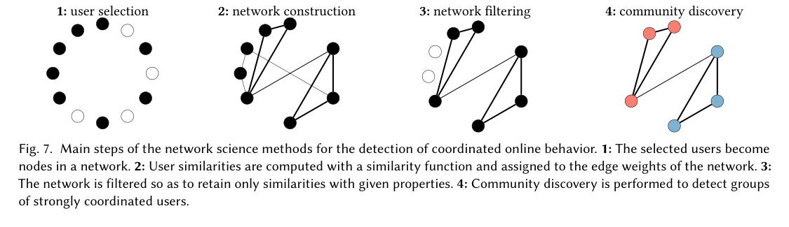

*Figure 7（PDF p.14）。用户选择 -> 网络构建 -> 网络过滤 -> 社区发现。裁图已人工核验。*

1. **User selection**：确定候选用户和观测窗口。错误的预筛选会直接限制召回率。
2. **Network construction**：按共同 URL、hashtag、文本、目标或时间关系计算用户相似度并赋边权。
3. **Network filtering**：用阈值、统计骨干或其他准则去除预期偶然相似。
4. **Community discovery**：在过滤后的图上寻找高内聚账号群。

**Before / After / Diff / Trade-off**

- **Before**：账号级特征分类或单个相似度阈值。
- **After**：保留用户间关系并在网络上发现群体。
- **Diff**：预测单位从账号转为账号关系和群体。
- **Trade-off**：解释性增强，但结果对用户选择、相似函数、时间窗口、过滤和社区算法高度敏感。

#### 3.2.4 Characterization 指标

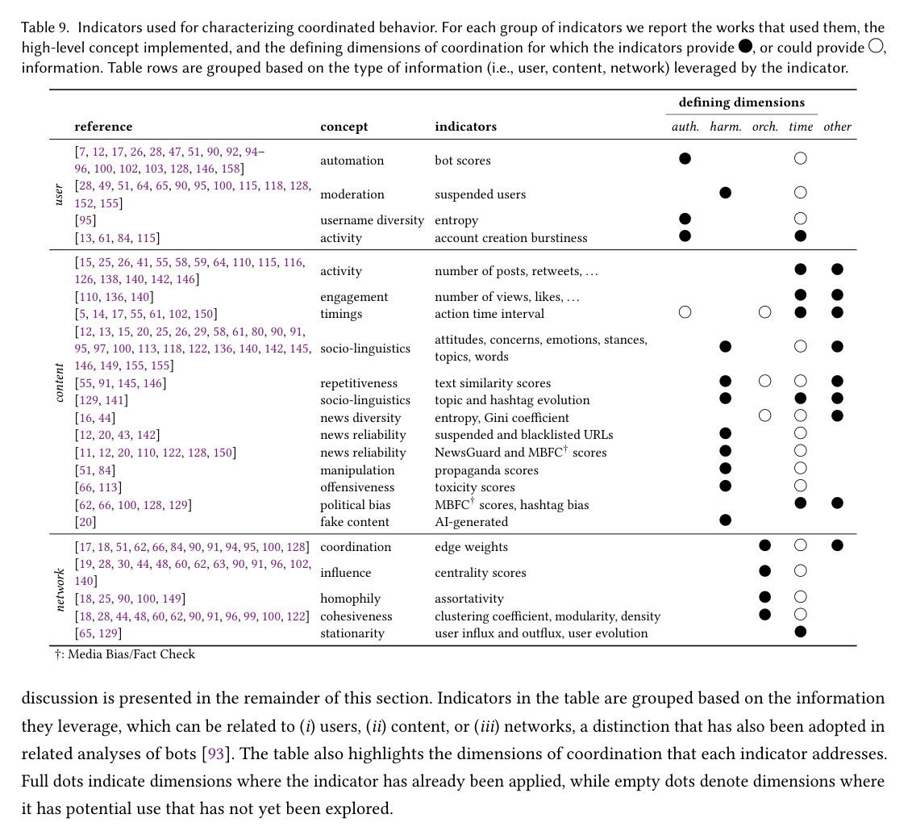

*Table 9（PDF p.26）。黑点表示文献已将该指标用于相应维度，空心点表示作者认为有潜力但尚未使用。裁图已人工核验。*

Table 9 的核心不是给出一个加权公式，而是证明不同证据源测量不同概念：用户信息主要支持 authenticity，内容支持 harmfulness，网络结构主要支持 orchestration，而几乎所有指标都可以被扩展为 time-variance 测量。[PDF pp.26-29]

Bot score 位于 `user -> automation -> authenticity` 路径。作者明确列出三类误差：[Section 5.1，PDF pp.26-27]

- Bot 检测本身会出错。
- 自我声明、服务性或其他善意 Bot 可能是真实且无害的。
- Troll、假身份或部分人工控制账号可能不自动化，却仍不真实。

因此，CogGuard 已接入 Bot detection 是一项真实系统能力，但其输出只能成为账号级 authenticity evidence，不能直接形成社区真实性标签。

### 3.3 关键形式化内容

论文在 Section 3.1.1 将输入写为：

$$
I = \langle U, H \rangle, \quad U = \{u_1, \ldots, u_N\}, \quad H = [H^{u_1}, \ldots, H^{u_N}]
$$

其中每个用户的活动按时间排序：

$$
H^{u_j} = [h_1^{u_j}, \ldots, h_{T_j}^{u_j}], \quad
h = \langle type, target, content, timestamp \rangle
$$

**来源**：Section 3.1.1，PDF p.12。

- $U$：待分析用户集合。
- $H$：所有用户的活动序列。
- $h$：一个可观测动作。
- `type`：发布、转发、评论、关注等动作类型。
- `target`：动作指向的账号或对象，部分动作可为空。
- `content`：文本、图片、URL、mention、hashtag 等内容。
- `timestamp`：动作发生时间。

这一定义提示 CogGuard：`EventSnapshot` 必须保存动作级 provenance、关系类型和时间，不能只保存聚合账号特征。若先把多层动作压平为单一无向相似边，后续模型无法恢复方向、证据类型或事件顺序。

Discovery 与表征可抽象为：

$$
f(I) \rightarrow \{B, C, G\}, \qquad g(B \mid C \mid G, I) \rightarrow M
$$

这里 $B$ 是标签、$C$ 是簇、$G$ 是网络社区、$M$ 是表征指标。论文没有要求 $f$ 或 $g$ 必须是神经网络，也没有提供统一优化目标。该形式化描述任务接口，不是一个端到端可复现算法。

### 3.4 系统综述设计

论文采用系统性检索和筛选，构建协调在线行为研究语料，再按定义、检测方法、表征指标和开放问题组织证据。Figure 3 给出 PRISMA 流程，Tables 1-8 汇总操作定义及网络科学、无监督、有监督方法，Table 9 汇总表征指标。[PDF pp.3, 7, 16-26]

该设计适合回答“领域如何定义和实现任务”，不适合证明某个模型优于另一个模型。文中数量分布反映已纳入文献，不是现实世界行为发生率。

### 3.5 核心贡献

1. **统一定义**：以 actors、actions、intent 覆盖此前平台和任务特定定义。
2. **分析职责分离**：把发现协调者与刻画群体属性分开，阻止从协调性直接跳到恶意性。
3. **四维框架**：将 authenticity、harmfulness、orchestration、time-variance 作为可独立测量的轴。
4. **方法与证据地图**：同时梳理网络科学、数据挖掘、机器学习和表征指标。
5. **研究缺口**：明确跨平台、动态、多模态、规模、验证、主观性和归因问题。

它主要是问题定义、证据组织和研究议程创新，不是新的检测模型或 benchmark。

## 4. 证据与结果分析（Evidence & Results）

### 4.1 研究设计与证据协议

- **研究对象**：协调在线行为的学术与平台研究。
- **证据类型**：定义、方法类别、数据与验证协议、表征指标、案例和研究数量分布。
- **比较对象**：网络科学、无监督学习、有监督学习、模拟方法及四维指标。
- **不确定性**：作者讨论定义异质性、标签匮乏、平台偏置和 harmfulness 主观性，但综述本身不提供模型级多 seed 统计比较。
- **主要限制**：Twitter/X 和 harmful/inauthentic/orchestrated 研究占主导；语言、平台、数据访问和平台处置标签都会影响证据覆盖。

### 4.2 全量图表覆盖清单

自动清单检测到 21 项，其中 Figure 6 和 Table 9 各有一次重复文本命中；唯一编号对象为 10 个 Figure 和 9 个 Table。

| 编号 | 页码 | 作用 | 关键？ | 本报告处理 |
|---|---:|---|:---:|---|
| Figure 1 | 2 | 协调与其他网络现象的关系 | 否 | 背景图，标题和正文核验 |
| Figure 2 | 2 | 年度发文趋势 | 否 | 描述领域增长，不承载方法主张 |
| Figure 3 | 3 | PRISMA 检索流程 | 是 | 用于判断综述证据范围 |
| Figure 4 | 3 | 学科来源分布 | 否 | 支持跨学科背景 |
| Table 1 | 7 | 既有操作定义 | 是 | 支持定义碎片化判断 |
| Figure 5 | 11 | authenticity/harmfulness 分类图 | 是 | 支持两维独立性 |
| Figure 6 | 12 | detection -> characterization | 是 | §3.1 嵌入完整页并精读 |
| Figure 7 | 14 | 网络 Discovery 四步 | 是 | §3.2.3 嵌图并精读 |
| Figure 8 | 15 | social/interaction/coordination network 区别 | 是 | 用于确认协同边不要求直接互动 |
| Table 2 | 16 | 单层用户网络方法 | 否 | 方法目录，未逐行复现 |
| Table 3 | 18 | 时间窗口与网络类型 | 是 | 支持窗口敏感性判断 |
| Table 4 | 19 | 不同时间窗的有效 co-action | 是 | 支持边界效应判断 |
| Table 5 | 20 | multiplex 用户网络方法 | 是 | 支持多层关系不应过早压平 |
| Table 6 | 21 | 内容网络方法 | 否 | 支持多模态/内容路线地图 |
| Table 7 | 22 | 无监督方法 | 否 | 方法目录，未逐项做性能重分析 |
| Table 8 | 23 | 有监督方法 | 是 | 支持训练目标异质性判断 |
| Table 9 | 26-29 | 四维表征指标 | 是 | §3.2.4 嵌图并精读 |
| Figure 9 | 30 | 平台组合分布 | 是 | 支持跨平台稀缺判断 |
| Figure 10 | 30 | 四维组合分布 | 是 | §4.3 嵌图并精读 |

#### 4.2.1 其余关键视觉证据

下列图表已直接核验，用于支撑综述范围、定义分离、窗口效应、多层关系、监督目标和跨平台偏置。它们作为证据地图保留，不在正文逐行复述。

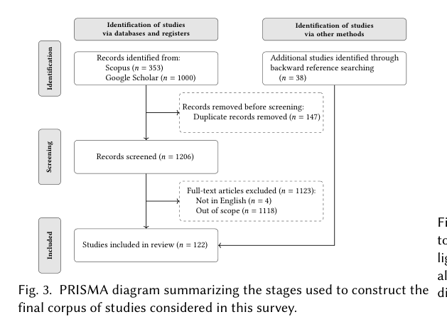

*Figure 3（PDF p.3）：从数据库与 backward reference search 筛选出 122 篇纳入研究。*

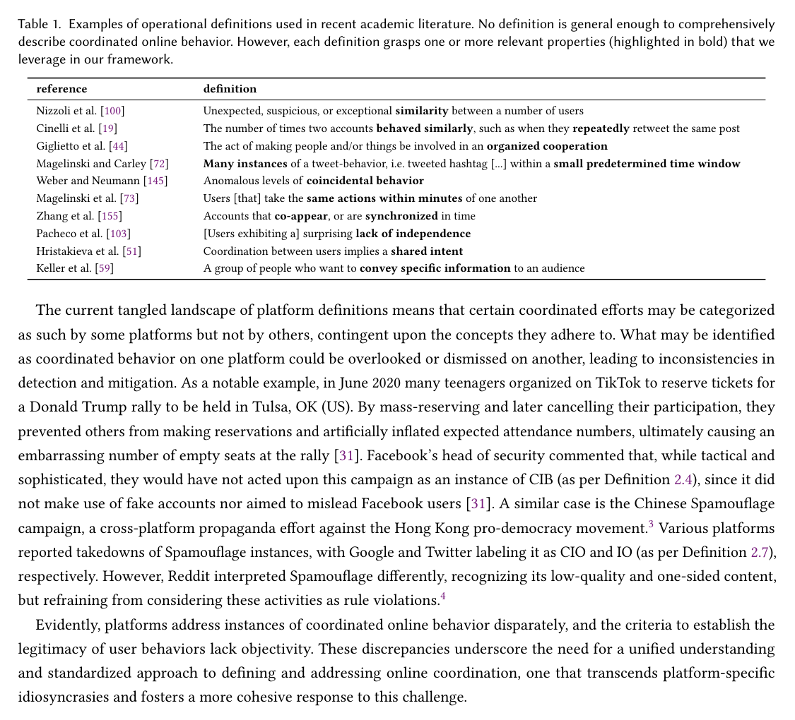

*Table 1（PDF p.7）：既有定义分别强调相似、重复、组织、时间接近、同步或共同意图，没有单一定义覆盖全部属性。*

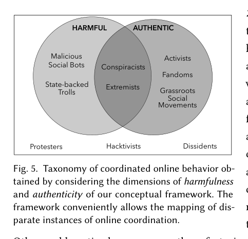

*Figure 5（PDF p.11）：真实与有害并非对立轴，图中同时包含 authentic-harmful 和 inauthentic-harmless 反例。*

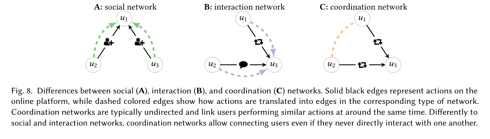

*Figure 8（PDF p.15）：协调网络可连接从未直接互动、但执行相似且时间接近动作的账号。*

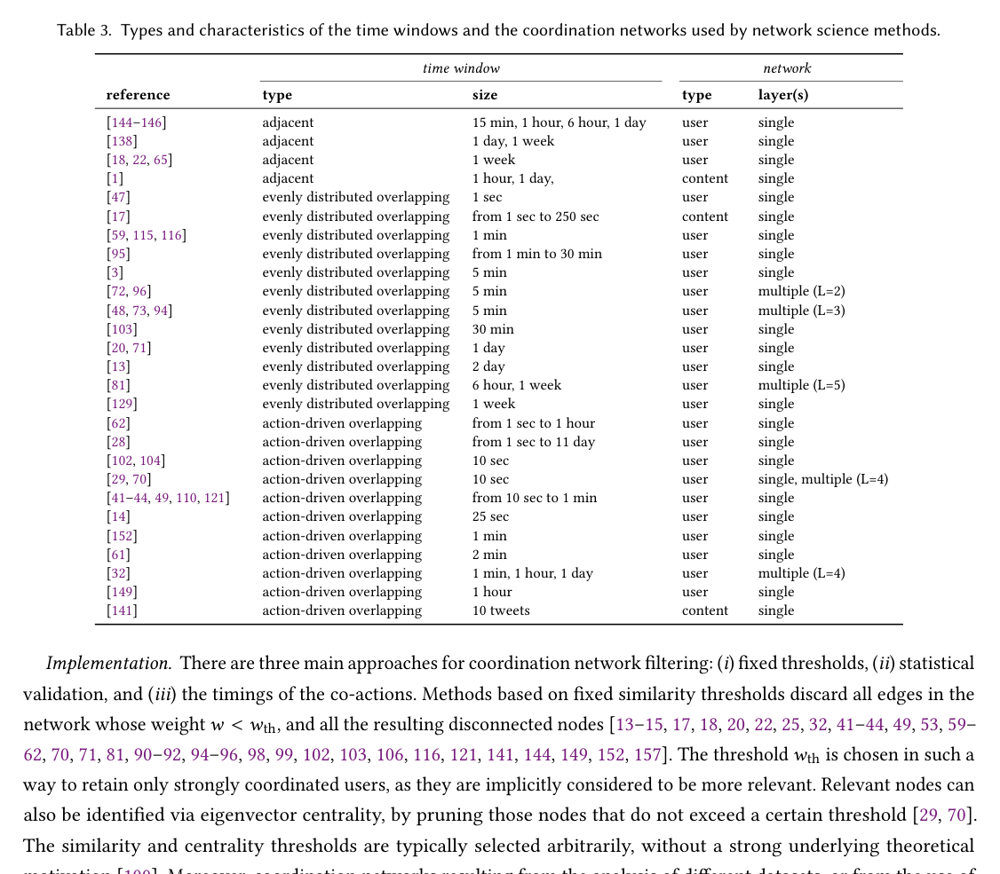

*Table 3（PDF p.18）：文献使用相邻、均匀重叠、动作驱动重叠等多种窗口，尺度跨度很大。*

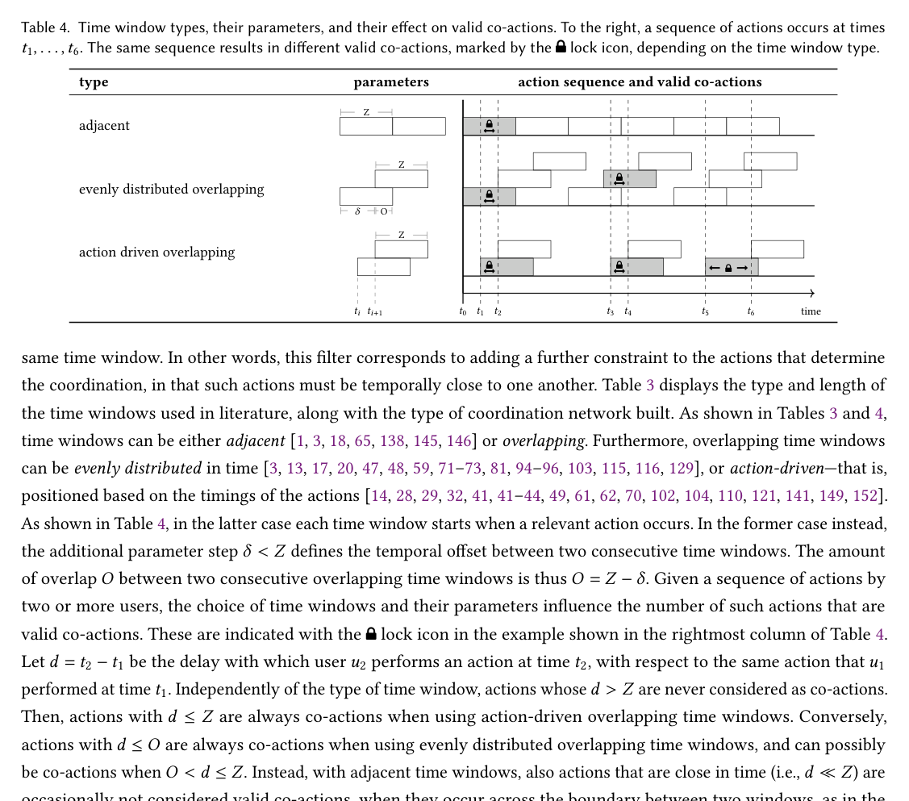

*Table 4（PDF p.19）：相同动作序列在不同窗口规则下会产生不同有效 co-action，说明窗口不是无害的预处理参数。*

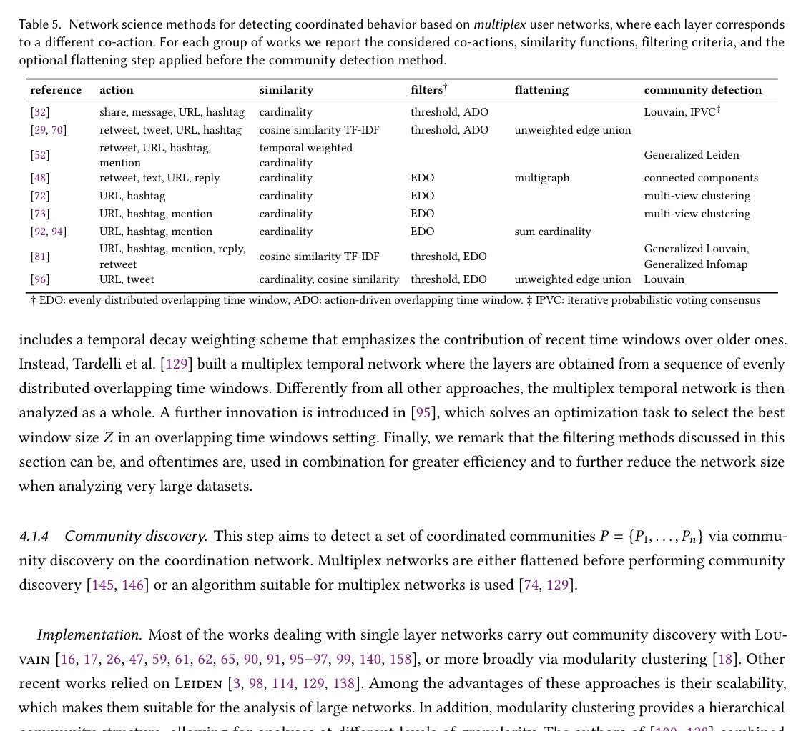

*Table 5（PDF p.20）：不同 co-action 层可被保留、压平或交给多层社区算法；压平方式必须作为显式实验变量。*

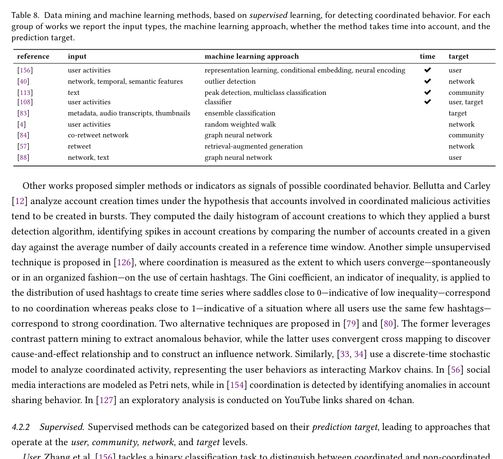

*Table 8（PDF p.23）：监督工作的预测单位跨 user、network、community 和 target，不能把指标直接横向比较。*

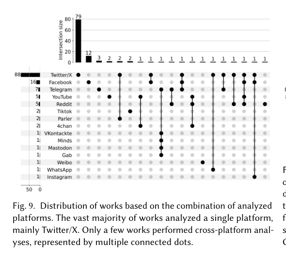

*Figure 9（PDF p.30）：单平台 Twitter/X 研究占绝对多数，真正多平台组合很少。*

### 4.3 核心证据

#### 4.3.1 Figure 10：研究覆盖不均衡

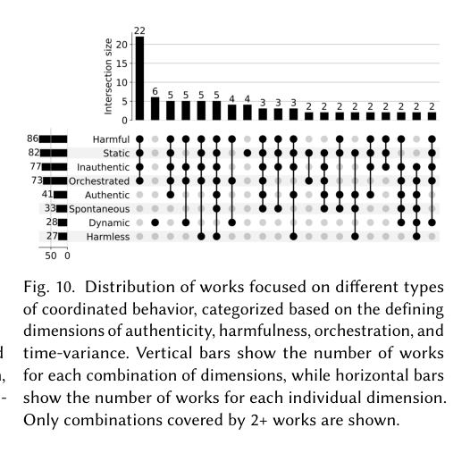

*Figure 10（PDF p.30）。有害、静态、非真实、有组织行为占据文献主流；无害、动态、自发和真实协调明显较少。裁图已人工核验。*

图中横向计数为 harmful 86、static 82、inauthentic 77、orchestrated 73、authentic 41、spontaneous 33、dynamic 28、harmless 27。它支持“研究语料存在对象偏置”，但不能推出真实世界中有害协调更普遍。[Figure 10，PDF p.30]

对 CogGuard 的直接含义是：若训练数据只由平台核验 IO 账号和普通账号组成，模型可能学习“被平台处置的账号画像”，而不是可泛化的 harmful coordination。必须加入 coordinated-but-harmless negatives 和意图/危害独立标签。

#### 4.3.2 Table 9：指标不是标签

Table 9 说明表征依赖不同来源：

- 用户级自动化与账号信息主要测 authenticity。
- 内容语义、来源可靠性、毒性和宣传分数主要测 harmfulness。
- 边权、中心性、同配性和凝聚度主要测 orchestration。
- 成员流、主题演化和重复测量主要测 time-variance。

支持强度为“概念和文献实践层面强，预测有效性层面有限”。它汇总哪些指标被使用，不证明这些指标经过统一数据集校准，也不提供固定贝叶斯权重或处置阈值。

#### 4.3.3 Section 6：主要开放问题

| 开放问题 | 论文直接证据 | 对 CogGuard 的约束 |
|---|---|---|
| 跨平台 | 多数研究只分析单平台且以 Twitter/X 为主 [Figure 9, p.30] | 三平台需分别构图、校准和汇报，不能做未经证据支持的身份合并 |
| 时间动态 | 多数工作只做浅层时间分析 [pp.30-31] | 需比较硬窗口、时间核、动态社区和成员迁移，而非只增加窗口数量 |
| 多模态 | 文本外模态研究稀少 [p.31] | 图像/视频相似性只能在有质量门禁时加入证据层 |
| 规模 | 成对相似度在大规模下昂贵 [p.31] | 必须报告候选生成召回率、复杂度、峰值内存与时延 |
| 验证与形式化 | 缺统一统计定义和广泛 Gold [pp.31-32] | 需零模型、强简单基线、campaign/platform/time holdout |
| 主观性 | harmfulness 受文化、利益相关方、意图和影响定义影响 [p.32] | 标签需多维、多标注者、provenance 和 abstain |
| 归因 | 账号发现不等于幕后主体归因 [p.32] | 黑灰产归因必须依赖独立交易与取证证据，不能从社区结构直接推出 |

### 4.4 主张—证据审计

| 核心主张 | 最强证据 | 支持等级 | 最大替代解释 | 最快补强/证伪方案 |
|---|---|---|---|---|
| actors-actions-intent 可统一定义 COB | 定义与大量操作定义映射 | 强 | 仍缺统计可识别性 | 在不同平台为同一事件建立统一 action contract |
| Discovery 与 characterization 应分离 | Figure 6 与方法/指标综述 | 强 | 工程上可共享 encoder | 保持独立输出、损失、标签和晋级门禁 |
| 四维应独立测量 | 反例、Figure 5、Table 9 | 强 | 维度可能经验相关 | 多任务标注并报告标签相关矩阵与条件误差 |
| Bot score 可辅助 authenticity | Table 9、Section 5.1 | 部分 | Bot 检测误差与概念不一致 | 校准账号分数，报告社区覆盖、缺失和异质性 |
| 动态分析优于静态分析 | 少量动态研究与综述讨论 | 部分 | 数据集和参数差异 | 同协议比较 hard window、kernel、multislice 与 runtime |
| 某个复杂模型能普遍优于简单基线 | 本文没有该证据 | 未支持 | 任务、标签与 split 不同 | 多 campaign 同协议、CI、最差 campaign 门禁 |

### 4.5 可靠性、复现性与争议点

- **最可信结论**：协同发现与有害定性必须职责分离；四维不能由单一代理变量替代。
- **最弱结论**：对“哪种算法最好”无法从综述直接回答，各文献的输入、过滤、标签和指标不可直接比较。
- **测量风险**：Bot score、毒性、平台 suspension、新闻源评分和协调强度均有概念偏差。
- **选择偏差**：Twitter/X、国家 IO、有害和静态案例占主导。
- **复现风险**：大量研究依赖平台数据、私有处置标签或任务特定阈值。
- **总体可信度**：对领域定义与缺口为高；对模型性能排序为低，因为论文不是统一 benchmark。

## 5. 论文的贡献与对 CogGuard 的影响

### 5.1 主要贡献

1. **问题层**：用 actors、actions、intent 给出可迁移定义。
2. **架构层**：定义发现群体与表征群体的明确接口。
3. **测量层**：建立 authenticity、harmfulness、orchestration、time-variance 四维框架。
4. **证据层**：汇总网络科学、机器学习、指标和验证缺口。

### 5.2 对 CogGuard 的直接判断

CogGuard 当前生产链主要完成论文意义上的 coordinated-user **detection**，也就是项目所称的 **Discovery**：从动作证据构图、过滤、社区发现并输出证据、风险、窗口和谱系。工程链已闭合，但研究候选尚未稳定超过生产 evidence prior。

项目 Stage 2 harmful Coordination **Detection** 对应论文 characterization 中的 harmfulness 维度及其后续决策，而不是论文 Figure 6 中的 detection。该阶段目前只有研究代码和契约，缺少合格群体标签、跨 campaign/platform/time 实验、校准、OOD/selective risk、批准制品和生产激活，因此不能称为完成。

Bot detection 已经接入 API、服务、账号列表/详情和前端。其运行仍依赖有效模型激活指针；更重要的是，Bot 输出是账号级 authenticity proxy，尚未形成经校准、带覆盖率和缺失性报告的社区 authenticity 指标。

### 5.3 值得探索的未来方向

1. **严格 Discovery 对比**
   - 当前假设：复杂研究候选应优于 evidence prior。
   - 破裂点：当前候选跨 campaign 方向反转，均值差为负且区间跨零。
   - 新问题：哪些成熟组件在生产同协议下提供稳定增益？
   - 最小验证：补齐 30/30 配对并解耦 seed 与 fold，逐步消融 multigraph、统计骨干、时间核和 multislice 社区。

2. **社区真实性聚合**
   - 当前假设：高 Bot 比例等于社区不真实。
   - 破裂点：善意 Bot 与非自动化伪装账号构成双向反例。
   - 新问题：如何把账号级校准概率转成带不确定性的群体证据？
   - 最小验证：输出均值/分位数、有效覆盖、缺失率、平台校准误差和敏感性，不输出硬标签。

3. **harmful Detection 数据契约**
   - 当前假设：IO membership 可替代 harmfulness。
   - 破裂点：IO 标签测主体身份，且文献缺少 harmless coordinated controls。
   - 新问题：如何独立标注意图、潜在影响和观测影响？
   - 最小验证：按 campaign 采集 coordinated-harmful、coordinated-harmless 和 uncertain 群体，由双分析员基于证据裁决。

4. **选择性决策**
   - 当前假设：分类器总能给出标签。
   - 破裂点：新平台、新 campaign、证据不足和时间漂移会使置信度失真。
   - 新问题：在什么覆盖率下风险可接受？
   - 最小验证：报告 risk-coverage、AURC、OOD 分层与拒判原因。

## 6. 结论（Conclusion）

这篇综述最重要的贡献不是提供一个新模型，而是严格分离“发现谁在协同”和“判断协同是什么性质”。其 actors-actions-intent 定义与四维框架能够直接纠正 CogGuard 当前的任务表述：系统主要完成 Discovery，harmful Detection 仍未完成。Bot detection 确实已接入，但只能作为账号级 authenticity 证据，不能替代社区真实性或有害性。后续研究应以生产 evidence prior 为强基线，逐项验证成熟网络和时间组件，并在独立 harmfulness 数据、校准与治理门禁完成前保持研究模型离线。

> **最终判断**：核心参考，值得作为 Coordination 任务定义、数据契约和主张边界的上位依据。
> **读完应记住的一句话**：一起行动说明“协同”，不能单独说明“虚假”或“有害”。
